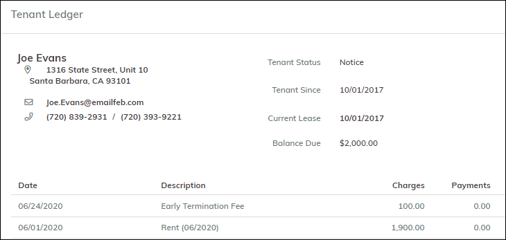

## Table of Contents

- [When a tenant gives notice, how do I record it in Breeze?](#when-a-tenant-gives-notice-how-do-i-record-it-in-breeze)
  - [To change a tenant's status to Notice](#to-change-a-tenants-status-to-notice)
  - [Move Out Date on the Calendar](#move-out-date-on-the-calendar)
- [Can I continue to charge rent after I change a tenant's status to Notice or Evict?](#can-i-continue-to-charge-rent-after-i-change-a-tenants-status-to-notice-or-evict)
  - [Notice Tenants](#notice-tenants)
  - [Evict Tenants](#evict-tenants)
- [Early Termination Fees](#early-termination-fees)
  - [To set up early termination fees](#to-set-up-early-termination-fees)
  - [To charge an early termination fee](#to-charge-an-early-termination-fee)
- [How do I move a tenant out?](#how-do-i-move-a-tenant-out)
  - [To change the tenant's status](#to-change-the-tenants-status)
  - [To refund the deposit](#to-refund-the-deposit)
  - [Last Month's Rent](#last-months-rent)

# When a tenant gives notice, how do I record it in Breeze?

When a tenant gives notice, you change the tenant's **Status** to **Notice** and enter the **Move Out** date.

## To change a tenant's status to Notice

Go to **Tenants > Tenants**. A list of tenants appears.

Select the appropriate tenant.

On the **Tenant** screen, click the **Edit** icon (the pencil).

Click the **Status** field.

Select **Notice**. The **Notice Information** screen appears.

Complete the screen.

| Field                            | Description                                                                                                                                                                                                                                                                       |
| -------------------------------- | --------------------------------------------------------------------------------------------------------------------------------------------------------------------------------------------------------------------------------------------------------------------------------- |
| **Move Out Date**                | Enter the date the tenant will move out.                                                                                                                                                                                                                                          |
| **Continue charging rent?**      | This check box is selected by default. Change it if needed.                                                                                                                                                                                                                       |
| **Post Early Termination Fee**   | If you charge termination fees, select this check box.                                                                                                                                                                                                                            |
| **Continue charging Rent Until** | Enter the appropriate date. For example, a tenant gives notice two months before the end of their lease. Their move-out date is 10/31/2021, but they are obligated to pay rent until 12/31/2021. To continue charging rent after they move out, enter "12/31/2021" in this field. |
| **Reason for Moveout**           | Select a reason for move-out.                                                                                                                                                                                                                                                     |
| **Promote Additional Tenant?**   | If there is an additional tenant (for example, a roommate) who is staying in the unit and will become the main tenant, select this check box.                                                                                                                                     |

Click **Ok**.

Breeze displays the **Tenant Information** screen.

.png>)

The **Status** changes to **Notice**, and a new button, **Cancel Notice**, appears on the screen.

There are two new date fields: **Continue charging Rent Until** and **Move Out**.

## Move Out Date on the Calendar

If you use the Move Out Template, the calendar will show a **Follow-Up** on the move out date.

Click the note to view the details. The instruction in the **Follow-Up** is to process the move out.

.png>)

**Note**: In this case, the actual move out date is 10/31, but because 10/31 is a Sunday, the **Follow-Up** is dated 11/01, the next business day.

# Can I continue to charge rent after I change a tenant's status to Notice or Evict?

There is an option on the **Company Settings** screen that allows you to continue charging rent to Notice and Evict tenants.

.png>)

If you select this option, the Monthly Posting function will continue to create rent charges after you change a tenant's status.

## Notice Tenants

When you change a tenant's status to Notice, the **Notice Information** screen appears.

In this screen, there is an option to continue charging rent (selected by default). You enter a date for how long the charges should continue (**Continue Charging Rent Until**). This date can be after the **Move Out Date**, if the tenant moves out before their lease expires.

## Evict Tenants

If the option on the **Company Settings** screen is turned on, Breeze will continue to create charges for Evict tenants. However, if you try to create a receipt for an Evict tenant, a warning message appears.

If you accept money from an Evict tenant, it can derail the eviction process, so we recommend against it.

# Early Termination Fees

With Breeze, you can set up an _early termination fee_. When a tenant leaves before the end of a lease, Breeze adds a fee. You can set a default amount for the fee at the system level and then modify it as needed at the property level.

This article has two parts:

- How to set up the fee
- How to charge the fee when a tenant leaves early

**Note**: This feature is only available for residential properties.

## To set up early termination fees

1. Go to **Company Settings > Account Settings**. Complete the **Early Termination Charge Code** field.

   If you want to track early termination fees separately, you can create a GL account for them and then add a charge code that references the new account.

   As an alternative, you can use an existing charge code, for example, **Miscellaneous**.

2. On the **Company Settings** screen, select the **Property Defaults** tab.

   

   Complete the following fields:

   - **Early Termination Fee** – Enter the amount of the early termination fee, either a percentage of the monthly rent or a flat amount.
   - **Early Termination Fee Type** – Select **Flat** or **% of Rent**.

3. After setting the fees up on the **Company Settings** screen, you can modify them at the property level if needed. Open the **Property** screen, and go to the **Property Defaults** tab. The fields are the same as shown above.

## To charge an early termination fee

When you change a tenant's status to **Notice**, a popup appears.

Select the checkbox for **Post Early Termination Fee**.

Complete the rest of the screen and click **OK**.

Breeze creates a charge for the fee. To view it, you can go to the tenant ledger.

# How do I move a tenant out?

When a tenant moves out, you need to do two things:

- Change the tenant's status.
- Refund the deposit.

As an option, you can enter a forwarding address.

---

## To change the tenant's status

On the **Tenant** page, click the **Edit** icon (the pencil) and change the **Status** from **Current** to **Past**.

.png>)

When you do this, another screen appears where you enter the **Move Out Date** and (optionally) the reason for moving.

Complete the screen and click **Ok**.

The options for **Reason for Moveout** come from a customizable list. Go to **Admin > Toolbox > Custom Lists** (tile) > **Reasons for Moveout** (tab).

The **Promote Additional Tenant** function makes a roommate the main tenant, creating a new tenant record.

> **Note**: Do **not** change the status to **Past** unless the tenant has actually moved out.
>
> In some cases, changing the status to **Past** cannot be undone.
>
> Example: Tenant A is scheduled to move out on August 31st, but doesn't actually move out until September 5. On the 31st, you change his status to **Past**. On the 2nd, you want to change his status back to **Current**, but the system prevents you because another tenant (Tenant B) is already assigned to that unit as **Current** or **Future**.

---

## To refund the deposit

Click the **Refund Deposit** button. The **Deposit Refund** screen appears.

Lower part of screen:

This screen shows:

- Available credits (deposits)
- Any outstanding charges
- The amount owed to the tenant or landlord

You can enter a forwarding address for the tenant.

Select **Print Moveout Statement** to generate a statement. Breeze will also attach the statement to the tenant record.  
(This feature is only available if the tenant's status is **Notice** or **Past** and the **Move Out Date** is the current date or a past date.)

You can also add detail lines (e.g., cleaning fees or damages). Click **Add Row** in the detail section.

If the tenant is moving out mid-month, there will be a line for the last month's rent. See the next section for details.

Click **Post**. If the tenant is due a refund, the system creates a payable to the tenant. To write a check, open the payable and click **Pay Now**.

---

## Last Month's Rent

If the tenant is moving out in the middle of a month and has **not** paid rent for that month, Breeze adds a prorated charge for the extra days.

Example (move-out date: 01/15/2020):

If the tenant **has already paid** rent for the month, Breeze adds a **credit charge** for the days not occupied.

Example (move-out date: 12/15/2019):

You can edit or deselect these charges if not needed.
