# Table of Contents

- [Table of Contents](#table-of-contents)
- [How do I move a tenant in?](#how-do-i-move-a-tenant-in)
- [How do I move a tenant in without adding a prospect record?](#how-do-i-move-a-tenant-in-without-adding-a-prospect-record)
  - [To add a tenant directly from the Property screen](#to-add-a-tenant-directly-from-the-property-screen)
  - [Adding a Tenant Mid-Month](#adding-a-tenant-mid-month)
  - [Last Month's Rent as a Move-in Charge](#last-months-rent-as-a-move-in-charge)
- [How do I set up move-in and move-out fees?](#how-do-i-set-up-move-in-and-move-out-fees)
  - [Overview](#overview)
  - [To set up move-in and move-out fees](#to-set-up-move-in-and-move-out-fees)
  - [Move-in Fees at Move-In](#move-in-fees-at-move-in)
  - [Move-out Fees at Move-Out](#move-out-fees-at-move-out)
- [How does Breeze prorate rent at move-in and move-out?](#how-does-breeze-prorate-rent-at-move-in-and-move-out)
  - [Proration Settings](#proration-settings)
  - [Proration at Move-In](#proration-at-move-in)
  - [Proration at Move-Out](#proration-at-move-out)
- [How do I reverse a move-in?](#how-do-i-reverse-a-move-in)

---

# How do I move a tenant in?

There are two ways to move a tenant in:

- **As part of the prospect workflow**: Add prospect record → Charge application fee → Screen tenant → Execute lease → Move in
- **Directly from the Property screen**: Bypass prospect workflow using the Unit tab

[Back to Top ⬆️](#table-of-contents)

---

# How do I move a tenant in without adding a prospect record?

## To add a tenant directly from the Property screen

1. Open **Property** screen → **Units** tab
2. Locate unit → Check **Rent/Deposit** amounts  
   .png>)
3. Click **Add Tenant** → Complete tenant details  
   .png>)
4. Review **Move-In Charges** → Click **Save**  
   .png>)
5. Confirm charges → **Continue**  
   .png>)

## Adding a Tenant Mid-Month

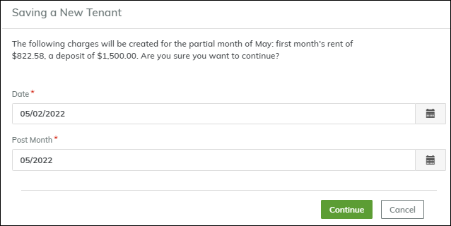  
_Prorated rent example: $822.58 for partial May occupancy_

## Last Month's Rent as a Move-in Charge

Manually add charge for last month's rent if required

[Back to Top ⬆️ ⬆️](#table-of-contents)

---

# How do I set up move-in and move-out fees?

## Overview

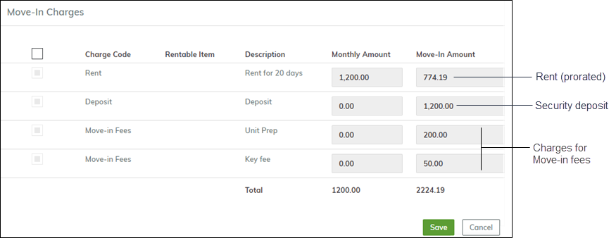  
_Typical move-in charges: Rent, Deposit, Fees_

| Charge Type      | Description                     |
| ---------------- | ------------------------------- |
| **Rent**         | From Unit setup (auto-prorated) |
| **Deposit**      | From Unit setup                 |
| **Move-in Fees** | Setup at Unit Type level        |

## To set up move-in and move-out fees

1. **Property** → **Units** → **Unit Types**  
   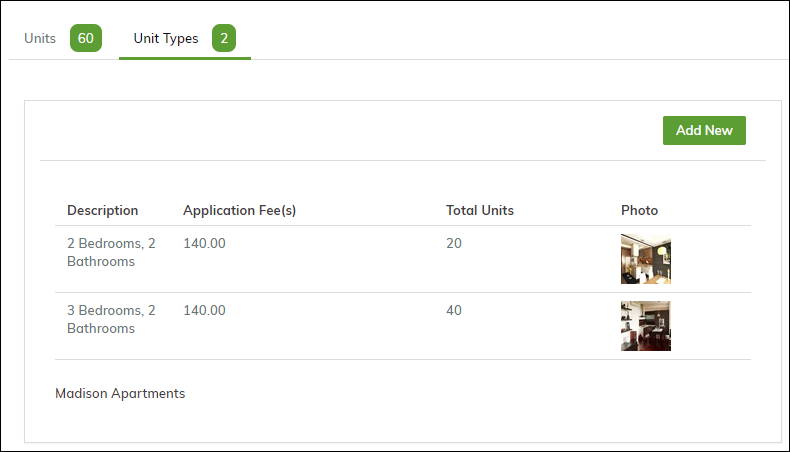
2. Edit unit type → **Move-in Charges** tab  
   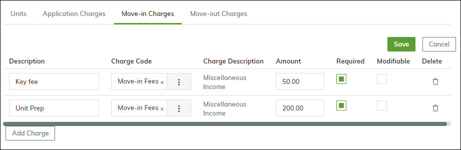
3. Add fees (Key/Prep fees shown) → Set Required/Modifiable
4. Repeat for **Move-out Charges**  
   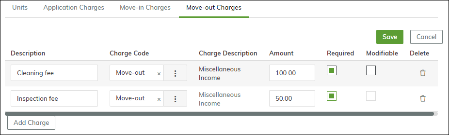

## Move-in Fees at Move-In

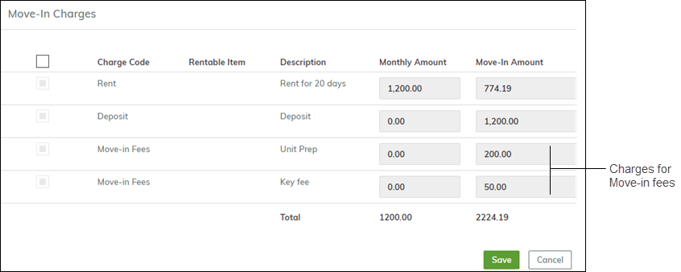  
_Charges appear during tenant move-in_

## Move-out Fees at Move-Out

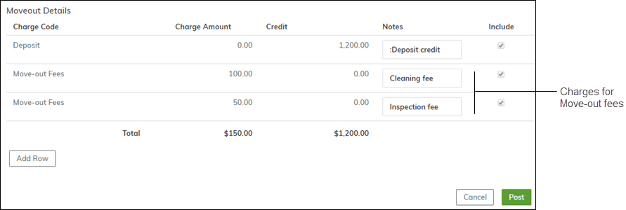  
_Fees appear during deposit refund process_

[Back to Top ⬆️](#table-of-contents)

---

# How does Breeze prorate rent at move-in and move-out?

## Proration Settings

.png>)  
_Configure in Company Settings → Property Defaults_

| Method                   | Calculation Example           |
| ------------------------ | ----------------------------- |
| **Actual Days in Month** | $1,095 ÷ 31 days = $35.22/day |
| **30-Day Month**         | $1,095 ÷ 30 days = $36.50/day |

## Proration at Move-In

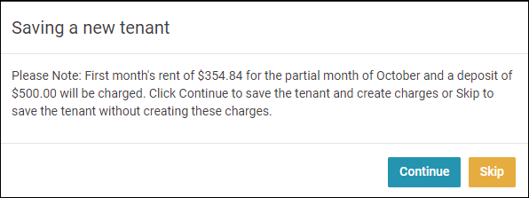  
_$354.84 prorated for 10/22 move-in_

## Proration at Move-Out

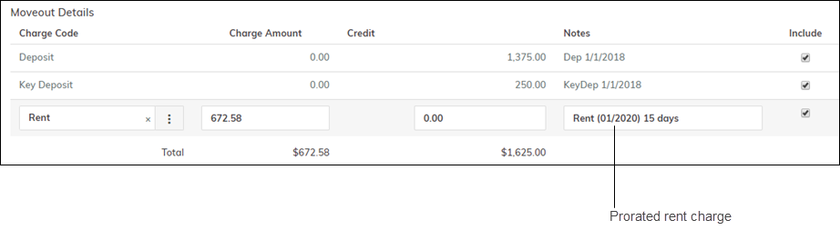  
_Charge for partial month occupancy_  
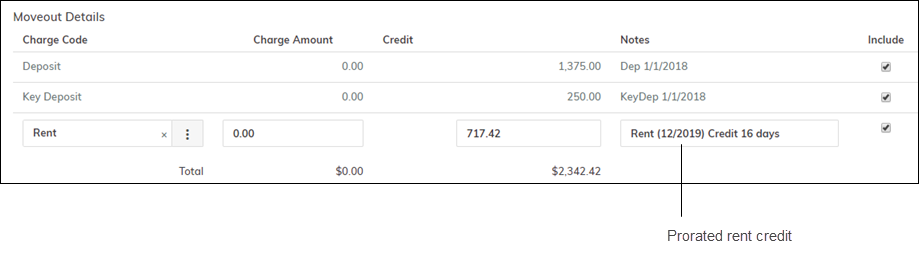  
_Credit for early move-out_

[Back to Top ⬆️](#table-of-contents)

---

# How do I reverse a move-in?

1. Click **Reverse Move-In** on Tenant screen  
   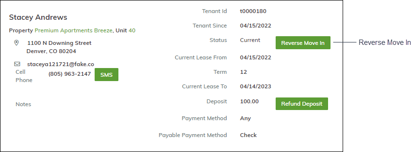
2. Enter reversal date → **Save**  
   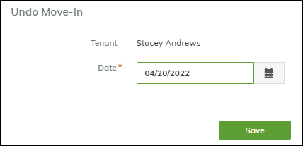
3. Status changes to **Future**  
   .png>)
4. Ledger shows reversal transactions  
   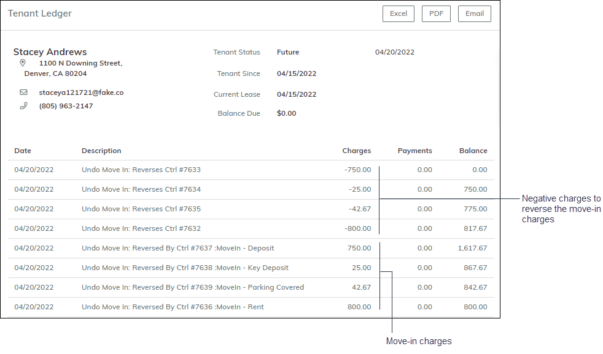

[Back to Top ⬆️](#table-of-contents)
