# Table of Contents

- [The Prospect Workflow in Breeze](#the-prospect-workflow-in-breeze)
  - [Workflow Summary](#workflow-summary)
  - [1. Enter Information About the Prospect](#1-enter-information-about-the-prospect)
    - [Check Quoted Rent](#check-quoted-rent)
    - [Check Duplicates](#check-duplicates)
  - [2. Additional Prospects](#2-additional-prospects)
  - [3. Rentable Items](#3-rentable-items)
  - [4. Leasing Specials](#4-leasing-specials)
  - [5. Application Fees](#5-application-fees)
  - [6. Tenant Screening](#6-tenant-screening)
  - [7. Lease Documents](#7-lease-documents)
  - [8. Execute Lease](#8-execute-lease)
  - [9. Tenant Move-in](#9-tenant-move-in)
  - [Data Transfer](#data-transfer)
  - [Managing Applicants](#managing-applicants)
    - [Canceling an Applicant](#canceling-an-applicant)
    - [Denying an Applicant](#denying-an-applicant)

---

# The Prospect Workflow in Breeze

This article describes how to create prospects in Breeze and move them through the prospect workflow.

> **Note:** For tenants applying via RentCafe, the process differs - applications are submitted directly on RentCafe and appear in Breeze as applicants.

---

## Workflow Summary

| Step                      | Required/Optional | Setup Requirements            |
| ------------------------- | ----------------- | ----------------------------- |
| 1. Enter main tenant info | Required          | None                          |
| 2. Add occupants          | Optional          | None                          |
| 3. Add rentable items     | Optional          | [Setup Required](link)        |
| 4. Add leasing specials   | Optional          | [Setup Required](link)        |
| 5. Charge application fee | Optional          | Set fees in Property settings |
| 6. Screen prospect        | Optional          | Enable screening              |
| 7. Generate lease         | Optional          | [Setup Required](link)        |
| 8. Execute lease          | Required          | None                          |
| 9. Move tenant in         | Required          | None                          |

---

## 1. Enter Information About the Prospect

1. Navigate to **Tenants > Prospects** → Click **Add New**  
   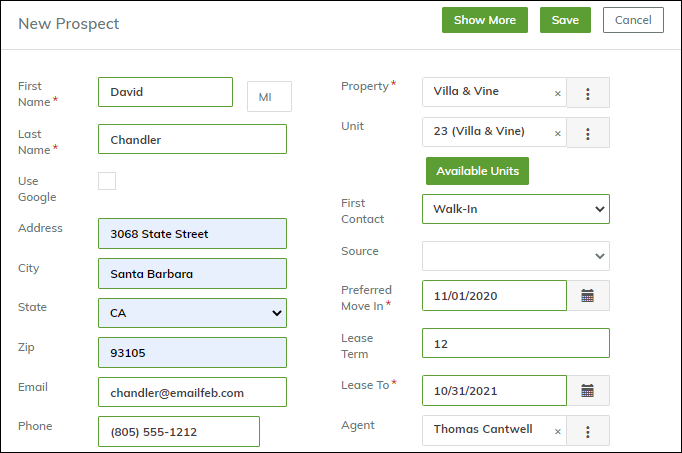
2. Complete required fields (marked with \*)
3. Save to proceed to next step

### Check Quoted Rent

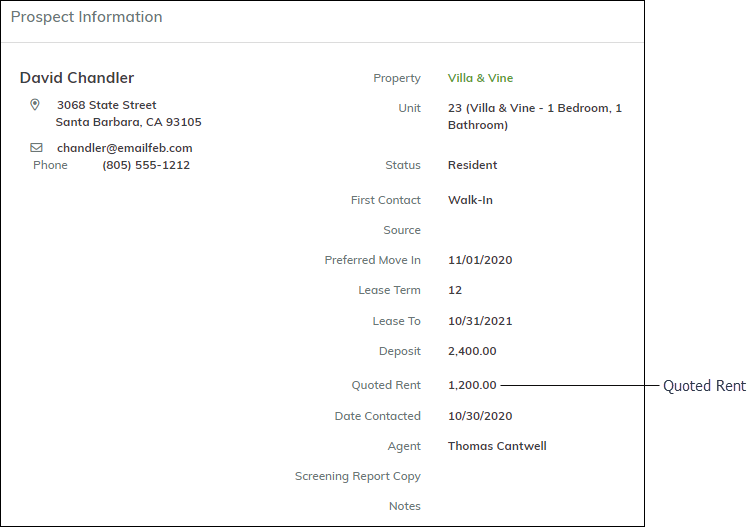

- Auto-populated from unit's Market Rent
- Editable via pencil icon

### Check Duplicates

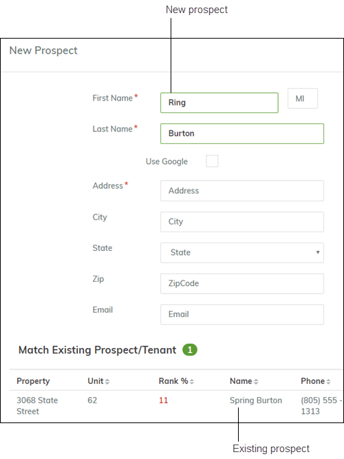

- System checks for existing matches
- Click matches to review

---

## 2. Additional Prospects

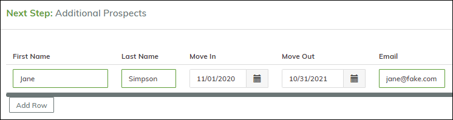

- Add family/roommates
- Complete details for each occupant

---

## 3. Rentable Items

.png>)

- Add parking/storage units
- Enter quantity → Click **Reserve**

---

## 4. Leasing Specials

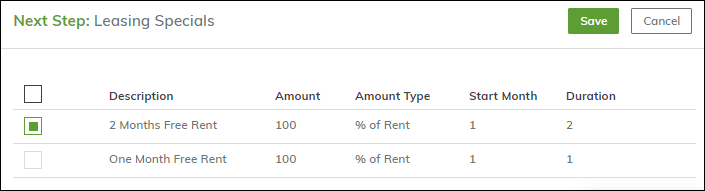

- Select discounts/offers
- Click **Save** to apply

---

## 5. Application Fees

.png>)

- Requires unit selection
- Click **Proceed** to post charges
- Status changes to **Applied**

> **Note:** Use **Add Charge** button for extra fees

---

## 6. Tenant Screening

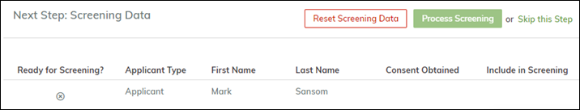

- Available if screening enabled
- [Setup Guide](link)

---

## 7. Lease Documents

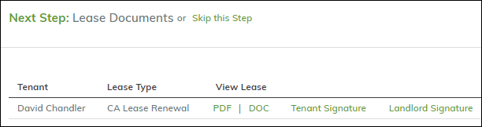

- Generate PDF agreements
- [Document Setup](link)

---

## 8. Execute Lease

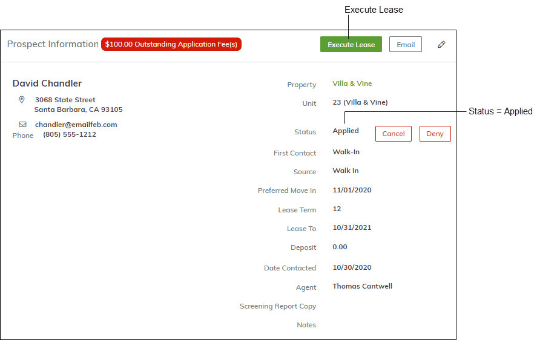

- Click **Execute Lease** when status is **Applied**
- Confirm tenant details

---

## 9. Tenant Move-in

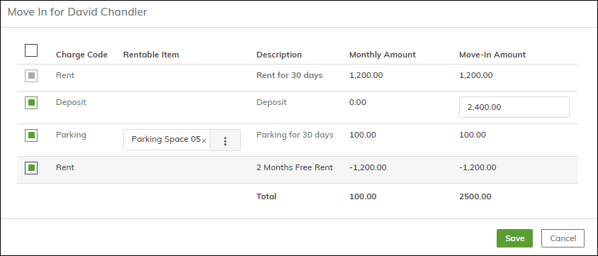

1. Review charges (rent/deposit/items)
2. Adjust dates if needed
3. Click **Continue** to finalize  
   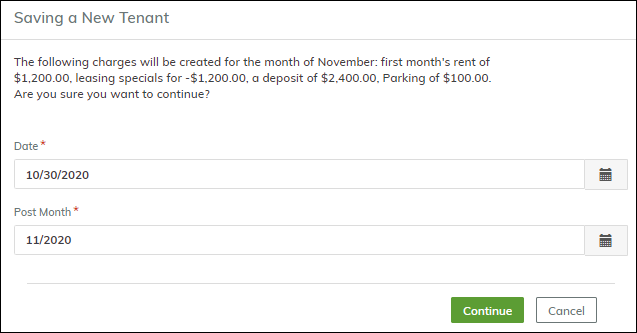

Status changes to **Current**  
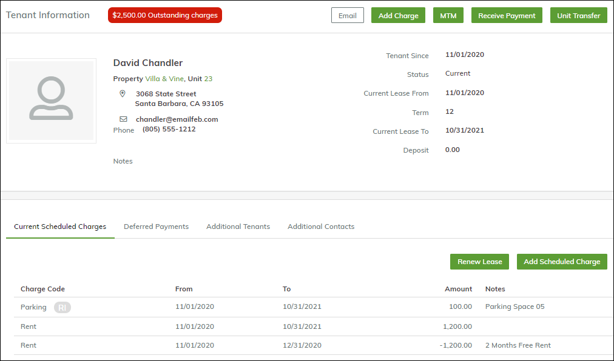

---

## Data Transfer

- Prospect data → Tenant record
- Vehicles/pets → **Other Info** tab
- Custom data → **Custom Data** tab

---

## Managing Applicants

### Canceling an Applicant

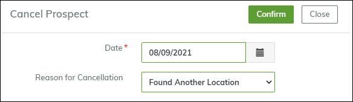

1. Click **Cancel**
2. Enter date/reason
3. Status changes to **Canceled by Manager**  
   

### Denying an Applicant

- Process similar to cancellation
- Use **Deny** button
- Status changes to **Denied**

[Back to Top](#table-of-contents)
