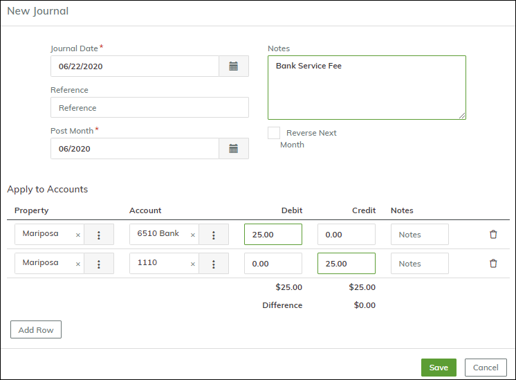

# How do I reconcile my bank statement?

## Table of Contents

- [How do I reconcile my bank statement?](#how-do-i-reconcile-my-bank-statement)
  - [Table of Contents](#table-of-contents)
  - [Overview](#overview)
  - [To reconcile your bank statement](#to-reconcile-your-bank-statement)
  - [Saving and Posting](#saving-and-posting)
  - [Recording Bank Fees and Interest](#recording-bank-fees-and-interest)
  - [Un-reconciling a Bank Account](#un-reconciling-a-bank-account)
  - [Trouble-Shooting](#trouble-shooting)

## Overview

Before you reconcile your bank statement, make sure you have finished combining your receipts into deposits, paid your payables, and entered any journal entries that impact your cash accounts.

You must reconcile your statement once a month.

## To reconcile your bank statement

Go to **Accounting > Banking > Bank Reconciliation**.

Select the bank account.

Breeze displays the **Latest Reconciliation Statement Date** and **Latest Reconciliation Statement Balance**. The date tells you if you are reconciling the correct month; the balance should tie to the opening statement balance.

Enter the date of the bank statement and the ending balance.

Click **Start**. Breeze displays un-reconciled transactions.

Compare the transactions on the bank statement to the Breeze transactions on the screen. Select the checkbox on the left to clear each transaction that matches the bank statement.

When you have cleared all the transactions and the **Difference** is zero (0), click **Post**.

## Saving and Posting

You can save your work at any time during the process. For example, if you clear half the transactions on the screen but there's an interruption and you have to do something else, you can click **Save**. When you go back to the screen to finish the reconciliation, Breeze remembers the transactions that you cleared.

When you have cleared all the transactions and the difference is zero (0), your account is reconciled, and the **Post** button becomes active.

Click **Post** to finish the reconciliation. Breeze marks the deposits, payments, and cash-related journal entries as **Reconciled**. On the **Bank Account** screen, in the **Reconciliation Data** section, it enters the statement date and balance.

## Recording Bank Fees and Interest

To record bank fees or interest income, you can create a journal entry directly from the **Bank Reconciliation** screen. Click the **Add Journal** button. The **New Journal** screen appears.

For bank fees, complete the screen as shown above. Debit the Bank Fees account and credit the Cash Account.

For bank interest, credit the Bank Interest account and debit the Cash account, as shown below.

When you save, the journal appears on the **Bank Reconciliation** screen and can be reconciled against the statement.

If the bank account is linked to multiple properties, you can split fees (or interest) by adding a line for each property, or you can designate one property for bank fees and interest.

## Un-reconciling a Bank Account

To un-reconcile a bank account, go to **Admin > Toolbox > Un-reconcile Bank**. Select the bank account, enter the reconciliation date, and click **Submit**.

## Trouble-Shooting

If you are having trouble balancing your bank statement, we recommend the following:

1. Verify that all items on the bank statement have been checked off on the Breeze Bank Rec.
2. Rebuild the GL back to the prior month.
3. Generate the **Bank Balance Exception Report**. This report will show you any issues that could cause the reconciliation to be out of balance (**Reporting > Bank Reports > Bank Analytics > Bank Balance Exception Report**).
4. Check the bank reconciliation for the prior month (**Reporting > Bank Reports > Bank Analytics > Bank Reconcile History**) and ensure the difference is still 0. If it is not, the difference is due to a change that was made in that month.

When all issues are resolved, your reconciliation should balance correctly.
