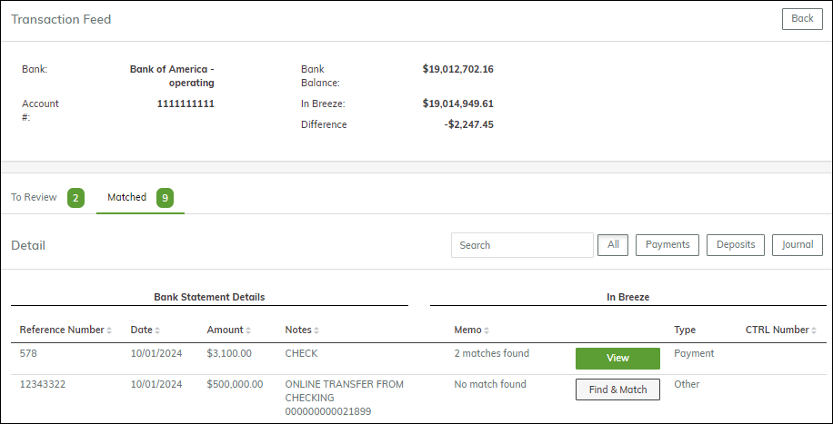
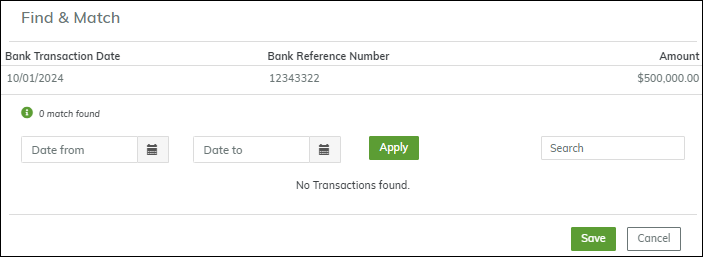

# Bank Transaction Feed

## Table of Contents

1. [Overview](#overview)
2. [Setup](#setup)
3. [Using the Bank Transaction Feed](#using-the-bank-transaction-feed)

## Overview

Once a day, the bank sends a bank transaction file to Breeze. For every bank transaction, the system attempts to find a matching transaction in Breeze (a deposit record, a payment record, or a journal entry to a Cash account). If there is an exact match, the system links the transactions. If Breeze does not find a match, you can review the bank transaction and link it manually to an existing Breeze transaction or create a new Breeze transaction.

All the matched transactions are marked as **reconciled** on the **Bank Reconciliation** screen, making the bank reconciliation process considerably easier.

## Setup

To turn this feature on for your company, start a chat with us. There is no other setup required.

## Using the Bank Transaction Feed

To review the transactions that have come from the bank, go to **Accounting > Banking > Transaction Feed**. The screen displays a list of bank accounts.

To open a bank account, click anywhere in its row. The **Transaction Feed** screen opens.

There are two tabs: **To Review** and **Matched**. Click the **Matched** tab to review transactions that were matched by Breeze.

Most of the matches will be correct, but if you spot a problem, you can **Unmatch** the transaction. This moves it to the **To Review** tab, where you can look for the correct match.

To match transactions, open the **To Review** tab.

This example shows two unmatched transactions. For the first one, there are two possible matches.

Click the **View** button. The **Find & Match** screen appears, displaying the matching transactions.

Select the correct transaction and click **Save**.

For the second transaction, no match was found.

Click the **Find & Match** button. The **Find & Match** screen appears.

Enter a date range and click **Apply**. A list of unmatched transactions within that range appears. If you find the correct one, select it and click **Save**.

In some cases, you may have to add a Breeze transaction, such as a journal entry to record a transfer from one account to another. Navigate away from the **Transaction Feed** screen and add the transaction.

When you go back to the **Transaction Feed** screen, the system will have matched the new Breeze transaction with the existing bank transaction, and there will be nothing else required.

When all the transactions are matched and no more transactions appear in the **To Review** tab, you are finished.
