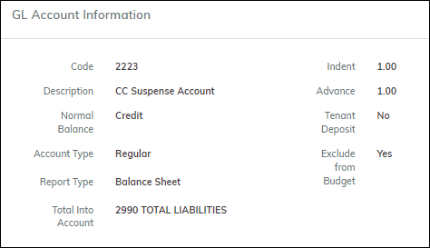
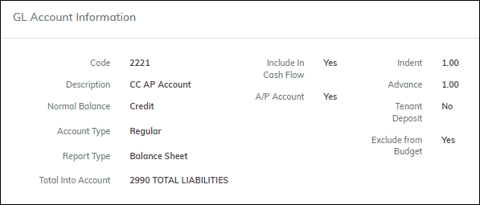
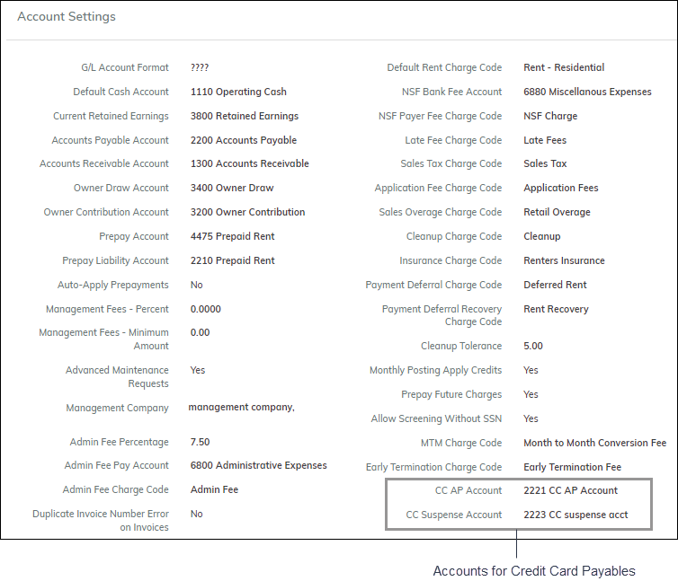

# Setup for Credit Card Payables

## Table of Contents

1. [Adding GL Accounts for CC Payables](#adding-gl-accounts-for-cc-payables)
2. [Completing the CC Payable Fields on Company Settings](#completing-the-cc-payable-fields-on-company-settings)
3. [Setting up Credit Card Vendors](#setting-up-credit-card-vendors)

## Adding GL Accounts for CC Payables

Go to **Admin > GL Account**.

Add two new accounts:

- A **Credit Card Suspense Account**
- A **Credit Card AP Account**

Examples:

**Credit Card Suspense Account:**

**Credit Card AP Account:**

## Completing the CC Payable Fields on Company Settings

After adding the new accounts, enter them in the **Company Settings** screen.

Go to **Company Settings > Account Settings** tab.

Complete the fields for credit card payables:

- **CC AP Account**
- **CC Suspense Account**

## Setting up Credit Card Vendors

To create payables for credit card companies, you must set them up as vendors.

Go to **Vendors > Add New**.

.png>)

Complete the screen and select the **Credit Card Vendor** checkbox.
