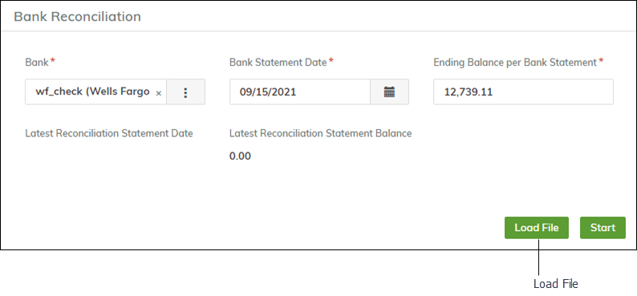
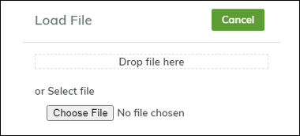
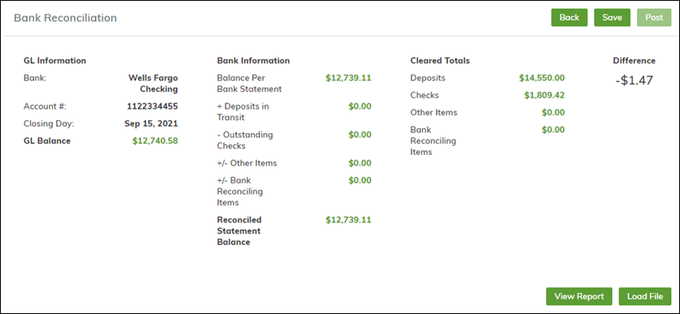
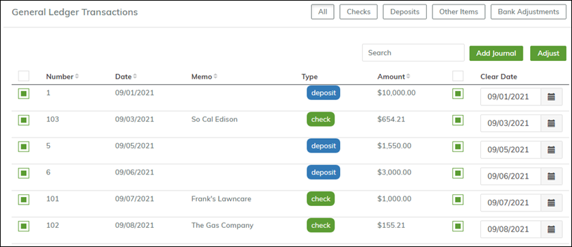
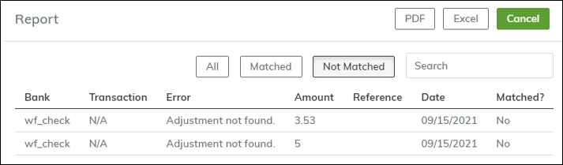
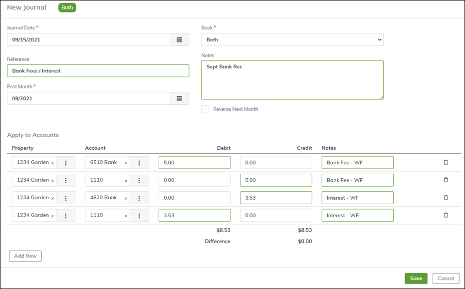
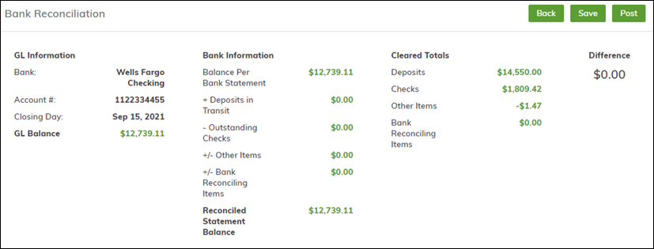

# How do I import a bank statement file and complete a bank reconciliation?

Using Breeze, you can upload bank statement files, and the system will automatically match transactions on the bank statement with Breeze transactions: checks, deposits, and journal entries.

Breeze accepts the following bank file formats:

- **QFX** (use the `.qfx` extension)
- **BAI2** (use the `.txt` extension)

Typically, you can download statement files from your bank's website. For more information about this step, contact your bank.

## To use a bank file in a bank reconciliation

1. Go to **Accounting > Banking > Bank Reconciliation**.
2. Select the **Bank**.
3. Enter the **Bank Statement Date** and the **Ending Balance per Bank Statement**.
4. Click **Load File**.

A popup window appears:

5. Drag and drop the bank file into the popup window or click **Choose File** and browse to the location of the bank file.
6. Breeze loads the file and displays the **Bank Reconciliation** screen.

In the lower half of the screen, you can see the transactions that have been matched.

For matched transactions, the **Clear Date** comes from information in the file. If the date is blank in the file, Breeze will use the Bank Rec date.

### Viewing Unmatched Transactions

To see unmatched transactions:

- Click **View Report** and select **Not Matched**.

In this example, the report shows two adjustments in the bank statement file that were not matched to Breeze transactions.

Unmatched adjustments are typically transactions created by the bank (e.g., fees and interest payments). These transactions are not recorded in Breeze before you get the statement because you don't know what the amounts will be.

### Adding Journal Entries for Unmatched Transactions

1. In the **Bank Reconciliation** screen, click **Add Journal** and create a journal entry.

2. In the detail section, enter lines for:

   - Bank fees (e.g., a debit to the **Bank Fees** account and a credit to **Cash**).
   - Interest payments (e.g., a credit to the **Bank Interest Account** and a debit to **Cash**).

3. After saving the journal entry, it appears on the **Bank Reconciliation** screen.

.png>)

On the **Bank Reconciliation** screen, if a single journal entry has multiple line items to cash, Breeze nets the amounts. If you want to see distinct amounts, you need to add multiple journals.

4. Select the checkbox to clear the journal entry.
5. At the top of the screen, verify that the **Difference** is now zero, and then post the bank reconciliation.

Once the difference is zero, the bank reconciliation process is complete.
