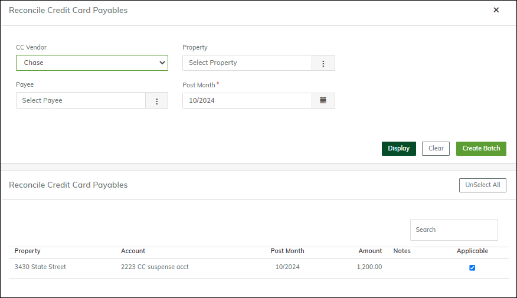
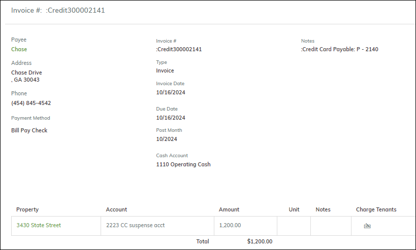
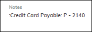

# Using Credit Card Payables

This article describes how to create and process a credit card payable. For general information about credit card payables, see the following:

- [Credit Card Payables: Overview](#)
- [Setup for Credit Card Payables](#)

## To Create a Credit Card Payable

This procedure describes how to record a credit card payment made outside of Breeze. For example, you went to Ace, bought $1,200 worth of paint, and paid for it with your Chase credit card. In Breeze, you record the payment by creating a credit card payable.

1. Go to **Accounting > Accounts Payable > Payables**.
2. Click **Add New**. The **New Payable** screen appears.

   

3. Select the **Credit Card** checkbox. In place of the **Cash Account** field, there is a new one: the **CC Vendor** field.
4. Select the CC vendor and complete the rest of the screen as you normally would.
5. When you save, the payable is marked as paid, and the **Cash Account** and **AP Account** fields show the accounts set up for credit cards.

   

## Creating a Payable to the Credit Card Company

When you receive the monthly statement from the credit card company, you can reconcile it in Breeze and create a payable to record the amount due to the credit card company.

1. Go to **Accounting > Accounts Payable > Reconcile Credit Card Payables**.
2. Select the **CC Vendor** and the **Post Month**.
3. Click **Display**. The screen shows the un-reconciled credit card payables for that CC vendor.

   

4. Select the payables you want to reconcile.
5. Click **Create Batch**. Breeze creates a payable to the CC company.

   

6. The **Notes** section lists the original credit card payables that are included in this payable to the credit card company.

   

   In this example, there is only one, but there could be multiple payables listed. The payable is not posted so you can add additional detail lines to it.

For information about the GL accounts used in credit card payables, see [Credit Card Payables: Overview](./Credit_Card.md).
