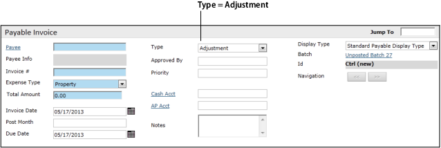
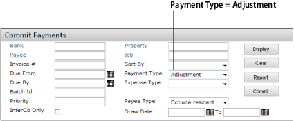

# Adjustment Workflow

Adjustments record payments made without a check or an EFT payment. The most common use for adjustments is for payments the bank automatically deducts from your account periodically. For example, if you have arranged for a bank to automatically deduct a monthly loan payment from your account, you use this feature to record the payments.

The workflow for adjustments is similar to the workflow for regular payables:

1. **Create a payable with a Type of Adjustment.**

   

2. **Approve the adjustment, using the Commit Payments function.**  
   In the **Commit Payments** screen, select a **Payment Type** of **Adjustment**.

   

3. **Process the adjustment, using the Make Adjustment function.**

   This is similar to Process Payments, but uses a different screen. See the following procedure. When you process an **adjustment**, no payment is created (no check or EFT payment). There is also a separate numbering sequence for adjustments.

---
