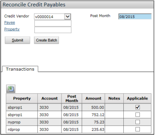

**Invoices Paid by Credit Card**

**With this feature, you can account for transactions that are paid with a credit card outside of Voyager.** Currently, it is only available to US clients (that is, clients who do not have an International license).

**Overview**

Previously, when you paid for goods or services with a credit card, there was no easy way to record the transactions in Voyager.

For example, you bought $1,200 worth of goods at Home Depot with an American Express card. At the end of the month, you got a statement from American Express that included the $1,200 purchase from Home Depot, along with other purchases. You paid that bill in full, using a check or EFT.

In Voyager, it was difficult to record exactly what happened. A payable to the vendor (Home Depot) would not have the information about the credit card payment, and a payable to the credit card company (American Express) would not have any information about the vendor.

With this feature, there are now two payables for each purchase:

- **One to the actual vendor**, for example, Home Depot. This payable includes the name of the credit card company and uses accounts designated for credit card purchases.
- **Another to the credit card company**, for example, American Express. This payable is generated by the system when you reconcile credit card purchases and has the control number of the original payable.

**When you process payments, if there are multiple payables to the same credit card company, they are consolidated into one payment.**

**Process**

1. **You pay a vendor with a credit card (outside of Voyager);** for example, you buy $1,200 worth of paint at Home Depot and pay with your American Express card.
2. **You record the transaction in Voyager by creating a payable to the vendor.**
   - You use a payable display type that has been set up for credit card payments. The display type includes a field for the name of the credit card company.
   - The payable affects the following accounts:

| Account                 | Debit | Credit |
| ----------------------- | ----- | ------ |
| Expense Account - Paint | 1,200 |        |
| Credit Card AP Account  |       | 1,200  |

**This type of payable hits the Credit Card AP account, not the normal AP account.**

- When you post the payable, Voyager creates a payment record automatically.

| Account                      | Debit | Credit |
| ---------------------------- | ----- | ------ |
| Credit Card AP Account       | 1,200 |        |
| Credit Card Suspense Account |       | 1,200  |

3. **You receive the bill from the credit card company (American Express).**
4. **You reconcile the payable in Voyager, creating a new payable to the credit card company.**

| Account                      | Debit | Credit |
| ---------------------------- | ----- | ------ |
| Credit Card Suspense Account | 1,200 |        |
| Normal AP Account            |       | 1,200  |

- The payable clears the suspense account and credits the normal AP account.
- _(The **Reconcile Credit Payables** screen is located at **Payables > Reconcile Credit Card Payables**.)_

5. **You use the regular payment processing function to pay the credit card company.**

| Account           | Debit | Credit |
| ----------------- | ----- | ------ |
| Normal AP Account | 1,200 |        |
| Cash Account      |       | 1,200  |

**End Result**

After processing the payable to the credit card company, only two accounts have a balance:

| Account                 | Debit | Credit |
| ----------------------- | ----- | ------ |
| Expense Account - Paint | 1,200 |        |
| Cash Account            |       | 1,200  |

The other accounts used in the process—the Credit Card AP Account, the Credit Card Suspense Account, and the normal AP account—net to zero.

**Setup**

To use this feature, you need to do the following:

- **On the Accounts & Options screen**, designate the accounts to be used as the **CC Suspense Account** and the **CC AP Account**.
- **Create a display type for credit card purchases.** On the **Payable Display Type** screen, select the **CC Vendor (Payable Only)** checkbox.
  - The display type triggers the credit card functionality.
- **Set up the credit company as a vendor.** On the **Vendor** screen, select the **Is Credit Card Vendor** option.
