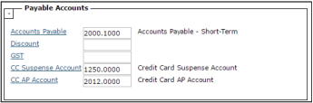

# Payable Accounts

Payable Accounts settings determine which G/L accounts Voyager uses for transactions and calculations associated with invoices and payments to vendors, owners, and other payees.

> **Note:**  
>   
> You must have previously set up your chart of accounts before completing the fields in this section. For more information, see _Chart of Accounts_ in the _Voyager Core Financials Setup Guide_.

Click the link to select an account, and then click **OK**. The account number and description appear in the field.

| **Field**                                       | **Description**                                                                                                                                                                                                                                                                                                                                                                                                                                                                                                        |
| ----------------------------------------------- | ---------------------------------------------------------------------------------------------------------------------------------------------------------------------------------------------------------------------------------------------------------------------------------------------------------------------------------------------------------------------------------------------------------------------------------------------------------------------------------------------------------------------- |
| **Accounts Payable**                            | Default payable offset account. Voyager requires this account for accrual accounting.   **Tip**: You can associate individual G/L accounts with different payable offset accounts by completing the **Payable** field on the **Account Info** screen. You can specify a different payable offset account on invoices by completing the **AP Acct** field in the **Offset** section of the **Payable** screen.                                                                                                  |
| **Discount**                                    | Account to which the **Process Checks** feature applies discounts for early payment of invoices.   **Note**: If you leave this field empty, Voyager records discounts as negative expense to the same G/L account used for the expense. For example, for a \$100 payable with a 5% discount for early payment, Voyager would create a \$100 expense and a \$5 negative expense. Discount setup is part of vendor setup; for more information, see _Vendor Setup_ in the _Voyager Core Financials Setup Guide_. |
| **GST**                                         | Account for Canadian GST (Goods and Services Tax).                                                                                                                                                                                                                                                                                                                                                                                                                                                                     |
| **CC Suspense Account**   **CC AP Account** | These fields only appear for US databases.   Accounts used to track invoices paid by credit cards. For more information, see _Invoices Paid by Credit Card_ in the _Core User’s Guide_.                                                                                                                                                                                                                                                                                                                        |
