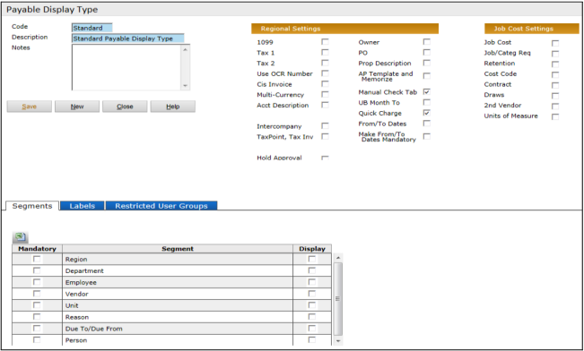
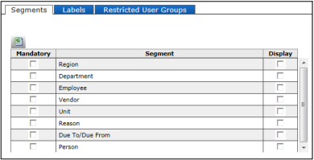
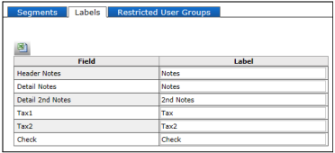
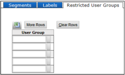

# Payable Display Types

**Payables > Add Payable Display Type**

Display Types are customized views of the **Payable** screen. Before you can enter payable invoices, you must have at least one payable display type in your database.

> **Note:**  
>   
> If you are upgrading from Voyager 6.0, a “standard” payable display type is added automatically to the database, so that you can create transactions immediately without having to set up display types.

Display types are associated with users. When a user opens the screen, the system remembers the last display type used by that user. The user can choose another display type as needed.

In the **Payable Display Type** screen, you name a display type, and you add optional elements as needed. The elements then appear on the **Payable Invoice** screen.

> **Note:**  
>   
> The **Utility Billing** tab appears on this screen if you have a license for it. (Utility Billing is a US feature, not applicable to Voyager International.)

---

## Regional Settings

| Setting                          | Description                                                                                                                                                                                                                                                                                                                                            |
| -------------------------------- | ------------------------------------------------------------------------------------------------------------------------------------------------------------------------------------------------------------------------------------------------------------------------------------------------------------------------------------------------------ |
| **1099**                         | Adds the 1099 check box to Payables. The 1099 form is used in the US for tax reporting.                                                                                                                                                                                                                                                                |
| **Tax 1**   **Tax 2**        | Add fields for first and second taxes.                                                                                                                                                                                                                                                                                                                 |
| **Use OCR Number**               | **Note**: This option requires the International module.  Adds an additional **OCR Number** field on payables. Used in conjunction with the **Use OCR Number** field on the **Country Information** screen.                                                                                                                                        |
| **CIS Invoice**                  | **Note**: This option requires the International module.  Adds the **CIS Info** tab. CIS is functionality designed for the UK.                                                                                                                                                                                                                     |
| **Multi-Currency**               | **Note**: This option requires the International module.  Select this check box to include currency fields on the screen: **Total Amount** (with select currency dropdown), **Base Amount**, **Exch Rate**, and **Exch Rate Date**.                                                                                                                |
| **Acct Description**             | Adds a column in the **Details** tab for account descriptions. When you select an account, Voyager displays the account description in addition to the account number.                                                                                                                                                                                 |
| **Notes 2**                      | Adds a second **Notes** field, typically used for notes in a second language.                                                                                                                                                                                                                                                                          |
| **Intercompany**                 | Adds the **Company** field, used for intercompany accounting.                                                                                                                                                                                                                                                                                          |
| **TaxPoint, Tax Inv**            | **Note**: This option requires the International module.  Adds fields for the taxpoint date and the tax invoice number.                                                                                                                                                                                                                            |
| **Owner**                        | **Note**: This option requires the International module.  Adds the **Owner** field (owner = legal entity). When you select a legal entity on the **Payable** screen, all properties selected in the **Details** tab must belong to that legal entity.                                                                                              |
| **PO**                           | Adds the **PO** field. When you select a PO (purchase order) on the **Payable** screen, the payable details are imported from the purchase order.                                                                                                                                                                                                      |
| **Prop Description**             | Displays the property description.                                                                                                                                                                                                                                                                                                                     |
| **AP Template and Memorize**     | Allows you to use AP Templates with payables.  Adds the **AP Template** field and the **Memorize** button to the **Payable** screen. For more information, see **AP Templates**.                                                                                                                                                                   |
| **Manual Check Tab**             | Adds the **Manual Check** tab, where you can enter information about a manual payment prior to posting the payable.  When you post, the payment information is recorded and the payable is considered “paid.”  If the payable has already been posted, you cannot use the **Manual Check** tab. In this case, use the Manual Payment function. |
| **UB Month To**                  | “UB” stands for “Utility Billing.”  **Note**: Utility Billing is a US feature, not applicable to Voyager International.                                                                                                                                                                                                                            |
| **Quick Charge**                 | Adds the **D** link to a posted payable (“D” stands for “Distribute”). This allows you to charge back the amount of the payable to tenants at a property.                                                                                                                                                                                              |
| **From/To Dates**                | Adds from/to date fields, for payables that affect a period. This is often used when it is necessary to specify the service period.                                                                                                                                                                                                                    |
| **Make From/To Dates Mandatory** | Makes the from/to date fields required fields.                                                                                                                                                                                                                                                                                                         |

---

## Job Cost Settings

If you have Voyager Construction Management, select those fields you want to display on the **Payable Invoice** screens:

| Setting              | Description                                                                                                                                                       |
| -------------------- | ----------------------------------------------------------------------------------------------------------------------------------------------------------------- |
| **Job Cost**         | Adds the **Job** and **Category** fields.                                                                                                                         |
| **Job/Categ Req.**   | If you selected **Job Cost** and you also want to make the **Job** and **Category** fields required, select this check box.                                       |
| **Retention**        | Adds the **Retention** and **Retention Account** fields.                                                                                                          |
| **Cost Code**        | Adds the **Cost Code** field (labeled **C**).                                                                                                                     |
| **Contract**         | Adds the **Contract** field and the **Load Contract** button.                                                                                                     |
| **Draws**            | Adds the **Draw Info** and **Draw Date** fields.                                                                                                                  |
| **2nd Vendor**       | Select this check box to display the **2nd Vendor** field. Useful for writing joint checks. Printed checks are made out to the primary vendor and the 2nd vendor. |
| **Units of Measure** | Adds a field for units of measure, used for unit-based accounting.                                                                                                |

---

## Segments Tab

You can add segment fields to the **Payable** screen and make them required fields (the user must enter a segment value to complete the payable).

> **Note:**  
>   
> Do not select the **Mandatory** check box if you use segment validation rules set up in System Administration.

---

## Labels Tab

In this tab, you can customize some of the field labels on the **Payable** screen.  
Type the customized version in the **Label** column.

---

## User Group Security Tab

Select the user groups that **should not** have access to the display type. By default, all groups have access.

> **Note:**  
>   
> This feature was designed this way (preventing access instead of granting access) to make transitioning easier. If the default was no access and you had to select each group that should have access, when you upgraded no user groups would have access to any display type.

---
