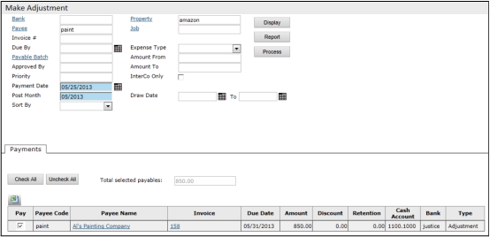

# Processing Adjustments

### To process adjustments

1. **On the side menu, select _Payables > Payments > Make Adjustment_.** The **Make Adjustment** screen appears.
   

2. **The top part of the screen is a filter.**  
   Use it to select the adjustments you want to process.

3. **Click _Display_.**  
   The **Payments** tab appears.

4. **Select the _Pay_ check boxes** for the adjustments that you want to process.

5. **If you want to preview the adjustments on the screen, click _Report_.**  
   The **Process Payments Report** appears.

6. **Click _Process_.**  
   Voyager processes the adjustments.
