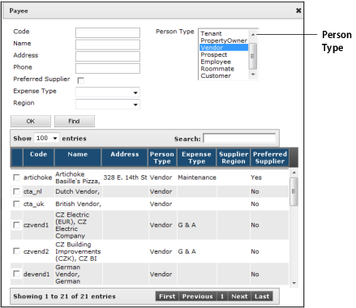
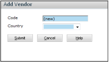
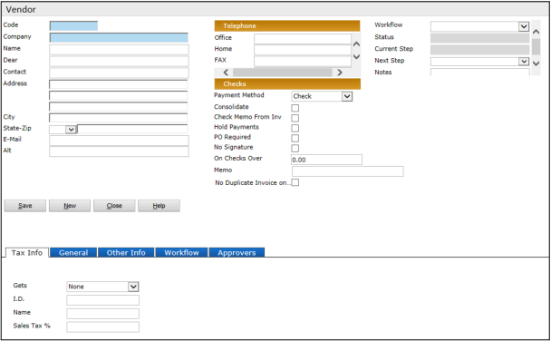
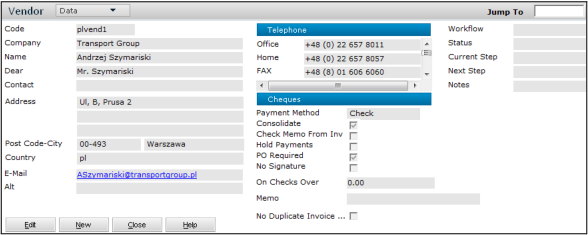
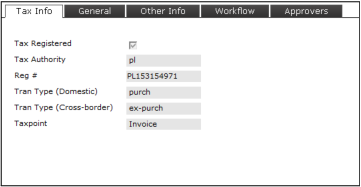
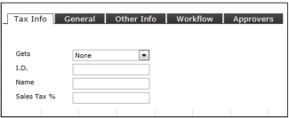
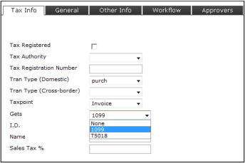
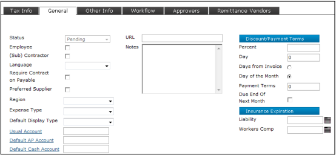
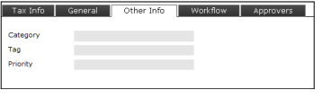

# Vendors

**Topics**

- Vendor Overview
- Vendor Setup
- _...additional topics will be added_

This section describes how to set up and maintain vendor records.

---

## Vendor Overview

Vendors are people and organizations that you pay for goods and services, for example, contractors, landscapers, and home improvement stores. Set up the property management company as a vendor if it receives commissions or other fees.

Before you can make a payment to a vendor, you have to set them up in the database and approve them.

### Paying Non-Vendors

Although you may occasionally pay legal entities, owners, employees, and tenants, do not add them as vendors; Voyager allows you to make payments to non-vendors.

When you enter a payable, you select a payee. The lookup defaults to vendors, but you can select any “person-type” record in the database.

Besides vendors, you can select:

- tenants
- property owners
- prospects
- employees
- roommates
- customers

---

## Vendor Setup

### To add a vendor

1. Select **Payables > Vendors > Add Vendor**. The **Add Vendor** filter appears.

   

   > **Note:**  
   >   
   > This filter appears only if you have done the setup for countries in your database and if you are logged in as a user. If you are logged in as DBO, it does not appear.

   If **Auto-Code Vendors** is selected in the **Accounts & Options** screen, the **Code** field displays (new) and Voyager generates the code after you complete the vendor record. The **Country** field determines the configuration of the address block (this field appears only for clients with a license for International).

2. Complete the screen and click **Submit**. The **Vendor** screen appears.

   

3. Complete the **Vendor** screen. The following sections describe each tab and section of the **Vendor** screen.

#### Top Section of the Vendor Screen

The following fields require explanation:

| **Field**                       | **Description**                                                                                                                                                                                                                                                                                                                                                                                                                                                                                                                                                                                                                                                                                                                                                                                                                                                                                                                                                                                                                                                                                                                                                                                                                                       |
| ------------------------------- | ----------------------------------------------------------------------------------------------------------------------------------------------------------------------------------------------------------------------------------------------------------------------------------------------------------------------------------------------------------------------------------------------------------------------------------------------------------------------------------------------------------------------------------------------------------------------------------------------------------------------------------------------------------------------------------------------------------------------------------------------------------------------------------------------------------------------------------------------------------------------------------------------------------------------------------------------------------------------------------------------------------------------------------------------------------------------------------------------------------------------------------------------------------------------------------------------------------------------------------------------------- |
| **Company**   **Name**      | Voyager uses the **Name** field followed by the **Company** field to form the payee name on payments.   For individuals, enter the first name in the **Name** field and the last name in the **Company** field. For example: **Name** = John, **Company** = Doe. Payee Name = John Doe.   For businesses, the **Name** field is optional. You can enter the entire payee name in the **Company** field, or you can split the payee name between the two fields.   For example, if the vendor’s name is The Ace Company, type **The** in the **Name** field and **Ace Company** in the **Company** field. The vendor name, The Ace Company, will be used on payments.   **NOTE** The Vendor filter searches for the contents of the **Company** field, not the **Name** field. If there is part of the name that you want to use in searches, be sure it is in the **Company** field. For example, if you will use “Ace” in searches, it should be entered in the **Company** field.   **NOTE** If you use Voyager to file 1099s electronically, punctuation should be avoided in the **Company** field. Punctuation can cause data misalignment in 1099 files generated for electronic submission to the IRS. |
| **Dear**                        | Type the text that should appear after the word **Dear** at the beginning of a letter. For example, if your contact is Patricia Smith, you might type **Ms. Smith** in the **Dear** field. If you are unsure of the appropriate courtesy title, you can type the name with no courtesy title (e.g., **Pat Smith**).   The **Dear** field is used in system-generated letters, for example, letters created by the **Correspondence** feature.                                                                                                                                                                                                                                                                                                                                                                                                                                                                                                                                                                                                                                                                                                                                                                                                 |
| **Payment Method**              | Select **Check** or **EFT**. Sets a default for payments to the vendor. (If needed, you can override the default when you create payables.)                                                                                                                                                                                                                                                                                                                                                                                                                                                                                                                                                                                                                                                                                                                                                                                                                                                                                                                                                                                                                                                                                                           |
| **Consolidate**                 | Specifies that multiple payables to the same vendor are paid with one payment. (This check box is selected by default, but not required.)                                                                                                                                                                                                                                                                                                                                                                                                                                                                                                                                                                                                                                                                                                                                                                                                                                                                                                                                                                                                                                                                                                             |
| **Check Memo from Inv**         | Select this check box if you want the memo on the check to come from the **Notes** field at the top of the **Payable Invoice** screen. If not selected, the memo on the check will come from the **Memo** field on the **Vendor** screen.                                                                                                                                                                                                                                                                                                                                                                                                                                                                                                                                                                                                                                                                                                                                                                                                                                                                                                                                                                                                             |
| **Hold Payments**               | Prevents processing a payment to this vendor.                                                                                                                                                                                                                                                                                                                                                                                                                                                                                                                                                                                                                                                                                                                                                                                                                                                                                                                                                                                                                                                                                                                                                                                                         |
| **PO Required**                 | Select this check box if you require purchase orders for payables to this vendor.                                                                                                                                                                                                                                                                                                                                                                                                                                                                                                                                                                                                                                                                                                                                                                                                                                                                                                                                                                                                                                                                                                                                                                     |
| **No Signature/On checks Over** | If you sign checks with a bitmap signature and you want to suppress the bitmap for checks over a certain amount, select the **No Signature** check box and type the highest amount for which a bitmap signature is permissible.                                                                                                                                                                                                                                                                                                                                                                                                                                                                                                                                                                                                                                                                                                                                                                                                                                                                                                                                                                                                                       |
| **No Duplicate Invoice**        | Select this check box if you want to prevent users from saving more than one payable with the same date and invoice number. For example, if there is an existing payable with an **Invoice Date** of 05/31/2011 and an **Invoice #** of 1234, and a user tries to save another payable with the same invoice date and invoice number, they will not be able to.   **NOTE** In addition to the vendor-level setting described above, there is a system-level setting to prevent duplicate invoice numbers (**Accounts and Options** screen > **Payable Opts** > **Error for Duplicate Invoice Number** check box).                                                                                                                                                                                                                                                                                                                                                                                                                                                                                                                                                                                                                             |

---

#### Tax Info Tab (Global, Region = All or UK)

| **Field**                    | **Description**                                                                                                                                                                                                                                                                                  |
| ---------------------------- | ------------------------------------------------------------------------------------------------------------------------------------------------------------------------------------------------------------------------------------------------------------------------------------------------ |
| **Tax Required**             | If selected, Voyager calculates tax on transactions involving this vendor.                                                                                                                                                                                                                       |
| **Tax Authority**            | The organization that receives the tax.                                                                                                                                                                                                                                                          |
| **Reg #**                    | The tax registration number of the vendor.   There are two permissions related to this field: - **Vendor Tax Registration Number** - **Vendor Tax Registration Number Modify**  The first allows you to mask the number, the second to restrict users from modifying it. |
| **Tran Type (Domestic)**     | The default transaction type for the vendor. The transaction types specify if the transaction is taxable or not.                                                                                                                                                                                 |
| **Tran Type (Cross border)** | For transactions between countries or Canadian provinces (i.e. for transactions where the vendor’s tax authority does not match the property’s tax authority).                                                                                                                                   |
| **Taxpoint**                 | When the tax is due.                                                                                                                                                                                                                                                                             |

For more information about taxation, see the **International User’s Guide**.  
The **Region** setting refers to the country where the vendor is located.

---

#### Tax Info Tab (US)

| **Field**       | **Description**                                                                                                                                                                                                                                                                                                                              |
| --------------- | -------------------------------------------------------------------------------------------------------------------------------------------------------------------------------------------------------------------------------------------------------------------------------------------------------------------------------------------- |
| **Gets**        | Select the type of tax document you are responsible for providing to the vendor: **None**, **1099 (U.S.)**, or **T5018 (Canada)**.                                                                                                                                                                                                           |
| **ID**          | Enter the vendor’s tax identification number.                                                                                                                                                                                                                                                                                                |
| **Name**        | If the vendor will receive a 1099, and the name that appears in the **Company** field at the top of the screen differs from the official taxpayer identification name, enter the official name here. Otherwise, leave this field blank.   The name in this field prints first on the 1099, before the name in the **Company** field. |
| **Sales Tax %** | No longer supported.                                                                                                                                                                                                                                                                                                                         |

---

#### Tax Info Tab (Global, Region = US or Canada)

If you have an International license, and the **Region** is set to US or Canada, the **Tax Info** tab shows both sets of fields — the global fields and the US fields.

This allows you to calculate taxes and designate the vendor for a 1099, or a T5018.

---

#### General Tab

| **Field**                                                                   | **Description**                                                                                                                                                                                                                                                                                                                                                                                                                                                                                                                                                                                                                                                                                                                                                                                                                                                                                                                                             |
| --------------------------------------------------------------------------- | ----------------------------------------------------------------------------------------------------------------------------------------------------------------------------------------------------------------------------------------------------------------------------------------------------------------------------------------------------------------------------------------------------------------------------------------------------------------------------------------------------------------------------------------------------------------------------------------------------------------------------------------------------------------------------------------------------------------------------------------------------------------------------------------------------------------------------------------------------------------------------------------------------------------------------------------------------------- |
| **Status**                                                                  | The status of the vendor.   If your vendors do not go through a workflow, select a status. If your vendors go through a workflow, this field is informational and contains a status based on the **Next Step** field. For more information, see **Vendor Records and Workflows**.   **Pending** — The default status for new vendors. The vendor has not been approved or rejected, and payables for this vendor cannot be added.   **Approved** — The vendor has been approved and payables for this vendor can be added.   **Rejected** — The vendor has been rejected and payables for this vendor cannot be added.   **Inactive** — This status is applicable if you have not set up vendor authorization. Select this for vendors you no longer use. Voyager removes the vendor code from lookup lists; however, the vendor will still appear on reports that include transactions prior to the inactive date. |
| **Employee**                                                                | Select this check box if this vendor is also an employee of your organization. This field is informational only.                                                                                                                                                                                                                                                                                                                                                                                                                                                                                                                                                                                                                                                                                                                                                                                                                                            |
| **(Sub) Contractor**                                                        | For clients using the Construction/Job Cost module, this setting marks the vendor as a subcontractor and allows you to set up default vendor retention.   In the UK, use this setting for CIS vendors. For information about CIS functionality, see the **International User’s Guide**.                                                                                                                                                                                                                                                                                                                                                                                                                                                                                                                                                                                                                                                             |
| **Expense Type**                                                            | Expense types are categories of expenses, for example, capital, construction, tenant improvements, repairs, and maintenance.   **Expense Type** is a required field on payable invoices. If you want the **Expense Type** field on payable invoices to default to a particular setting for this vendor, select it here.   **NOTE** Expense types are set up in Voyager System Administration. For more information, see **Payable Expense Types**.                                                                                                                                                                                                                                                                                                                                                                                                                                                                                          |
| **Default Display Type**                                                    | If you want the **Display Type** field on the **Invoice Register** screen to default to a particular display type for this vendor, select it here.                                                                                                                                                                                                                                                                                                                                                                                                                                                                                                                                                                                                                                                                                                                                                                                                          |
| **Usual Account**                                                           | If you want the **GL Account** field on the **Purchase Order** and **Payable Invoice** screens to default to a particular G/L account for this vendor, select that G/L account.   **NOTE** If you have Multiple Chart of Accounts (MCA), the **Usual Account** field does not appear.                                                                                                                                                                                                                                                                                                                                                                                                                                                                                                                                                                                                                                                               |
| **Default AP Account**   **Default Cash Account**                       | These fields only appear if you have an International license.   If you want the **AP Account** and **Cash Account** fields on the **Purchase Order** and **Payable Invoice** screens to default to particular accounts for this vendor, select those accounts.   Settings for accounts in this screen will override settings made at a higher level (property and system levels).   If you have Multiple Chart of Accounts (MCA), these fields do not appear.                                                                                                                                                                                                                                                                                                                                                                                                                                                                      |
| **Insurance Expiration Section**   **Liability**   **Workers Comp** | Enter the insurance expiration dates.   After the dates have passed (one or both), you cannot process payments to the vendor.                                                                                                                                                                                                                                                                                                                                                                                                                                                                                                                                                                                                                                                                                                                                                                                                                       |

For information on **Discounts/Payment Terms**, see **Vendor Discounts (US)** or **Vendor Discounts (Global)**.

---

#### Other Info Tab

This tab contains user-defined fields.  
You can set up these fields in Voyager System Administration. Go to **Admin > Environment > Vendor Fields**.

> **Note:**  
>   
> If you set up a **Category** field, you can use it as a criterion to auto-attach approval workflows to vendor records — the system will attach different workflows based on the vendor **Category**.

---
