# Commercial Move-In

## Table of Contents

1. [Overview](#overview)
2. [Task Navigation Table](#task-navigation-table)
3. [System and Property Level Setup](#system-and-property-level-setup)
4. [Setting Up Deposits](#setting-up-deposits)
5. [Creating Opening Charges](#creating-opening-charges)
6. [Tracking Security Deposit Charges](#tracking-security-deposit-charges)
7. [Deposit Increase Feature](#deposit-increase-feature)
8. [Quick Refunds](#quick-refunds)
9. [Letters of Credit](#letters-of-credit)
10. [Bank Guarantees](#bank-guarantees)

## Overview

### Security Deposits and Opening Charges

A security deposit provides monetary security to the landlord, in case of damage to the unit or failure by the tenant to comply with the agreement. The deposit is returned, minus any deductions for repairs, cleaning, or restoration. The deposit is typically returned at the end of the lease, though in some cases it is returned earlier.

In Voyager, security deposits are typically charged to tenants by using the Opening Charges feature. They are refunded by using either the Quick Refund feature or the Move-Out Accounting feature.

Opening charges consist of required security deposits and prorated amounts of the first period’s regular charges.

> **Note:** Commercial Billing (US) or Periodic Invoicing (International) will also include prorated amounts of the initial rent charges, but to bill security deposits, you must use the Opening Charges feature.

The following graphic shows how to set up and use security deposits in Voyager.

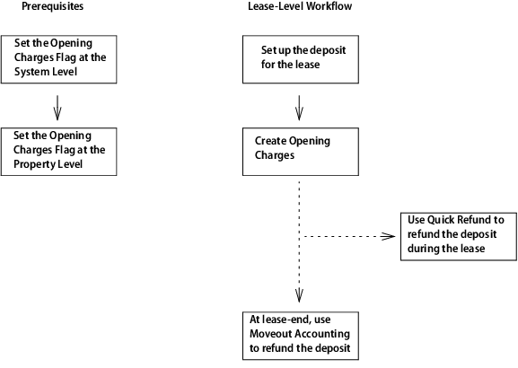

### Security Deposits and Escrow (Holding) Accounts

Some states or regions require that you keep security deposits in an escrow (or holding) account. If your organization uses an escrow account for deposits, deposit the entire amount of the deposit into the account. Then, during move-out, transfer the entire amount to your operating account. In general, you should not make multiple payments from the escrow account for a single deposit; instead, transfer the entire deposit to the operating account and make payments from that account.

Then, during move-out, Voyager will transfer the security deposit to the Operating account automatically for processing. How the transfer occurs is defined by the Move-out Transfer field on the Accounts & Options screen. For more information, see the Core Administration Guide.

### Letters of Credit

A letter of credit is issued by a bank to guarantee a client's ability to pay the lease. A letter of credit is often used instead of a security deposit. In Voyager you can track letters of credit, but there are no charges associated with them. The Letters of Credit feature was designed for US clients.

### Bank Guarantees

A bank guarantee is similar to a letter of credit—it is issued by a bank and guarantees its client’s ability to pay the lease. In Voyager, a bank guarantee can be indexed. The Bank Guarantee feature was designed for non-US clients.

## Task Navigation Table

| Task                                     | Navigation                                                                                |
| ---------------------------------------- | ----------------------------------------------------------------------------------------- |
| System level setup for Opening Charges   | Setup > Commercial Setup > System Configuration                                           |
| Property level setup for Opening Charges | Setup > Property > Property Configuration > Commercial                                    |
| Set Up Deposits                          | Amendment screen > Links menu > Deposit link > Deposit Summary screen > New Record button |
| Create Opening Charges                   | Lease screen > Links menu > Opening Charges link                                          |
| Track Security Deposit Charges           | Lease screen > Summary tab > Deposits Required link                                       |
| Quick Refunds                            | Lease Administration > Deposits > Quick Refund                                            |
| Track Letters of Credit                  | Lease screen > Links menu > Letter of Credit link                                         |
| Track Bank Guarantees                    | Lease screen > Links menu > Bank Guarantee link                                           |
| Index Bank Guarantees                    | Charges > Indexation > Process Bank Guarantee Indexation                                  |

... (Rest of the document remains unchanged)

# Move-In Navigation

## Task Navigation Table

| Task                                     | Navigation                                                                                |
| ---------------------------------------- | ----------------------------------------------------------------------------------------- |
| System level setup for Opening Charges   | Setup > Commercial Setup > System Configuration                                           |
| Property level setup for Opening Charges | Setup > Property > Property Configuration > Commercial                                    |
| Set Up Deposits                          | Amendment screen > Links menu > Deposit link > Deposit Summary screen > New Record button |
| Create Opening Charges                   | Lease screen > Links menu > Opening Charges link                                          |
| Track Security Deposit Charges           | Lease screen > Summary tab > Deposits Required link                                       |
| Quick Refunds                            | Lease Administration > Deposits > Quick Refund                                            |
| Track Letters of Credit                  | Lease screen > Links menu > Letter of Credit link                                         |
| Track Bank Guarantees                    | Lease screen > Links menu > Bank Guarantee link                                           |
| Index Bank Guarantees                    | Charges > Indexation > Process Bank Guarantee Indexation                                  |

## System and Property Level Setup

Voyager has two checkboxes for the Opening Charges feature—one at the system level and one at the property level. The checkbox at the system level sets a default for all the properties in the database. The checkbox at the property level determines if you can use opening charges for a specific property.

## Setting Up Deposits

You set up a required deposit when you set up the original lease amendment or any other subsequent amendments. This step does not create a charge for the deposit; you create the charge when you run the Opening Charges feature after the lease has been activated.

### To set up a required deposit

1. Open the appropriate amendment record.
2. In the Links menu, select Deposit. The Deposit Summary screen appears.

   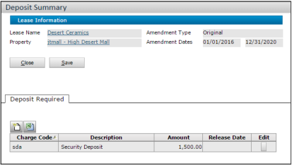

3. Click the **New Record** button . The New Deposit screen appears.

   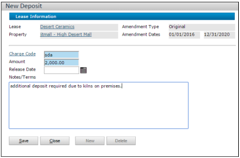

4. Complete the screen.

   - The **Release Date** is the day you will refund the deposit. This field is informational.
   - After the release date has passed, Voyager assumes you have refunded the deposit. The deposit is no longer displayed on the Summary tab of the Lease screen.

## Creating Opening Charges

Opening charges consist of security deposits plus prorated amounts of the first month's regular charges. You can create opening charges after the original lease amendment has been activated.

### To create opening charges

1. Open the appropriate lease record.
2. In the **Links** menu, click the **Opening Charges** link. The Opening Charges screen appears.

   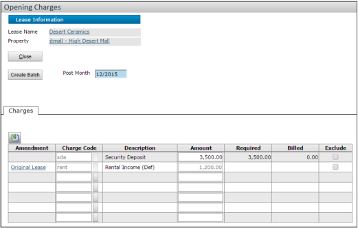

   If the **Opening Charges** link does not appear, check the **Require Opening Charges** setting at the system and property levels.

   

3. Review the charges displayed on the screen.
4. Select the **Exclude** checkbox for any charge you want to remove. If needed, you can edit the security deposit amount or add additional charges.
5. Click the **Create Batch** button.

   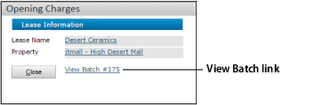

## Tracking Security Deposit Charges

**Navigation:** Lease screen > Summary tab > Deposits links (Deposits Required, Deposits Billed, or Deposits Received)

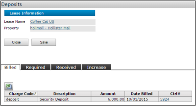

You can track deposits that are required, billed, and/or received.

## Deposit Increase Feature

If a lease agreement states that a tenant’s security deposit will increase over time in relation to increases in rent, Voyager can calculate and create a charge for the new security deposit.

### To set up the deposit increase

1. Open the lease record.
2. In the **Summary** tab, click one of the **Deposit** links. The **Deposits** screen opens.
3. Click the **Increase** tab.

   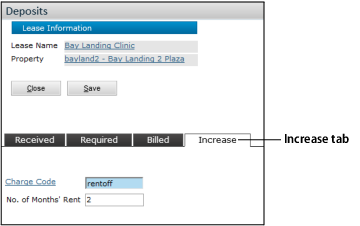

4. Enter the appropriate charge code and the number of months used to calculate the deposit.

### To run the increase function

1. Select **Lease Administration > Deposits > Deposit Increase**. The **Deposit Increase** screen appears.

   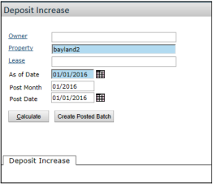

2. Complete the top part of the screen.
3. Click **Calculate**. Voyager displays the matching leases.

   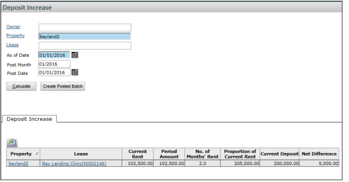

4. Click **Create Posted Batch**.

## Quick Refunds

Use the **Quick Refund** feature to refund security deposit credits, prepayments, or credit charges (negative charges).

### To create a quick refund

1. Select **Lease Administration > Deposits > Quick Refund**.
2. Complete the filter and click **Submit**. The **Quick Refund** screen appears.

   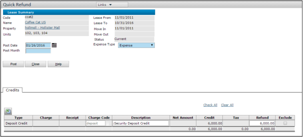

3. Enter the **Post Date** and **Post Month** and select an **Expense Type**.
4. You can exclude any credits you do not want to refund or change the refund amount.
5. Click **Post**.

## Letters of Credit

The **Letter of Credit (LOC)** feature enables you to track multiple letters of credit, including bank, amount, terms, draws, and paydown information.

### To enter letter of credit information

1. On the **Lease** screen, click **Letter of Credit** in the **Links** menu. The **LOC Summary** screen appears.

   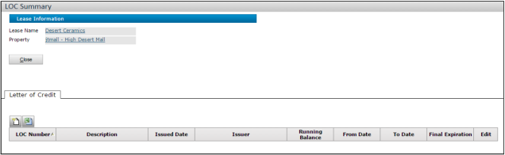

2. Click the **New Record** button . The **Letter of Credit** screen appears.

   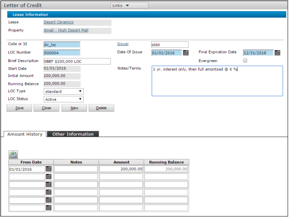

3. Complete the screen.

## Bank Guarantees

A **bank guarantee** is a guarantee from a lending institution ensuring that the liabilities of a debtor will be met.

### To enter bank guarantee information

1. On the **Lease** screen, click **Bank Guarantee** in the **Links** menu. The **Bank Guarantee Summary** screen appears.

   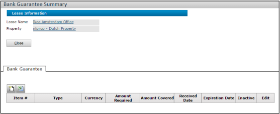

2. Click the **New Record** button . The **Bank Guarantee Detail** screen appears.

   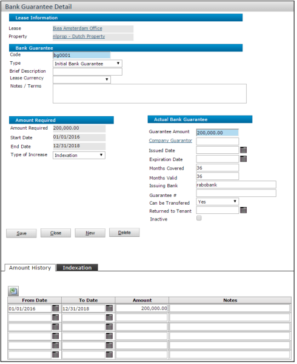

3. Complete the **Bank Guarantee** section of the screen.
4. Complete at least one line in the **Amount History** table.
5. Complete the **Type of Increase** field.
6. Complete the **Actual Bank Guarantee** section of the screen.
7. To index the amount required, complete the **Indexation** tab.

   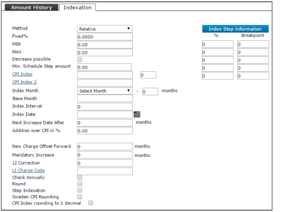

### Running Indexation for Bank Guarantees

**Navigation:** Charges > Indexation > Process Bank Guarantee Indexation

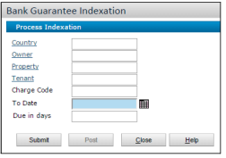

This function changes the amount of the bank guarantee but does not produce charges.

---

This document provides step-by-step navigation and setup instructions for managing move-in processes in Voyager.
