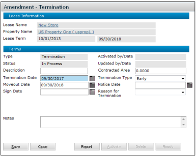
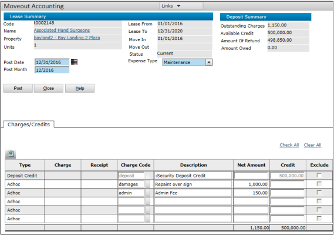
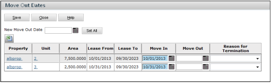

# Commercial Move-Out

## Topics

- [Move-Out Overview](#move-out-overview)
- [Move-Out Navigation](#move-out-navigation)
- [Termination Amendments](#termination-amendments)
- [Move-Out Accounting](#move-out-accounting)
- [Entering Move-Out Dates](#entering-move-out-dates)
- [Commercial Billing and Lease Status](#commercial-billing-and-lease-status)

---

## Move-Out Overview

In Voyager, there are three different ways to handle move-out:

- **Normal Lease End**: Use a termination amendment to enter the move-out date and change the lease status to **Past**. Billing stops.
- **Early Termination**: Use a termination amendment to adjust the lease-end date, enter the move-out date, and mark the lease as **Past**. Billing stops.
- **Go Dark** (tenant stops operating but continues paying rent): Use the **Move-Out Dates** function to enter a new move-out date. The unit becomes available, but billing continues until the lease-end date.

### Termination Amendment vs. Move-Out Dates Function

- **Move-Out Dates**: Only updates the move-out date on the lease.
- **Termination Amendment**: Updates the move-out date, lease-end date (if needed), and sets lease status to **Past**.

### Move-Out Accounting

Use the **Move-Out Accounting** function to reconcile credits and charges when a tenant leaves. It is independent of lease status and does **not** require a termination amendment.

### Mid-Year Expense Reconciliation

You can perform a **mid-year reconciliation** of recovery estimate charges against actual expenses when a tenant leaves mid-period.

> See documentation on **Recoveries** or **Service Charges** for details.

### Move-Out and Straight-Lining

If a lease is straight-lined and terminates early, you must write off the straight-line balance.

> See the “Early Termination” chapter in the _Straight-Line Best Practices Guide_ and _Straight-lining Rents_ documentation.

---

## Move-Out Navigation

| Task                        | Navigation                                                      |
| --------------------------- | --------------------------------------------------------------- |
| Add a Termination Amendment | Lease screen > Amendments tab > New Record button > Termination |
| Perform Move-out Accounting | Lease Administration > Deposits > Move-out Accounting           |
| Enter Move-Out Dates        | Lease screen > Links menu > Move-Out Dates                      |

---

## Termination Amendments

### To set up a termination amendment:

1. Open the appropriate lease record.
2. On the **Amendments** tab, click the **New Record** button.  
   
3. In the popup, select **Termination**. The _Amendment - Termination_ screen appears.  
   
4. Complete the screen.  
   _(Termination Reason options are user-defined. See "Reason for Termination Tab")_

#### After Activating a Termination Amendment

- The lease status becomes **Past**.
- If the tenant status changes later, you can:
  - Create a **holdover amendment** (tenant stays).
  - Create another **termination amendment** (tenant leaves earlier).

---

## Move-Out Accounting

Move-out accounting reconciles charges/credits for the tenant.

- Automatically creates a **refund payable** if needed.
- You can add ad hoc charges (e.g., cleaning fees).
- Can be performed **any time**, regardless of lease status.

### To perform move-out accounting:

1. Go to **Lease Administration > Deposits > Move-out Accounting**.
2. Complete the filter and click **Submit**.  
   
3. Complete **Post Month** and **Post Date** fields.
4. Exclude or add charges as needed.
5. Click **Post**.

> If there’s a credit, Voyager creates a payable and posts it to the general ledger. Process it through standard payable procedures.

---

## Entering Move-Out Dates

Use this function if a tenant vacates early (e.g., "goes dark").

- Unit is marked as **available**.
- Billing **continues** until a **termination amendment** is posted.
- If both lease-end and move-out dates are in the past, lease status becomes **Past**.

>   
> Changing move-out date on a **terminated lease** does _not_ reactivate it.

### To change move-out dates:

1. Open the lease record.
2. On the **Links** menu, select **Move-Out Dates**.  
   

#### For all units:

a. Enter date in **New Move-Out Date** field  
b. Click **Set All**

#### For individual unit:

a. Locate the unit  
b. Enter date in its **Move-Out** field

---

## Commercial Billing and Lease Status

Describes how Commercial Billing interacts with lease-end dates and statuses.

>   
> Commercial Billing is used by **US clients**. Others use **Invoicing (Global)**.

### Commercial Billing Rules

- **If lease status is Past**: No charges created.
- **If lease status is not Past**:
  - **Current schedule dates** → Charges created
  - **Past dates** → No charges. If lease end & move-out are past, status becomes **Past**
  - **Future dates** → No charges. No status changes
