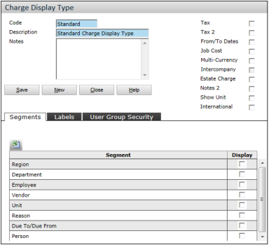
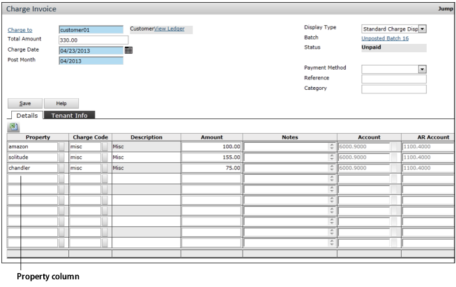
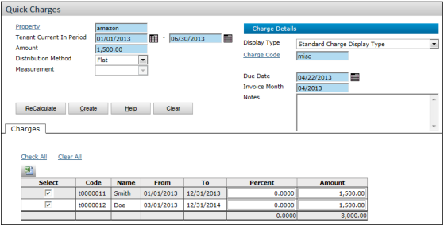
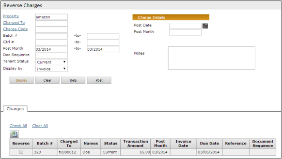

# Table of Contents

- [Charges](#charges)
  - [Overview](#overview)
  - [Charge Display Types](#charge-display-types)
  - [Creating Charge Batches](#creating-charge-batches)
  - [Reviewing and Editing Charges](#reviewing-and-editing-charges)
  - [Finding Charge Batches](#finding-charge-batches)
  - [Quick Charges](#quick-charges)
  - [Reversing Charges](#reversing-charges)
  - [Merging Charge Batches](#merging-charge-batches)
  - [Write-Offs (US)](#write-offs-us)
  - [Charge Adjustments (Global)](#charge-adjustments-global)

---

# Charges

## Overview

This chapter describes ad hoc charges, quick charges, and ways to change or adjust charges and charge batches.

### Recurring Charges

Recurring charges are created by three features:

- **Monthly Posting**: Used by US residential clients
- **Commercial Billing**: Used by US commercial clients
- **Periodic Invoicing**: Used by global clients (non-US)

For information on these features, see the relevant user guide.

### Charge Batches

Charges are always created in batches with three levels:  
**Charge Batch > Charge Invoice > Charge**  
(A Charge Invoice groups charges with a single invoice number.)

  
_How charges and receipts affect G/L accounts in accrual and cash accounting._

---

## Charge Display Types

Customized views of the Charge screen. At least one display type must exist in your database.

> **Note:** Voyager 6.0+ automatically adds a "standard" display type for immediate use.

### Display Type Configuration

| Field                   | Description                                                    |
| ----------------------- | -------------------------------------------------------------- |
| **Tax/Tax 2**           | Adds tax fields (requires International module).               |
| **From/To Dates**       | Adds date fields (mandatory for UK/All regions).               |
| **Job Cost**            | Adds Job Cost fields (requires Job Cost module).               |
| **Multi-Currency**      | Adds non-base currency fields (requires International module). |
| **Estate Charge**       | Replaces Property field with Estate (group of properties).     |
| **Show Unit**           | Adds Unit column (Condo module only).                          |
| **Segments**            | Select segments to display.                                    |
| **Labels**              | Customize tax labels (e.g., "HST" for Canada).                 |
| **User Group Security** | Restrict access by user group.                                 |

### Example Display Type (Job Cost)

### System-Generated Charges

Most charges are created automatically (e.g., Monthly Posting). Voyager dynamically displays relevant fields for these charges.

---

## Creating Charge Batches

**Structure:**  
  
_Charge Batch > Charge Invoice > Charge_

### To Create an Ad Hoc Charge Batch

1. Navigate to **Charges > Create Detail Batch**.  
   
2. Complete batch header (Total Declared/Items Declared act as controls).
3. Click **New Record**  to open the Charge Invoice screen.  
   
4. Select **Display Type** (change before entering data).
5. Complete **Charge To**, **Property**, and **Unit** fields.
6. Enter charges in Details grid:
   - Select **Charge Code** and enter **Amount** (tax auto-calculated).
   - Click **Save** after each entry.
7. Adjust **Total Declared/Items Declared** if needed, then **Post**.

### Customer Charge Invoices

  
_Multi-property charges require matching currencies._

> **Note:** For multiple currencies, an International license is required.

---

## Reviewing and Editing Charges

### To Review/Edit Charges

1. Navigate to **Charges > Review Charge**.  
   
2. Complete filter and submit.
3. Edit charges in the **Charge Invoice** screen.

---

## Finding Charge Batches

### To Find Batches

1. Navigate to **Charges > Find Charge Batches**.  
   
2. Filter by:
   - **Batch Type**: Open/Empty/All
   - Other criteria (Property, Date Range, etc.)
3. Click **Find** and sort results by column.  
   
4. Click **Edit** to view batch details.  
   

---

## Quick Charges

### To Create Quick Charges

1. Navigate to **Charges > Create Quick Charges**.  
   
2. Configure:
   - **Property** and **Tenant Current In Period**
   - **Amount** and **Distribution Method** (Even/Flat/Prorated/None)
3. Click **Display** to preview.  
   
4. Adjust amounts/percentages and **Post**.

### Distribution Examples

- **Even**:  
  
- **Flat**:  
  
- **Prorated**:  
  
- **None**:  
  

### Payable Integration

  
_Link Quick Charges to Payables for direct distribution._  
  
_Posted charges reference the payable control number._

---

## Reversing Charges

### Open Period Reversals

1. Navigate to **Charges > Reverse Charges (Open Period)**.  
   
2. Filter charges/invoices and select items.  
   
3. Enter **Post Date/Month** and click **Post**.  
   _Voyager creates negative charges and zero receipts._  
   

### Closed Period Reversals

Process identical to Open Period, but includes closed periods.  

---

## Merging Charge Batches

### To Merge Batches

1. Find batches via **Charges > Find Charge Batch**.  
   
2. Edit the target batch and click **Add Batch**.  
   
3. Select batches to merge and save.  
   

---

## Write-Offs (US)

### Setup

- **G/L Account**: Create a bad debt expense account.  
  
- **Charge Code**: Link to bad debt account.  
  

### To Create Write-Off Batch

1. Navigate to **Charges > Write Off Charges**.  
   
2. Filter charges and select items.  
   
3. Select **Write Off Code** and post.  
   _Generates reversing charges and receipts._  
   

---

## Charge Adjustments (Global)

_Use standard charge reversal/editing tools for global adjustments._
