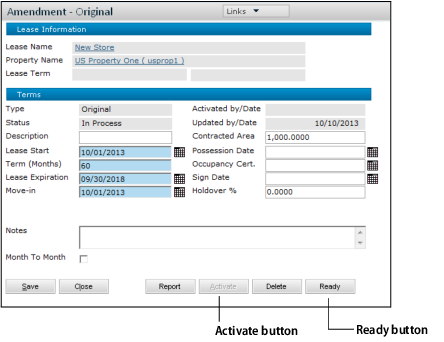
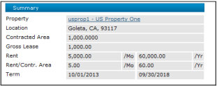

# Leases (US)

## Content:

- [Leases (US)](#leases-us)
  - [Content:](#content)
  - [Leases Overview](#leases-overview)
  - [Leases Navigation](#leases-navigation)
  - [Adding a Lease Record](#adding-a-lease-record)
  - [Activating Lease Amendments](#activating-lease-amendments)
    - [To activate a lease amendment](#to-activate-a-lease-amendment)
    - [Permissions for Lease Activation](#permissions-for-lease-activation)
  - [Viewing Lease Agreements](#viewing-lease-agreements)
    - [Summary Section](#summary-section)

This chapter describes how to set up a lease, add the original lease amendment, and activate the lease.

Lease screens vary according to the Region setting in the Country Information screen. This chapter applies to the US region.

## Leases Overview

A lease record contains all the details of a lease: information about the tenant, the space rented, the charge schedules, options, clauses, and so on.

Voyager lease records have the following structure:

The Lease screen is the central lease record, with a series of amendments attached to it. Lease details are stored at the Amendment level. The starting terms of the lease are stored in the “original amendment” record; changes are stored in additional amendment records. The Lease Information screen contains general information about the lease.

The Amendment screen has a set of tabs for lease details: units, rent charges, recovery setup, and so on.

## Leases Navigation

| Task                       | Navigation                                   |
| -------------------------- | -------------------------------------------- |
| Add Lease                  | Lease Administration > Leases > Add Lease    |
| Review Lease/Approve Lease | Lease Administration > Leases > Review Lease |

## Adding a Lease Record

To add a lease record, you complete multiple screens and tabs in Voyager, as shown in the following diagram:

> You can complete the tabs in the Amendment screen in any order, but if charges are based on unit area, you should complete the Units tab first.

Each screen and tab is described below.

## Activating Lease Amendments

You must activate an amendment before lease charges can be posted.

> After a lease amendment is activated, most users will not be able to modify it. Only users with appropriate permissions can modify activated amendments.

Activating a lease amendment typically involves two users.

### To activate a lease amendment

1.  First user:
    a. On the Amendment screen, click the Ready button. This is a signal that the lease is ready to be activated.
    The label on the Ready button changes to Edit, and the amendment status changes to Ready. In this status, the amendment cannot be modified.
    If you need to change the amendment, click the Edit button to change the status back to In Process.
    b. Contact the user who will activate the lease.
2.  Second user:
    a. On the Amendment screen, click the Report button. The Lease Abstract report appears. Use it to check the information in the lease record.
    If there is a problem with the lease, the second user can click the Edit button. This takes the lease back to the In Process status.
    b. Click Activate. The lease status changes to Activated.

### Permissions for Lease Activation

The following permissions apply to lease activation.

- Report button: No specific permission.
- Ready button: Commercial: Ready Amendment.
- Activate button: Commercial: Activate Amendments.
- Ability to modify an activated amendment: Commercial: Edit Active Amendment.

You can use the permissions separate the different functions. For example, the user group that creates lease records would be able to click the Ready button but not the Activate button.

## Viewing Lease Agreements

Before activation, a lease record displays a limited number of tabs, typically Amendments, Contacts, and General Info.

The General Info is optional. For more information, see General Info Tab.

After you activate the first lease amendment, the complete tab set appears.

At activation, the New Record button  becomes a view options button . When you click the view options button, you may get a list of options.

These are the tabs that offer multiple view options:

| Tab              | View Options                                                                                                          |
| ---------------- | --------------------------------------------------------------------------------------------------------------------- |
| Units            | Current, Future, Current and Future, Past, and All.                                                                   |
| Charge Schedules | Current, Future, Current and Future, Past, and All.                                                                   |
| Recovery         | Current, Future, Current and Future, Past, and All. The Recovery tab only appears if the lease type is set up as Net. |
| Amendments       | Current, Future, Current and Future, Past, and All.                                                                   |
| Options          | Active, Exercised, Declined, Expired, Canceled, and All.                                                              |

### Summary Section

The Summary section displays general information about the lease.

The Contracted Area figure comes from the active amendment(s). The figure comes from the sum of the units assigned to the lease amendments, unless you change the contracted area amount at the amendment level.

The label below Contracted Area (in this case, Gross Lease) is the label on the first column in the area table. (Area labels are set up at the system level.)
