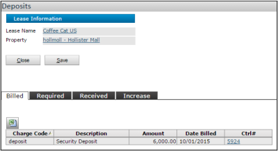

# Yardi Voyager (US) Move-In Process SOP for Accounts Receivable

## Table of Contents

- [Yardi Voyager (US) Move-In Process SOP for Accounts Receivable](#yardi-voyager-us-move-in-process-sop-for-accounts-receivable)
  - [Table of Contents](#table-of-contents)
  - [System and Property Level Setup](#system-and-property-level-setup)
  - [Assigning Units (Residential)](#assigning-units-residential)
  - [Setting Up Deposits (Commercial)](#setting-up-deposits-commercial)
  - [Creating Opening Charges (Commercial)](#creating-opening-charges-commercial)
  - [Adjusting Move-In Dates (Residential)](#adjusting-move-in-dates-residential)
  - [Posting Move-Ins (Residential)](#posting-move-ins-residential)
  - [Tracking Security Deposits (Commercial)](#tracking-security-deposits-commercial)
  - [Quick Refunds (Commercial)](#quick-refunds-commercial)

---

## System and Property Level Setup

**Purpose**: Enable Opening Charges functionality for security deposits and prorated charges.  
**Navigation**:

- **System Level**: `Setup > Commercial Setup > System Configuration`
- **Property Level**: `Setup > Property > Property Configuration > Commercial`

> **Note**: Ensure the **Require Opening Charges** checkbox is enabled at both levels.

---

## Assigning Units (Residential)

**Purpose**: Assign a future resident to a unit and update lease terms.  
**Navigation**:

1. On the dashboard, click **Person Search** > Search for the resident.
2. Open the resident record > **Functions** menu > **Assign Unit**.

  
**Steps**:

- Select **New Unit**, update **Lease-From Date**, **Term**, **Move-In Date**, and **Lease-To Date**.
- Click **Post** to save changes.

---

## Setting Up Deposits (Commercial)

**Purpose**: Define required security deposits for a lease amendment.  
**Navigation**:

1. Open the lease amendment > **Links** menu > **Deposit** > **Deposit Summary** screen.
2. Click **New Record** to define deposit details.

  
**Key Fields**:

- **Release Date**: Date for refunding the deposit (informational).
- **Amount**: Deposit value.

---

## Creating Opening Charges (Commercial)

**Purpose**: Generate charges for security deposits and prorated rent.  
**Navigation**:

1. Open the lease record > **Links** menu > **Opening Charges**.
2. Review charges, exclude/edit as needed > Click **Create Batch**.

> **Note**: Ensure the lease amendment is activated first.

---

## Adjusting Move-In Dates (Residential)

**Purpose**: Modify a resident’s move-in date without posting the move-in.  
**Navigation**:

1. Dashboard > **Resident Activity** > Click **Move In** number.
2. Click **Adjust Dates** for the resident > Update **Move-In Date** and lease terms.

  
**Key Fields**:

- **Move-In Date**: New occupancy date.
- **Lease-To Date**: Automatically calculated based on term.

---

## Posting Move-Ins (Residential)

**Purpose**: Finalize the resident’s move-in and trigger billing.  
**Navigation**:

1. Dashboard > **Resident Activity** > Click **Move In** number.
2. Select the resident > Complete **Move-In Screen** > Click **Post**.

  
**Key Fields**:

- **Move-In Date**: Actual occupancy date.
- **Lease-From/To Dates**: Billing period for rent.

**Batch Move-Ins**:  
Navigate to `Residents > Move-In Functions > Add Move-In Batch` to process multiple residents.

---

## Tracking Security Deposits (Commercial)

**Purpose**: Monitor deposit status (required, billed, received).  
**Navigation**:

1. Lease record > **Summary** tab > **Deposits Required/Deposits Billed/Deposits Received**.

**Deposit Increases**:

- Navigate to **Deposits** screen > **Increase** tab to configure automatic deposit adjustments.

---

## Quick Refunds (Commercial)

**Purpose**: Refund security deposits or credits.  
**Navigation**:

1. `Lease Administration > Deposits > Quick Refund`.
2. Filter residents > Enter **Post Date** and **Expense Type** > Click **Post**.

---

**End of SOP**
