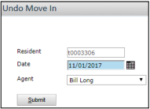

# Table of Contents

- [Move-Ins and Transfers Overview](#move-ins-and-transfers-overview)
- [Move-Ins and Transfers Navigation](#move-ins-and-transfers-navigation)
- [Move-In Procedures](#move-in-procedures)
  - [Assigning Units](#assigning-units)
  - [Adjusting Move-In Dates](#adjusting-move-in-dates)
  - [Canceling Move-Ins](#canceling-move-ins)
  - [Posting Move-Ins](#posting-move-ins)
  - [Posting Move-In Batches](#posting-move-in-batches)
  - [Reviewing, Editing, and Deleting Move-In Batches](#reviewing-editing-and-deleting-move-in-batches)
  - [Reversing Move-Ins](#reversing-move-ins)
- [Transfer Procedures](#transfer-procedures)
  - [Processing Transfers](#processing-transfers)
  - [Reviewing, Editing, and Canceling Unposted Transfers](#reviewing-editing-and-canceling-unposted-transfers)

---

# Move-Ins and Transfers Overview

After you execute an applicant's lease, the prospect becomes a future resident. When the resident is ready to occupy the unit, you must post a move-in for the resident. You can post move-ins for one or more residents at a time. Once you post a resident's move-in, the resident becomes a current resident.

If a current resident wants to move into a different unit, you can transfer the resident. A transfer copies a resident's information to a new record associated with a new unit.

---

# Move-Ins and Transfers Navigation

| Task                                    | Navigation                                           |
| --------------------------------------- | ---------------------------------------------------- |
| Post a move-in batch                    | Residents > Move-In Functions > Add Move-In Batch    |
| Review, edit, or delete a move-in batch | Residents > Move-In Functions > Review Move-In Batch |
| Process a transfer                      | Residents > Transfer Unit                            |

---

# Move-In Procedures

**Topics**

- Assigning Units
- Adjusting Move-In Dates
- Canceling Move-Ins
- Posting Move-Ins
- Posting Move-In Batches
- Reviewing, Editing, and Deleting Move-In Batches
- Reversing Move-Ins

This section describes how to move residents into units.  
There are two methods by which you can post move-ins for residents: move-ins and move-in batches. Move-ins are for one resident only. Move-in batches are for multiple residents across properties.

---

## Assigning Units

> **Note:** This procedure describes how to perform a task starting from the dashboard. You can perform the task starting from the side menu, but the navigation differs. To follow the procedure exactly, start from the dashboard.

If a future resident's unit is no longer available, or if the resident wants to move into a different unit at the same property, you can assign the resident to a different unit. When you do this, Voyager removes the resident's leasing specials, changes the resident's monthly rent amount to that of the new unit's market-rent amount, and updates the appropriate resident and resident history records.

> **Note:** Perform this procedure only for future residents. If you want to change a current resident's unit, you must transfer the resident. For more information, see Processing Transfers.

### To assign a future resident to a different unit

1. On the dashboard, click the **Person Search** tab.  
   
2. Complete the tab, as needed.
3. Click **Search**. A table of matching people appears to the right of the tab.
4. Click the name of the resident that you want to assign to a new unit. The **Resident** screen appears.
5. On the **Functions** menu, click **Assign Unit**. The **Assign Unit** screen appears.
6. If a warning message appears, notifying you that leasing specials will be removed, click **OK**.
7. Complete the screen. For field descriptions, see **Assign Unit Screen Reference**.
8. Click **Post**.

**Assign Unit Screen Reference**  

| Field              | Description                                                             |
| ------------------ | ----------------------------------------------------------------------- |
| New Unit           | New unit to assign the future resident.                                 |
| Lease-From Date    | Date the lease begins (default: expected move-in date).                 |
| Term (# of months) | Number of months in the lease term.                                     |
| Lease-To Date      | Date the lease expires (based on property setup).                       |
| Move-In Date       | Date the resident moves into the unit (default: expected move-in date). |

---

## Adjusting Move-In Dates

> **Note:** This procedure describes how to perform a task starting from the dashboard. You can perform the task starting from the side menu, but the navigation differs. To follow the procedure exactly, start from the dashboard.

If a resident wants to move into a unit later or earlier than expected, you can adjust the resident's move-in date. When you do this, Voyager changes the resident's move-in date to the new date and updates the appropriate resident and resident history records.

Perform this procedure if you want to record a new move-in date without posting a move-in for the resident. You can perform this procedure only for future residents.

> **Note:** If you have selected the Insurance Required for Move-in check box, you can adjust the move-in date only if the resident's renters insurance policy is active for this date.

> **Note:** If your property uses the Lease Ready Process, a warning message appears when you reopen the Move-In screens if move-in dates are adjusted.

### To adjust a future resident's move-in date

1. In the **Resident Activity** section on the dashboard, click the number next to **Move In**.  
   
2. Click the **Adjust Dates** button for the relevant resident.
3. Complete the **Adjust Move-In Dates** screen.
4. Click **Post**.

**Adjust Move-In Dates Screen Reference**  

| Field              | Description                                  |
| ------------------ | -------------------------------------------- |
| Move-In Date       | New move-in date for the resident.           |
| Lease-From Date    | Updated lease start date.                    |
| Term (# of months) | Number of months in the lease term.          |
| Lease-To Date      | Updated lease expiration date.               |
| Agent              | Name of the agent performing the adjustment. |

---

## Canceling Move-Ins

> **Note:** Start from the dashboard for this procedure.

If a future resident no longer wants to move into your property, you can cancel the resident's move-in. Voyager converts the resident back to a prospect with a Canceled status.

### To cancel a future resident's move-in

1. On the dashboard, click the **Person Search** tab.  
   
2. Complete the tab and click **Search**.
3. Click the resident's name.
4. On the **Functions** menu, click **Cancel Move-In**.  
   
5. Complete the cancellation details:
   - Cancel Date
   - Reason
   - Agent
6. Click **Submit**.

---

## Posting Move-Ins

> **Note:** Start from the dashboard for this procedure.

To move in one resident at a time:

1. Click the **Move In** number in Resident Activity.  
   
2. Click **Move In** for the relevant resident.
3. Use **Connect Utilities** if needed.
4. Complete the **Move-In** screen.
5. Click **Save** then **Post**.

**Move-In Screen Reference**  

| Field           | Description              |
| --------------- | ------------------------ |
| Move-In Date    | Resident's move-in date. |
| Lease-From Date | Lease start date.        |
| Term            | Lease term in months.    |
| Lease-To Date   | Lease expiration date.   |

---

## Posting Move-In Batches

To move in multiple residents:

1. Navigate to **Residents > Move-In Functions > Add Move-In Batch**.  
   
2. Set date ranges and submit.
3. Add residents to the batch.  
   
4. Review/edit individual move-ins.
5. Select residents to include.
6. Click **Post**.

---

## Reviewing, Editing, and Deleting Move-In Batches

1. Navigate to **Residents > Move-In Functions > Review Move-In Batch**.
2. Filter and select batch.
3. Edit or delete as needed.

---

## Reversing Move-Ins

To reverse a posted move-in:

1. Use **Person Search** to find resident.  
   
2. Access **Reverse Move-In** from Functions menu.  
   
3. Enter reversal date.
4. Click **Submit**.

---

# Transfer Procedures

**Topics**

- Processing Transfers
- Reviewing, Editing, and Canceling Unposted Transfers

This section describes transferring residents between units.

---

## Processing Transfers

> **Note:** Transfers copy resident information to new records.

### To process a transfer

1. Navigate to **Residents > Transfer Unit**.  
   
2. Complete transfer details:
   - Original and new units
   - Transfer date
   - Lease information
3. Select data to transfer:
   - Roommates
   - Rentable items
   - Security deposits
4. Click **Post Transfer**.

---

## Reviewing, Editing, and Canceling Unposted Transfers

> **Note:** Start from dashboard for this procedure.

1. Click **Unit Transfers** in Unit Statistics.
2. Select **In-Progress Transfers**.
3. Edit or cancel as needed.
4. To change units:
   - Click **Change Units**
   - Select new unit
   - Resubmit

---

This completes the full conversion of the HTML document to Markdown with proper image paths and table of contents.
