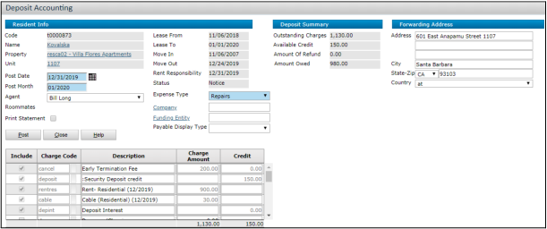

# Notices and Move-Outs

## Topics

- Notices and Move-Outs Overview
- Notices and Move-Outs Navigation
- Notice Procedures
- Move-Out Procedures

---

This section describes how to move out residents.

## Notices and Move-Outs Overview

Typically, when a resident wants to move out of your property, they notify you that they intend to move out on a specific date after the lease expires. When you receive this notification, you must post a notice for the resident. A notice records a resident’s expected move-out date and enables you to perform move-out procedures for the resident.

If a resident does not notify you, or moves out of the property early or unexpectedly, you can record one of three termination types to differentiate the notice:

- If a resident moves out significantly before the lease expires, you can record an early-termination notice.
- If a resident moves out unexpectedly without notifying you, you can record a skip notice.
- If a resident is being required to move out due to violations, you can record an eviction notice.

On the resident’s move-out date, you post a move-out for the resident and post deposit accounting for the resident. Deposit accounting applies charges and credits to the resident’s deposit and processes either a charge or payable, depending on the final balance.

---

## Notices and Move-Outs Navigation

| Task                                     | Navigation                                             |
| ---------------------------------------- | ------------------------------------------------------ |
| Post a notice batch                      | Residents > Notice Functions > Add Notice Batch        |
| Review, edit, or delete a notice batch   | Residents > Notice Functions > Review Notice Batch     |
| Post a move-out batch                    | Residents > Move-Out Functions > Add Move-Out Batch    |
| Review, edit, or delete a move-out batch | Residents > Move-Out Functions > Review Move-Out Batch |
| Cancel a notice                          | Residents > Notice Functions > Cancel Notice           |
| Promote a roommate to primary resident   | Residents > Promote Roommate                           |

---

## Notice Procedures

### Topics

- Posting Notices
- Posting Notice Batches
- Reviewing, Editing, and Deleting Notice Batches
- Canceling Notices

This section describes how to post notices for residents.

There are two methods by which you can post notices for residents: **notices** (for one resident) and **notice batches** (for multiple residents).

>   
> You cannot post notices or notice batches for residents who have proposed new leases.

---

### Posting Notices

If you want to record only one notice at a time, you can post a notice for each resident. Once posted, Voyager updates the resident’s status and history records.

#### This section includes:

- To post a notice for a resident
- To post an eviction notice

#### To post a notice for a resident

1. On the dashboard, click the **Person Search** tab.  
   
2. Complete the tab and click **Search**.
3. Click the name of the resident. The **Resident** screen appears.
4. On the **Functions** menu, click **Notice**.
5. Complete the screen. See _Notice Screen Reference_ for more details.
6. Click **Save**.

>   
> If the move-out date is less than the minimum days required, a confirmation will appear.

#### Notice Screen Reference

**Termination Type**

- Notice – Resident notified, moving near lease end
- Early Termination – Resident notified, moving out early
- Skip – Resident left without notice

**Notice Date** – Date resident gave notice  
**Move-Out Date** – Intended move-out date  
**Reason for Move-Out** – Administrator-defined  
**Notice Rent Responsible** – Charges continue post-move-out (requires responsibility date)  
**Responsibility Date** – Date through which charges apply  
**Post Early Termination Fee** – Adds fee to ledger  
**Agent** – Defaults to current user

>   
> Some fields may be hidden based on system settings.

#### Eviction Section

**Evict Date** – When to post eviction  
**Move-Out Date** – Required move-out date  
**Reason for Move-Out** – Administrator-defined  
**Post Early Termination Fee** – Adds fee to ledger  
**Agent** – Name of user processing eviction

---

### To post an eviction notice

1. On the dashboard, click the **Person Search** tab.  
   
2. Fill in required fields, click **Search**.
3. Click resident's name to open **Resident** screen.
4. On **Functions**, click **Evict**.
5. Complete the screen (see _Notice Screen Reference_).
6. Click **Save**.

---

### Posting Notice Batches

If you want to post multiple notices at once, use **notice batches**. You can continue editing a batch until it’s posted.

#### To post a notice batch

1. Go to **Residents > Notice Functions > Add Notice Batch**
2. Complete the **Create Bulk Notice Batch** screen.
3. Click **Submit**.
   
4. Complete the top of the **Bulk Notice Batch** screen.
5. Select the **Select** checkbox per resident.
6. Click **Save**.
7. Edit notices per resident as needed.
8. To add a resident:
   - Click **Add Resident**
   - Select resident
   - Click **OK**  
     
9. Click **Save**.
10. Click **Post**.

#### Create Bulk Notice Batch Screen Reference

- **Lease To -- to --**: Set lease expiry filter
- **Notice Date**: Default notice date
- **Reason for Move-Out**: Default reason
- **Post Early Termination Fee**: Adds fee on post

---

### Reviewing, Editing, and Deleting Notice Batches

You can manage batches before all notices are posted.

#### To review/edit/delete a batch

1. Go to **Residents > Notice Functions > Review Notice Batch**
2. Complete the filter and click **Submit**
3. Click **Delete** to remove batch
4. Edit as needed
5. Click **Save**

---

### Canceling Notices

Cancel a resident’s notice if you need to:

- Renew lease
- Adjust lease expiration
- Convert to month-to-month

Voyager will update the resident’s status accordingly.

>   
> This procedure starts from the dashboard.

#### To cancel a notice

1. From the dashboard, click **On-Notice** count  
   
2. Click **Cancel Notice** for the resident
3. Click **Cancel Evict** for evictions

---

## Move-Out Procedures

### Topics

- Adjusting Move-Out Dates
- Posting Move-Outs
- Posting Move-Out Batches
- Reviewing, Editing, and Deleting Move-Out Batches
- Reversing Move-Outs
- Posting Deposit Accounting
- Adjusting Deposit Accounting

Residents can be moved out individually or in batches.

Voyager applies full rent charges until move-out month, then prorates:

> Example:  
> Resident pays $900/month, moves out June 15  
> Charge = $900 for May + $450 for June ($900 ÷ 30 × 15)

---

### Adjusting Move-Out Dates

You can update a resident's move-out date if they are still on-notice.

>   
> Cannot move out after another resident's move-in date

#### To adjust move-out date

1. From dashboard, click **On-Notice**  
   
2. Click **Adjust Dates**
3. Complete screen:
   - **Move-Out Date**
   - **Reason for Move-Out**
   - **Agent**
4. Click **Save**

---

### Posting Move-Outs

Post individual resident move-outs.

#### To post a move-out

1. From dashboard, click **Move Out**  
   
2. Click **Move Out** next to resident

---

### Posting Move-Out Batches

You can move out multiple residents in a batch.

#### To post a move-out batch

1. Go to **Residents > Move-Out Functions > Add Move-Out Batch**
   
2. Set expected move-out date range
3. Complete screen
4. Click **Submit**
   
5. Complete batch details
6. Select residents to include
7. Click **Save**
8. To add a resident:
   - Click **Add Resident**
   - Select resident
   - Click **OK**
     
9. Click **Post**

---

### Reviewing, Editing, and Deleting Move-Out Batches

Review and edit unposted move-outs.

#### To review/edit/delete a move-out batch

1. Go to **Residents > Move-Out Functions > Review Move-Out Batch**
2. Submit filter
3. Click **Delete** if needed
4. Edit batch
5. Click **Save**

---

### Reversing Move-Outs

If a resident isn't moving out after all, you can reverse their move-out.

#### To reverse a move-out

1. Go to dashboard > **Person Search**  
   
2. Search and select resident
3. Click **Cancel Move-Out**

---

### Posting Deposit Accounting

Deposit accounting applies final charges or credits after move-out.

- **Positive balance** → Payable
- **Negative balance** → Charge and statement

>   
> Setup required for move-out charges

>   
> Procedure starts from dashboard

#### To post deposit accounting

1. Go to **Person Search** tab  
   
2. Search person
3. For canceled applicants:
   - Click name
   - Go to **Application Status**
   - Click **Deposit Acctg**
4. For past residents:
   - Click name
   - In **Functions**, click **Deposit Accounting**  
     
5. Fill in **Expense Type** and **Agent**
6. Update **Forwarding Address** if needed
7. Review **Ledger** report if needed
8. Fill in each transaction row:
   - **Include**
   - **Charge Amount**
   - **Credit**
9. Check **Print Statement** (optional)
10. Click **Post**

---

### Adjusting Deposit Accounting

You can adjust the deposit balance after initial posting.

>   
> Not available for residents with prepayments

#### To adjust deposit accounting

1. From dashboard, click **Person Search**  
   
2. Search for person
3. For canceled applicants:
   - Click name
   - Go to **Application Status**
   - Click **Adj Dep Acctg**
4. For past residents:
   - Click name
   - In **Functions**, click **Adjust Deposit Accounting**
5. Fill in transactions
6. (Optional) Check **Print Statement**
7. Click **Post**
