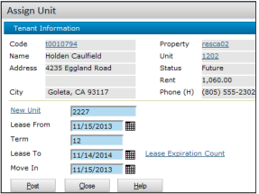
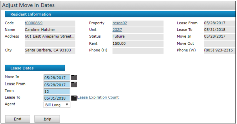
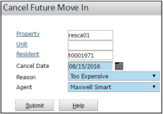
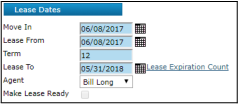
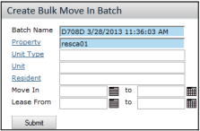
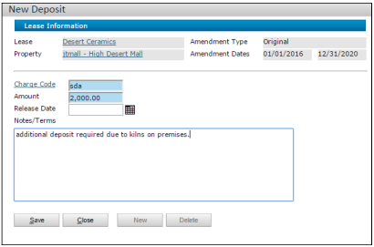
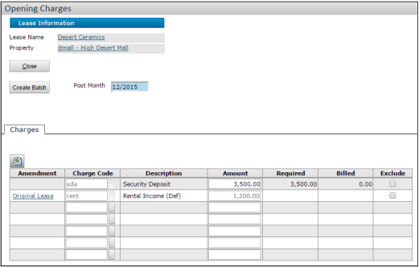

# Yardi Voyager Move-In Procedures (Residential & Commercial)

This document outlines **step-by-step** instructions for performing move-ins in Yardi Voyager, covering both **Residential** and **Commercial** processes. Each section references the official images from the Markdown guides you provided.

---

## Table of Contents

- [Yardi Voyager Move-In Procedures (Residential \& Commercial)](#yardi-voyager-move-in-procedures-residential--commercial)
  - [Table of Contents](#table-of-contents)
  - [1. Overview](#1-overview)
  - [2. Residential Move-In Steps](#2-residential-move-in-steps)
    - [2.1. Assigning Units](#21-assigning-units)
    - [2.2. Adjusting Move-In Dates](#22-adjusting-move-in-dates)
    - [2.3. Canceling a Move-In](#23-canceling-a-move-in)
    - [2.4. Posting a Single Move-In](#24-posting-a-single-move-in)
    - [2.5. Posting Multiple Move-Ins (Batch)](#25-posting-multiple-move-ins-batch)
    - [2.6. Key Accounting Impacts (Residential)](#26-key-accounting-impacts-residential)
  - [3. Commercial Move-In Steps](#3-commercial-move-in-steps)
    - [3.1. System and Property Setup](#31-system-and-property-setup)
    - [3.2. Setting Up Deposits](#32-setting-up-deposits)
    - [3.3. Creating Opening Charges](#33-creating-opening-charges)
    - [3.4. Key Accounting Impacts (Commercial)](#34-key-accounting-impacts-commercial)
  - [4. References](#4-references)

---

## 1. Overview

In **Yardi Voyager**, the **move-in process** ensures new tenants (or new lease amendments) are recorded properly in the system, with accurate charges and deposit tracking. Residential move-ins use a streamlined wizard, while commercial move-ins revolve around lease setup and “opening charges.” Both processes ultimately generate accounting entries for rent, deposits, and fees, compliant with US-based real estate accounting.

---

## 2. Residential Move-In Steps

_(From [Residential_Move_In.md](#))_

### 2.1. Assigning Units

If a **future resident** changes their mind about the unit **before** being moved in:

1. On the dashboard, click the **Person Search** tab, fill in the resident’s details, and click **Search**.  
   

2. Click the resident’s name to open the **Resident** screen.
3. From **Functions**, select **Assign Unit**.  
   
4. If a warning appears about leasing specials being removed, click **OK**.  
   
5. Complete the **Assign Unit** screen with the new unit information, lease dates, and rent details.  
   
6. Click **Post** to finalize the assignment.

> **Note**: This only applies to **future residents**. If someone is **current**, use the “Transfer Unit” function instead.

---

### 2.2. Adjusting Move-In Dates

If the scheduled move-in date changes:

1. In the **Resident Activity** area on the dashboard, find **Move In** and click the number next to it.  
   
2. Click **Adjust Dates** beside the relevant future resident.
3. On the **Adjust Move-In Dates** screen, enter the revised **Move-In Date** and any adjusted lease-from/to dates.  
   
4. Click **Post**.

---

### 2.3. Canceling a Move-In

If a **future resident** no longer wants to move in:

1. Open the **Person Search** tab, locate the resident, and select them.
2. From **Functions**, click **Cancel Move-In**.  
   
3. Complete the **Cancel Date** and **Reason**, then click **Submit**. The prospect’s status changes to **Canceled**.  
   

---

### 2.4. Posting a Single Move-In

To finalize move-in for **one** resident at a time:

1. From the **Resident Activity** dashboard, click the number next to **Move In**.  
   
2. For the desired future resident, click **Move In**.
3. (Optional) Click **Connect Utilities** if available.
4. Complete the **Move-In** screen fields:
   - **Move-In Date**
   - **Lease-From Date** / **Lease-To Date**
   - **Recurring charges** or deposit amounts if prompted  
     
5. Click **Save**, then **Post**. The resident becomes **Current** and initial charges post to the ledger.

---

### 2.5. Posting Multiple Move-Ins (Batch)

To move in **several** future residents at once:

1. Go to **Residents > Move-In Functions > Add Move-In Batch**.  
   
2. Define the date filters and click **Submit** to retrieve the list of future residents.
3. Check the residents you want to include in the batch.  
   
4. Make any needed edits to dates or charges.
5. Click **Post** to finalize the batch. All included residents become current.

---

### 2.6. Key Accounting Impacts (Residential)

- **Security Deposits**: Posting the move-in automatically creates a security deposit charge (liability) if applicable.
- **Rent & Recurring Charges**: Once posted, the system generates AR charges (rent, parking, pet fees, etc.).
- **Ledger Updates**: The move-in action updates the resident ledger, reflects a new occupant in the unit, and credits the deposit liability account upon payment.
- **Compliance**: Ensure the **post month** is correct for GAAP alignment, especially with prorated rent.

---

## 3. Commercial Move-In Steps

_(From [Commercial_Move_In.md](#) & [Leases.md](#))_

### 3.1. System and Property Setup

1. **Enable Opening Charges** at both **system** and **property** levels if you intend to use them for security deposits and first-period charges.  
   

2. **Add or Edit the Lease Record**:
   - Navigate to **Lease Administration > Leases > Add Lease**.  
     
   - Complete the necessary tabs (Units, Charge Schedules, etc.).
3. **Activate Lease Amendment**:
   - On the Amendment screen, click **Ready**, then have another user click **Activate** to finalize.  
     

> Once activated, the system will allow charges to post for this lease, effectively marking it as occupied.

---

### 3.2. Setting Up Deposits

1. From the **Amendment** record, select **Deposit** in the **Links** menu. The **Deposit Summary** screen appears.  
   
2. Click **New Record**  
     
   which opens the **New Deposit** screen:  
   
3. Enter the required deposit amount (and any release date or notes).
4. **Save** your changes. This action **does not** bill the tenant yet, but it attaches the deposit requirement to the lease.

---

### 3.3. Creating Opening Charges

1. Open the **Lease** record and, in the **Links** menu, click **Opening Charges**.  
   
2. Review or edit:
   - **Security deposit amounts**
   - **Prorated rent** or other initial charges
3. (Optional) Exclude any line items not needed by checking **Exclude**.
4. Click **Create Batch**  
     
   to post these charges to the tenant ledger.

**Result**: The system posts the initial deposit to the **Deposit Liability** account (once paid) and the initial rent/fees to AR. The lease is now considered occupied from a financial standpoint.

---

### 3.4. Key Accounting Impacts (Commercial)

- **Security Deposit**: Appears as a **billed charge** (credit to deposit liability) when posted. Once paid, it’ll show on AR as collected.
- **Rent & CAM**: The base rent, CAM, taxes, or other recurring charges usually come from **Rent Schedules**. Voyager starts billing them upon lease activation or the effective date you set.
- **Ledger & GL**: Each posted batch updates tenant receivables, deposit liabilities, and (once paid) cash accounts.
- **GAAP Considerations**: If your lease includes free-rent periods or stepped rents, you might also use the **Straight-Line Rent** module to comply with US GAAP on revenue recognition. That is done separately, but it relies on accurate lease activation and charges setup.

---

## 4. References

- **Residential Procedures**: [Residential_Move_In.md](#)
- **Commercial Setup & Deposits**: [Commercial_Move_In.md](#)
- **Lease Amendment Activation**: [Leases.md](#)

> **Disclaimer**: This SOP is a summary. Always consult your organization’s Yardi configuration and internal accounting policies for final guidelines on posting periods, deposit handling, and reporting.

---
