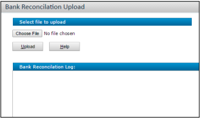
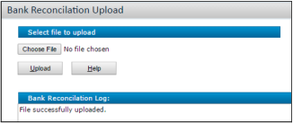
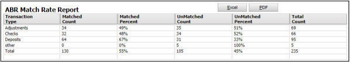
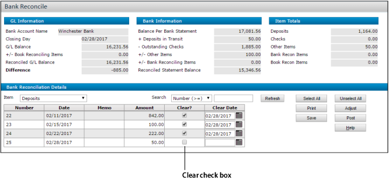

# Automatic Bank Reconciliation

**Table of Contents**

- [Bank Format](#bank-format)
- [Menu Items for Automatic Bank Reconciliation](#menu-items-for-automatic-bank-reconciliation)
- [Automatic Bank Reconciliation Setup](#automatic-bank-reconciliation-setup)
  - [Bank Manager Configuration](#bank-manager-configuration)
  - [Bank Setup for Automatic Bank Reconciliation](#bank-setup-for-automatic-bank-reconciliation)
- [Using the Automatic Bank Reconciliation Feature](#using-the-automatic-bank-reconciliation-feature)
  - [Importing Bank Files Manually](#importing-bank-files-manually)
    - [To import bank files manually](#to-import-bank-files-manually)
  - [Importing Bank Files via an AppTask](#importing-bank-files-via-an-apptask)
  - [Transaction Matching](#transaction-matching)
  - [Bank Manager Report](#bank-manager-report)
    - [To run the Bank Manager report](#to-run-the-bank-manager-report)
  - [Match Rate Report](#match-rate-report)
    - [To run the Match Rate report](#to-run-the-match-rate-report)
  - [Reviewing the Bank Reconciliation](#reviewing-the-bank-reconciliation)

Using the Automatic Bank Reconciliation feature, you can import a bank file into Voyager and have Voyager match the transactions in the file against existing bank transactions in the Voyager database. Voyager will typically match most, but not all, of the transactions. When a transaction is matched, it is marked as “cleared” on the **Bank Reconcile** screen. This greatly simplifies the process of bank reconciliation.

Importing bank files can be done manually or automatically, via an AppTask. After you import a statement, you can run a report that lists the transactions, showing which ones were successfully matched.

This feature does not post the bank reconciliation; it just clears items on the statement. For information on reviewing and posting the bank reconciliation, see **Bank Reconciliation**.

> **Note:**
>
> - Automatic Bank Reconciliation is available in GL Posting Utilities Plug-in 7.1 and subsequent plug-ins.
> - This feature was designed for clients in North America. Clients outside North America (in Europe, Asia, etc.) should use the Bank Book feature.

## Bank Format

To use this feature, you will need to get statement files from your bank in the **BAI2** format.

## Menu Items for Automatic Bank Reconciliation

The Automatic Bank Reconciliation features are found on the eBanking menuset:

- **Bank Reconciliation Upload**:  
  Bank Reconciliation > Import > Bank Reconciliation Upload

- **Bank Manager Report**:  
  Bank Reconciliation > Reports > Bank Manager Report

- **ABR Match Rate Report**:  
  Bank Reconciliation > Reports > Match Rate

- **Bank Manager Configuration**:  
  Bank Reconciliation > Setup > Bank Manager Configuration

They are also on the commercial menuset, located at **G/L > Banking > Automatic Bank Reconciliation**.  
In this chapter, we’ll use the menu paths from the eBanking menuset.

---

## Automatic Bank Reconciliation Setup

### Bank Manager Configuration

**Bank Reconciliation > Setup > Bank Manager Configuration**

The **Bank Manager Configuration** screen determines how bank file codes are associated with Voyager transaction types.

For example, in the screenshot above, **Trans Code 175** is an individual deposit and is linked to the Voyager type **Deposit - AR**. This means that if a file has a line item with the code of 175, Voyager will attempt to match that transaction with a deposit (of the same bank) in Voyager.

This table is auto-populated by Voyager. You typically do not need to modify it unless your bank uses additional codes or reuses the same codes for different purposes.

> **Note:** Currently, the **Is Negative** column is not used by the system.

### Bank Setup for Automatic Bank Reconciliation

In the **Bank Account** screen, make sure the bank account number is correct.  
(This screen is located at **Setup > System > Add Bank Account**.)

If the number is incorrect, transaction matching will fail, and you will see this error message on the report: **Invalid Bank Account Specified**.

---

## Using the Automatic Bank Reconciliation Feature

### Importing Bank Files Manually

#### To import bank files manually

1. **Select** **Bank Reconciliation > Import > Bank Reconciliation Upload**.

   

2. **Click** **Choose File** and select the bank file on your local system or network.  
   The bank file name appears on the screen.

   

3. **Click** **Upload**.

   - If one or more items **cannot** be matched, you will see: **File loaded with unmatched items**.  
     

   - If all items **can** be matched, you will see: **File successfully uploaded**.  
     

---

### Importing Bank Files via an AppTask

You can set up an AppTask to import bank files automatically, so items are cleared on a recurring basis.

For general information on setting up AppTasks, see the _Service Manager Administration and Setup Guide_. Use the following details to set up the bank file import task:

- **Class Name**  
  `ysi.lockbox.dll#ysi.lockbox.BankManagerTask`

- **URL (for a single file upload)**  
  `&BankManagerFile`  
  Example:  
  `&BankManagerFile=//ComputerName/Folder/File.txt/`

- **URL (for an entire directory)**  
  `&ImportDirectory`  
  Example:  
  `&ImportDirectory=//ComputerName/ImportFolder/`

- **URL (for an archive directory)**  
  `&ArchiveDirectory`  
  Enter the folder path where the files will be moved after the import is completed.  
  Example:  
  `&ArchiveDirectory=//ComputerName/ArchiveFolder/`

- **Example combining both import and archive directories**  
  `&ImportDirectory=//ComputerName/ImportFolder/&ArchiveDirectory=//ComputerName/ArchiveFolder/`

---

### Transaction Matching

After you upload a bank file, Voyager attempts to match its transactions with those in the general ledger using the following criteria:

- **Deposits:** Match on dollar amount
- **Checks:** Match on check number and dollar amount
- **Other items:** Match on dollar amount and reference number

---

### Bank Manager Report

The Bank Manager report lists the transactions in the bank file and any errors matching them to Voyager transactions.

#### To run the Bank Manager report

1. **Select** **Bank Reconciliation > Reports > Bank Manager Report**.

   

2. **Complete the screen.**

   | **Field**   | **Description**                                                                                                                  |
   | ----------- | -------------------------------------------------------------------------------------------------------------------------------- |
   | **File**    | Select the bank file you want to review.                                                                                         |
   | **Matched** | **Yes** – Only matched transactions   **No** – Only unmatched transactions   **Both** – Matched and unmatched transactions |

3. **Click Submit.**  
   The report appears. Different outcomes display based on the **Matched** setting.

   

---

### Match Rate Report

#### To run the Match Rate report

1. **Select** **Bank Reconciliation > Reports > Match Rate**.

   

2. **Select** the file(s) you want to review.

3. **Click Submit.**  
   The report appears.

   

The report shows how many items were matched, the percentage matched, how many were not matched, and the percentage unmatched. It provides totals for each column and row.

---

### Reviewing the Bank Reconciliation

After running the Bank Manager report, you can go to the **Bank Reconcile** screen (**G/L > Banking > Bank Functions > Bank Reconcile**).

- Items that were matched automatically by the uploaded bank file will have the **Clear** checkbox selected.
- Items that were not matched by the Auto Rec feature must be cleared manually. For details on using this screen, see **Bank Reconciliation**.
