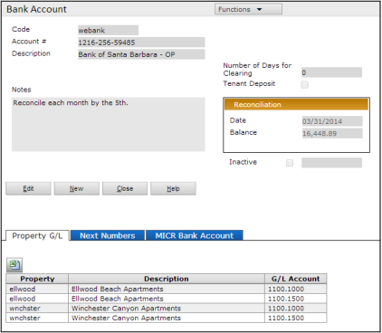
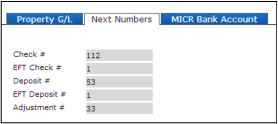
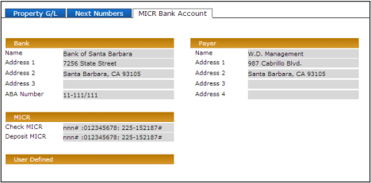
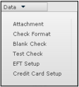

## Bank Account Setup

**Setup > System > Add Bank Account**

| **Field**                           | **Description**                                                                                                                                                                                                                                                                    |
| ----------------------------------- | ---------------------------------------------------------------------------------------------------------------------------------------------------------------------------------------------------------------------------------------------------------------------------------- |
| **Code**                            | Identifies the account within Voyager.                                                                                                                                                                                                                                             |
| **Account #**                       | The actual account number.                                                                                                                                                                                                                                                         |
| **Description**                     | The name of the bank, or other identifying information.                                                                                                                                                                                                                            |
| **Number of Days for Clearing**     | Not currently used.                                                                                                                                                                                                                                                                |
| **Tenant Deposit**                  | Used by Voyager International. This read-only field indicates the bank account was set up for tenant deposits. For more information, see _Bank Accounts for Tenant Deposits (Global Users)_.                                                                                       |
| **Reconciliation Date and Balance** | Voyager completes these fields after you reconcile the account. For more information, see the _Voyager Core User’s Guide_.                                                                                                                                                         |
| **Inactive**                        | Makes the account unavailable for transactions.                                                                                                                                                                                                                                    |
| **Inactive Date**                   | Date the account was made inactive. Completed manually. **Note:** This field is informational only. Entering a future date will not cause the account to become unusable on that date. You must manually select the **Inactive** check box to prevent the account from being used. |

---

### Property G/L Tab

| **Field**       | **Description**                                                                                                                                                                                                                                                                                                                               |
| --------------- | --------------------------------------------------------------------------------------------------------------------------------------------------------------------------------------------------------------------------------------------------------------------------------------------------------------------------------------------- |
| **Property**    | Codes for properties that use this bank account. Click the button in the column to view the property lookup list.                                                                                                                                                                                                                             |
| **G/L Account** | G/L cash account for the property. Click the button in the column to view the account lookup list. You must specify a cash account for each listed property.  - Multiple property/cash account combinations can be linked to the same bank account. - Each property/cash account combination can be linked to only one bank account. |

---

### Next Numbers Tab

>   
> **Note:** Do not change these settings after initial setup unless advised to do so by Yardi technical support. Voyager automatically updates these fields as it processes transactions.

| **Field**         | **Description**                                                                                                                             |
| ----------------- | ------------------------------------------------------------------------------------------------------------------------------------------- |
| **Check #**       | Number of the next check. **Note:** Leave this field empty until just prior to printing your first check.                                   |
| **EFT Check #**   | Number for the next electronic payment transaction.                                                                                         |
| **Deposit #**     | Number of the next deposit. **Note:** Leave this field empty until just prior to recording your first deposit.                              |
| **EFT Deposit #** | Number for the next EFT deposit.                                                                                                            |
| **Adjustment #**  | Number for the next adjustment. The default is zero. Change the starting number if you want to continue from a previous numbering sequence. |

---

### MICR Bank Account Tab

If you print checks on blank MICR (Magnetic Ink Character Recognition) check stock, complete the fields on the **MICR Bank Account** tab. If your bank information is preprinted on your check stock, leave the fields empty. (Setting up the formatting for check printing is described in the next chapter of the manual.)

| **Field**        | **Description**                                                                                                                                                                                                                                                                                                                                                                                                                                                                                                                                                                                                                                                                                                                                                                                                        |
| ---------------- | ---------------------------------------------------------------------------------------------------------------------------------------------------------------------------------------------------------------------------------------------------------------------------------------------------------------------------------------------------------------------------------------------------------------------------------------------------------------------------------------------------------------------------------------------------------------------------------------------------------------------------------------------------------------------------------------------------------------------------------------------------------------------------------------------------------------------- |
| **Name**         | Bank name.                                                                                                                                                                                                                                                                                                                                                                                                                                                                                                                                                                                                                                                                                                                                                                                                             |
| **Address 1-3**  | Bank address.                                                                                                                                                                                                                                                                                                                                                                                                                                                                                                                                                                                                                                                                                                                                                                                                          |
| **ABA Number**   | American Bankers Association routing number identifying the bank and its branch. The format is typically `##-###/###`.                                                                                                                                                                                                                                                                                                                                                                                                                                                                                                                                                                                                                                                                                                 |
| **Check MICR**   | MICR number.  - Use a letter **n** for each numeral in the check number. For example, if the check number is five numerals, you would type `nnnnn`. - Use `"` (double quotation marks) for the _on-us_ symbol, which appears before and after the check number and after the account number. - Use `:` (colon) for the _transit_ symbol, which appears before and after the routing number. - Use a hyphen `-` for the _dash_ symbol if needed within account numbers. - _yCheck_ adds the _amount_ symbol around the amount during check printing.  **Example**: If the MICR line on a check is shown as “`21110 :012345678: 225-162187"`,” you would type: `“nnnnn” :012345678: 225-162187”`. This example uses spaces between the check number, the routing number, and the account number. |
| **Deposit MICR** | MICR number for deposits. See the description of the **Check MICR** field for additional information.                                                                                                                                                                                                                                                                                                                                                                                                                                                                                                                                                                                                                                                                                                                  |
| **Name** (Payer) | Payer name.                                                                                                                                                                                                                                                                                                                                                                                                                                                                                                                                                                                                                                                                                                                                                                                                            |
| **Address 1-4**  | Payer address.                                                                                                                                                                                                                                                                                                                                                                                                                                                                                                                                                                                                                                                                                                                                                                                                         |

---

### Data Menu

The **Data** menu contains links to screens for entering additional bank account setup and check formatting.

| **Menu Link**         | **Description**                                                                                                                                                |
| --------------------- | -------------------------------------------------------------------------------------------------------------------------------------------------------------- |
| **Attachment**        | Adds an attachment to the bank account record.                                                                                                                 |
| **Check Format**      | Sets up the format for printing checks. See _Check Formatting_.                                                                                                |
| **Blank Check**       | Prints a blank check.                                                                                                                                          |
| **Test Check**        | Prints a test check for testing formatting. See _Printing a Test Check_. **Note:** You cannot use **Test Check** for checks that use a Crystal Reports format. |
| **EFT Setup**         | Sets up the bank account for electronic payment processing. For more information, see the _Electronic Payment Processing User’s Guide_.                        |
| **Credit Card Setup** | Sets up the bank account for credit-card transactions. For more information, see the _Electronic Payment Processing User’s Guide_.                             |

_Script references removed._
