# Bank Reconciliation

## Table of Contents

- [Bank Reconciliation](#bank-reconciliation)
  - [Table of Contents](#table-of-contents)
  - [Topics](#topics)
  - [Reconciling Bank Statements to the Voyager General Ledger](#reconciling-bank-statements-to-the-voyager-general-ledger)
    - [To Reconcile a Bank Account](#to-reconcile-a-bank-account)
      - [Using the Bank Reconciliation Detail Tab](#using-the-bank-reconciliation-detail-tab)
  - [Adjustments for Bank Reconciliation](#adjustments-for-bank-reconciliation)
    - [To Make an Adjustment for a Bank Reconciliation](#to-make-an-adjustment-for-a-bank-reconciliation)
  - [Merging Deposit Records](#merging-deposit-records)
    - [To Combine Two Bank Deposit Records](#to-combine-two-bank-deposit-records)
  - [Admin Procedures](#admin-procedures)
    - [Check Book Maintenance](#check-book-maintenance)
      - [To Correct a Transaction Error](#to-correct-a-transaction-error)
    - [Unposting Bank Reconciliations](#unposting-bank-reconciliations)
      - [To Unpost a Bank Reconciliation](#to-unpost-a-bank-reconciliation)
    - [Modifying Bank Reconciliation Dates](#modifying-bank-reconciliation-dates)
      - [To Modify a Bank Reconciliation Date](#to-modify-a-bank-reconciliation-date)
    - [Depositing Receipts](#depositing-receipts)
      - [To Deposit a Receipt](#to-deposit-a-receipt)
  - [Bank Reconciliation Reports](#bank-reconciliation-reports)
    - [Bank Directory Report](#bank-directory-report)
      - [To Generate the Bank Directory Report](#to-generate-the-bank-directory-report)
    - [Property Funds Report](#property-funds-report)
      - [To Generate the Property Funds Report](#to-generate-the-property-funds-report)
    - [Bank Reconciliation In Progress Report](#bank-reconciliation-in-progress-report)
      - [To Run the Bank Rec in Progress Report](#to-run-the-bank-rec-in-progress-report)
      - [For Global Users](#for-global-users)
    - [Bank Reconciliation Exceptions](#bank-reconciliation-exceptions)
      - [To Run the Bank Reconciliation Exception Report](#to-run-the-bank-reconciliation-exception-report)
    - [Bank Reconcile History Report](#bank-reconcile-history-report)
      - [To Generate the Bank Reconcile History Report](#to-generate-the-bank-reconcile-history-report)
    - [Bank Register Report](#bank-register-report)
      - [To Generate the Bank Register Report](#to-generate-the-bank-register-report)
  - [Daily Bank Reconciliation](#daily-bank-reconciliation)

---

## Topics

- Bank Reconciliation Overview
- Reconciling Bank Statements to the Voyager General Ledger
- Adjustments for Bank Reconciliation
- Merging Deposit Records
- Admin Procedures
- Bank Reconciliation Reports
- Daily Bank Reconciliation

This section describes the procedures for reconciling bank accounts.

---

## Reconciling Bank Statements to the Voyager General Ledger

To perform a bank reconciliation, you will need a copy of the bank statement, and the bank account must be set up in Voyager.

---

### To Reconcile a Bank Account

1. **From the side menu,** select **G/L > Banking > Bank Functions > Bank Reconcile**.  
   The **Bank Reconciliation** filter appears.

   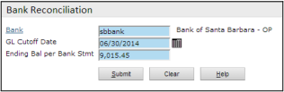

2. **Complete the filter:**

   | **Field**                    | **Description**                                 |
   | ---------------------------- | ----------------------------------------------- |
   | **Bank**                     | The bank account code.                          |
   | **GL Cutoff Date**           | Enter the date of the bank statement.           |
   | **Ending Bal per Bank Stmt** | Enter the ending balance of the bank statement. |

3. **Click Submit.**  
   The **Bank Reconcile** screen appears.

   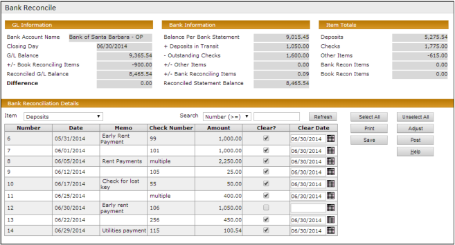

4. **Review the G/L Information section:**

   | **Field**                      | **Description**                                                                                                                       |
   | ------------------------------ | ------------------------------------------------------------------------------------------------------------------------------------- |
   | **Closing Day**                | The **G/L Cutoff Date** that was entered in the filter.                                                                               |
   | **G/L Balance**                | The ending G/L balance (on a cash basis) for the cash accounts/property combinations linked to this bank account.                     |
   | **+/- Book Reconciling Items** | Uncleared items entered through the **Bank Adjustments** screen, with a **Type** of **Book**, dated on or before the **Closing Day**. |
   | **Reconciled G/L Balance**     | Equals the sum of **G/L Balance** and **+/- Book Reconciling Items**.                                                                 |
   | **Difference**                 | The difference between the **Reconciled Statement Balance** and the **Reconciled G/L Balance**.                                       |

5. **Review the Bank Information section:**

   | **Field**                        | **Description**                                                                                                                                                                            |
   | -------------------------------- | ------------------------------------------------------------------------------------------------------------------------------------------------------------------------------------------ |
   | **Balance Per Bank Statement**   | The balance from the **Bank Reconciliation** filter.                                                                                                                                       |
   | **+ Deposits in Transit**        | Uncleared deposits dated on or before the **Closing Day**.                                                                                                                                 |
   | **- Outstanding Checks**         | Uncleared checks dated on or before the **Closing Day**.                                                                                                                                   |
   | **+/- Other Items**              | Uncleared journal entries (to the cash account), NSFs, and payables with a **Type** of **Adjustment**, dated on or before the **Closing Day**.                                             |
   | **+/- Bank Reconciling Items**   | Uncleared items entered through the **Bank Adjustments** screen, with a **Type** of **Bank**, dated on or before the **Closing Day**.                                                      |
   | **Reconciled Statement Balance** | Equals the sum of all items in this section: **Balance Per Bank Statement**, **+ Deposits in Transit**, **- Outstanding Checks**, **+/- Other Items**, and **+/- Bank Reconciling Items**. |

6. **In the Bank Reconciliation Detail section**, in the **Item** field, select the type of transaction you want to clear (deposits, checks, etc.). The transactions appear below.

   > **Note:** Transactions appear based on the transaction date, not the post month. The date must be before or during the month being reconciled.  
   > The **Memo** field contains identifying information. For checks, it displays the name of the vendor. For deposits, it displays the memo from the receipt batch header. For journal entries and other items, it shows text entered in the **Notes** field on the original records.

7. **Compare the transactions** on the bank statement to the transactions on the screen. Select the **Clear** checkbox for each transaction that matches the bank statement.

   > As you clear transactions, Voyager updates the totals in the **Item Totals** section (totals are for cleared items).  
   > Use the scroll bar to view additional transactions.

8. **If you want to specify a custom clear date** for a transaction, type it in the **Clear Date** field. If you do not enter a date, Voyager will use the cut-off date from the **Bank Reconcile** filter when you click **Save**. (Clear dates are used in Historical Bank Reconcile reports.)

9. **Repeat steps 6 through 8** for each transaction type.

10. **If you want to stop** working on the reconciliation and return to it later, click **Save**.

    > You can view a reconciliation summary report at any time by clicking **Print**.

11. **When the Reconciled Statement Balance agrees with the Reconciled G/L Balance, click Post.**  
    The **Bank Reconciliation Report** appears.

    > You can print this report as a Proof Of Cash report. To view and print earlier bank reconciliation reports, select **G/L > Banking > Bank Reports > Bank Reconcile History Report**.

---

#### Using the Bank Reconciliation Detail Tab

This section explains the buttons and fields in the **Bank Reconciliation Detail** tab.

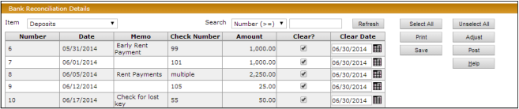

| **Field/Button**              | **Description**                                                                                                                                                                                                                             |
| ----------------------------- | ------------------------------------------------------------------------------------------------------------------------------------------------------------------------------------------------------------------------------------------- |
| **Item**                      | Select the type of transaction to display (deposits, checks, etc.).                                                                                                                                                                         |
| **Search / Refresh**          | **To search for transactions:**   1. In the **Search** drop-down, select a search type (e.g., Number (>=), Date (>=), etc.).  2. In the field to the right, enter the number or date.  3. Click **Refresh** to display results. |
| **Select All / Unselect All** | Select or unselect all the **Clear** checkboxes in the grid.                                                                                                                                                                                |
| **Print**                     | Opens a summarized version of the Bank Rec in Progress report.                                                                                                                                                                              |
| **Adjust**                    | Opens the **Bank Rec Adjustment** filter in another window, where you can create adjusting transactions (described in the next section of this chapter).                                                                                    |

---

## Adjustments for Bank Reconciliation

You can create an adjustment to temporarily allow for discrepancies between your books and the bank statement. It can be a bank reconciling adjustment (if the bank statement is incorrect) or a book reconciling adjustment (if the G/L is incorrect). Reconciling adjustments do not affect the G/L and should eventually be cleared—typically as part of the following reconciliation.

> **Note:**  
> Use this procedure only for adjustments that will be cleared in a subsequent reconciliation. Misuse of this feature will cause future bank reconciliation problems.

---

### To Make an Adjustment for a Bank Reconciliation

1. **Select** **G/L > Banking > Bank Functions > Bank Rec Adjustment**.  
   The **Bank Rec Adjustment** filter appears.

   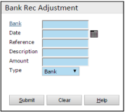

   > You can also access this screen by clicking the **Adjust** button on the **Bank Reconcile** screen.

2. **Complete the screen.** The following fields require explanation:

   | **Field**     | **Description**                                                                                                       |
   | ------------- | --------------------------------------------------------------------------------------------------------------------- |
   | **Date**      | The date the adjustment affects the bank record.                                                                      |
   | **Reference** | A reference number for the adjustment.                                                                                |
   | **Amount**    | The amount of the adjustment (can be positive or negative).                                                           |
   | **Type**      | **Bank Adjustment** — Adjusts the bank balance.   **Book Adjustment** — Adjusts the G/L balance (but not the G/L). |

3. **Click Submit.**  
   Voyager makes the bank reconciliation adjustment and displays a confirmation message.

   > When you perform a bank reconciliation, adjustments appear as either **Bank Reconciling Items** or **Book Reconciling Items** in the **Bank Reconciliation Detail** section of the **Bank Reconcile** screen, and should be cleared during a subsequent bank reconciliation.  
   > If you discover the reason for the adjustment, or correct the transaction that made the adjustment necessary, you can reverse its effect by creating an offsetting adjustment for the same amount and clearing both items.

---

## Merging Deposit Records

You may have entered multiple deposits in Voyager that the bank treated as a single deposit. This section explains how to merge Voyager deposit records so they correspond to bank deposit records.

---

### To Combine Two Bank Deposit Records

1. **From the side menu,** select **G/L > Banking > Bank Functions > Bank Deposit Merge**.  
   The **Merge Bank Deposit** filter appears.

2. **Complete the filter:**

   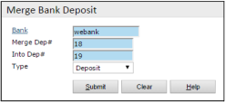

   | **Field**       | **Description**                                           |
   | --------------- | --------------------------------------------------------- |
   | **Bank**        | The Voyager bank account.                                 |
   | **Merge Dep #** | The deposit number of the deposit record to merge _from_. |
   | **Into Dep #**  | The deposit number of the deposit record to merge _to_.   |
   | **Type**        | Select **Deposit** or **EFT Deposit**.                    |

3. **Click Submit.**  
   Voyager displays detailed information on the deposits.

   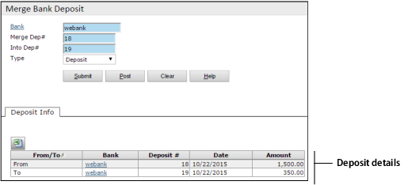

4. **To merge the deposits,** click **Post**. A warning message appears.

5. **Click Post again** to confirm the merge. Voyager merges the deposits and displays a report.

   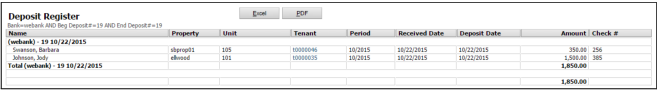

   > The report shows that there is now a single deposit record instead of two.

---

## Admin Procedures

### Check Book Maintenance

The Check Book Maintenance function can be used to correct errors in transactions that affect the bank, including checks, deposits, and journal entries. You can change dates and assign new numbers.

> **Note:** Changing transaction dates can affect reporting.

#### To Correct a Transaction Error

1. **Select** **G/L > Banking > Bank Functions > Check Book Maintenance**.  
   The **Check Book Maintenance** filter appears.

   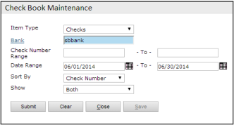

2. **Complete the filter:**

   | **Field**        | **Description**                                                                                                                                           |
   | ---------------- | --------------------------------------------------------------------------------------------------------------------------------------------------------- |
   | **Item Type**    | Select the type of transaction you want to correct: **Checks**, **Deposits**, **Other Items**, **Bank Reconciling Items**, or **Book Reconciling Items**. |
   | **Number Range** | Enter a range of transaction numbers.                                                                                                                     |
   | **Show**         | Options are **Reconciled**, **Unreconciled**, or **Both**.                                                                                                |

3. **Click Submit.**  
   The **Check Book Maintenance** screen appears, listing all transactions matching your search criteria.

   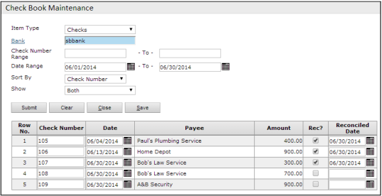

4. **Make changes** to the entries in the **Number** or **Date** columns as needed.

---

### Unposting Bank Reconciliations

You can unpost the most recent bank reconciliation.

> **Note:** Unposting will un-clear all transactions included in that reconciliation; you will need to redo it.

If you must unpost a reconciliation that is several months old, you must first unpost the most recent one, then the one before that, and so on, until you reach the one you need to unpost.

#### To Unpost a Bank Reconciliation

1. **In System Administration,** select **Toolbox > Unpost Bank Reconciliation**.  
   The filter appears.

   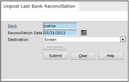

2. **Complete the filter.** In the **Reconciliation Date** field, enter the date of the last posted bank reconciliation for the bank account. If you are unsure of the date, open the **Bank Account** screen to find the date of the last posted bank reconciliation.

3. **Click Submit.**  
   Voyager displays a confirmation message. You can now rework and repost the bank reconciliation.

---

### Modifying Bank Reconciliation Dates

If the date for a posted reconciliation is incorrect, you can modify it—provided the new date does not match any existing posted date. You can only modify the most recent bank reconciliation date.  
There are no changes to the status of posted transactions or monetary amounts.

#### To Modify a Bank Reconciliation Date

1. **In System Administration,** select **Toolbox > Modify Bank Reconciliation Date**.  
   The **Modify Last Bank Reconciliation Date** filter appears.

   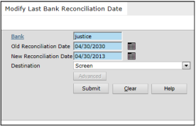

2. **Complete the filter:**

   | **Field**                   | **Description**                                                                                            |
   | --------------------------- | ---------------------------------------------------------------------------------------------------------- |
   | **Old Reconciliation Date** | Enter the date of the last posted bank reconciliation for the bank account (the date you need to correct). |
   | **New Reconciliation Date** | Enter the correct date for the bank reconciliation.                                                        |

3. **Click Submit.**  
   Voyager displays a confirmation message.

---

### Depositing Receipts

This function creates deposit records for un-deposited receipts.

> **Un-deposited receipts** are those not linked to deposit records. This can happen if:
>
> - The receipts were created before bank records for the property/account combinations were set up.
> - The cash account used on the receipts was not flagged as a “Cash Account” on the **GL Account** screen.

After running this procedure, the un-deposited receipts appear on the associated reconciliations. The Bank Reconciliation function uses deposit records to determine which transactions need to be cleared during monthly bank reconciliation.

#### To Deposit a Receipt

1. **From the Voyager System Administration side menu,** select **Toolbox > Deposit Receipt**.  
   The **Deposit Receipt** screen appears.

   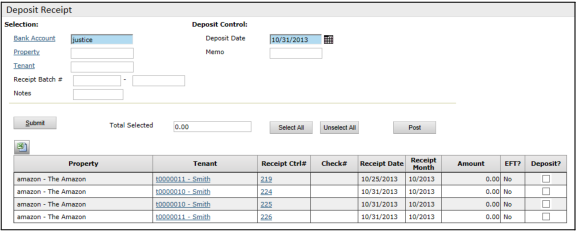

2. **Complete the filter fields** to locate the receipts you want to deposit. At a minimum, select **Bank Account** and **Property**.

   | **Field**         | **Description**                                                                                                                |
   | ----------------- | ------------------------------------------------------------------------------------------------------------------------------ |
   | **Bank Account**  | Identifies the bank account to which the receipts apply.                                                                       |
   | **Property**      | Specifies the property for the receipts. Leave blank to locate all deposit receipts for this account, or to refine the search. |
   | **Tenant**        | Specifies tenant(s) for the receipts. Leave blank to include all tenants’ deposit receipts.                                    |
   | **Receipt Batch** | Specifies the batch in which the receipts were created. Leave blank to include all batches.                                    |
   | **Notes**         | Searches for receipts by remarks or comments.                                                                                  |

3. **Click Submit.**  
   A table of un-deposited receipts appears according to your selected criteria.

4. **Select** the checkboxes for the receipts you want to deposit. The total of all selected items appears.

5. **Complete** the **Deposit Control** section for the new records:

   | **Field**        | **Description**                                                                                                                                     |
   | ---------------- | --------------------------------------------------------------------------------------------------------------------------------------------------- |
   | **Deposit Date** | Specify the date for the new deposit receipt records. The deposit date should be within the same month as the receipts’ post month to avoid issues. |
   | **Memo**         | Add any remarks for the new deposit receipt records.                                                                                                |

6. **Click Post.**

---

## Bank Reconciliation Reports

### Bank Directory Report

The Bank Directory report shows the bank account setup in a report format.

#### To Generate the Bank Directory Report

1. **Select** **G/L > Banking > Bank Reports > Bank Directory Report**.  
   The filter appears.

   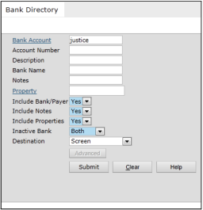

2. **Complete the filter.** The following fields require explanation:

   | **Field**              | **Description**                                                                                                                                                                                                                                   |
   | ---------------------- | ------------------------------------------------------------------------------------------------------------------------------------------------------------------------------------------------------------------------------------------------- |
   | **Include Bank/Payer** | Adds detailed information: Bank Name, Address, ABA Number, MICR Line, Payer Name, and Address.                                                                                                                                                    |
   | **Include Notes**      | Adds the notes (from the bank setup) to the report.                                                                                                                                                                                               |
   | **Include Properties** | Adds columns for properties and G/L accounts to the report.                                                                                                                                                                                       |
   | **Inactive Bank**      | **Both** = Show active and inactive banks.   **Active** = Show only active banks.   **Inactive** = Show only inactive banks.  The **Bank Account** screen includes an **Inactive** checkbox for marking a bank as active or inactive. |

3. **Click Submit.**  
   The report appears.

   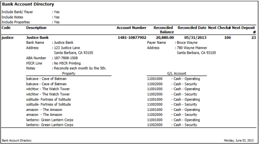

---

### Property Funds Report

For a specific bank account, the Property Funds Report lists the cash accounts of the various properties that are linked to it, including the ending balance of each cash account. It is used for trouble-shooting when a bank reconciliation does not balance.

The report, like the bank reconciliation, reports on Cash Books for the post month of the date specified in the filter. The balance of this report should tie to the G/L balance on the **Bank Reconciliation** screen for the same date, as well as the General Ledger.

#### To Generate the Property Funds Report

1. **Select** **G/L > Banking > Bank Reports > Property Funds Report**.  
   The filter appears.

   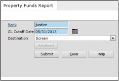

2. **Complete the filter.** In the **GL Cutoff Date** field, enter the ending date of the period.

3. **Click Submit.**  
   The report appears.

   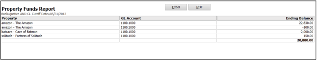

---

### Bank Reconciliation In Progress Report

This report helps determine the difference between the reconciled statement balance and the reconciled G/L balance. It displays the bank balance, outstanding (uncleared) items, the GL balance, the difference, and cleared items.

#### To Run the Bank Rec in Progress Report

1. **Select** **G/L > Banking > Bank Functions > Bank Rec In Progress Report**.  
   The filter appears.

   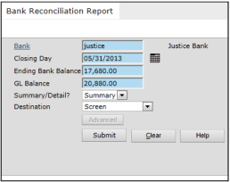

2. **Complete the screen.**

   | **Field**               | **Description**                                                                                                                                                                    |
   | ----------------------- | ---------------------------------------------------------------------------------------------------------------------------------------------------------------------------------- |
   | **Closing Day**         | Enter the date of the bank statement.                                                                                                                                              |
   | **Ending Bank Balance** | Enter the ending balance of the bank statement.                                                                                                                                    |
   | **GL Balance**          | Enter the GL Balance from the **Bank Reconciliation** screen.                                                                                                                      |
   | **Summary/Detail**      | **Summary** – Consolidates outstanding items into a single line per type.   **Detail** – A separate line for each outstanding item. (Cleared items are always shown in detail.) |

3. **Click Submit.**  
   The report appears.

   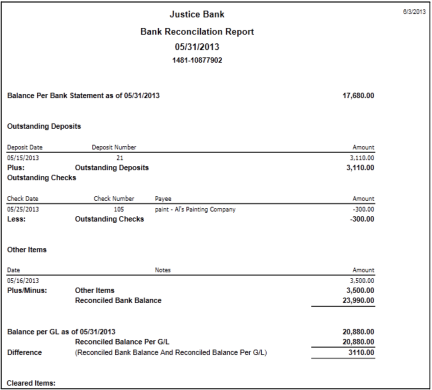

> **Note:** Due to space limitations, cleared items are not shown in the screenshot above.

#### For Global Users

If this report is run in Internet Explorer, the user must have regional settings completed (on the **User** screen, **Regional Settings** tab). Otherwise, an error appears.

---

### Bank Reconciliation Exceptions

The Bank Balance Exception Report displays transactions that cause the bank reconciliation to be out of balance (for example, transactions with a transaction date in a different month than the post month). If the bank reconciliation does not balance, use this report for troubleshooting.

#### To Run the Bank Reconciliation Exception Report

1. **Select** **G/L > Banking > Bank Functions > Bank Rec Exception Report**.  
   The filter appears.

   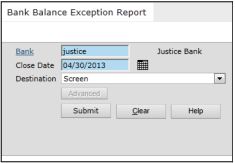

2. **Complete the filter.** In the **Closing Day** field, enter the date of the bank statement.

3. **Click Submit.**  
   The report appears.

The report identifies:

- Transactions with non-correlating dates (post month differs from the transaction date).
- Receipts that do not have a deposit record.
- Journal entries to the cash account made only to the accrual books.
- Posted receipts with a cash account in the detail lines.
- Posted charges or payables that have a cash account in the lines normally reserved for income or expense accounts.
- Receipts where the total line does not match the total of the detail lines.

---

### Bank Reconcile History Report

The Bank Reconcile History report displays **posted** bank reconciliations. To view a current, un-posted bank reconciliation, use the Bank Reconciliation In Progress report.

#### To Generate the Bank Reconcile History Report

1. **Select** **G/L > Banking > Bank Reports > Bank Reconcile History**.  
   The filter appears.

   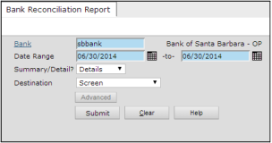

2. **Complete the filter:**

   | **Field**          | **Description**                                                                                                                                                                         |
   | ------------------ | --------------------------------------------------------------------------------------------------------------------------------------------------------------------------------------- |
   | **Summary/Detail** | **Summary** – Consolidates outstanding items into a single line for each type.   **Detail** – A separate line for each outstanding item. (Cleared items are always shown in detail.) |

3. **Click Submit.**  
   The report appears.

   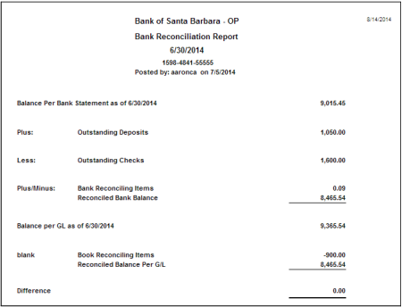

> **Note:** The G/L balance on the Bank Reconciliation Report shows the post-month G/L balance as of the date the report is run. If changes are made to the G/L after the reconciliation is performed (for example, if someone posts in a prior period), the report might be out of balance.

> We recommend that after posting a bank reconciliation, you run this report in detail mode and save the results. If a G/L change occurs later and you need to troubleshoot, you can compare your current report with the version generated on the day you posted the reconciliation.

---

### Bank Register Report

The Bank Register report lists all transactions within a specified date range.

#### To Generate the Bank Register Report

1. **Select** **G/L > Banking > Bank Reports > Bank Register**.  
   A filter appears.

   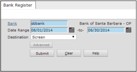

2. **Complete the filter and click Submit.**  
   The Bank Register report appears.

   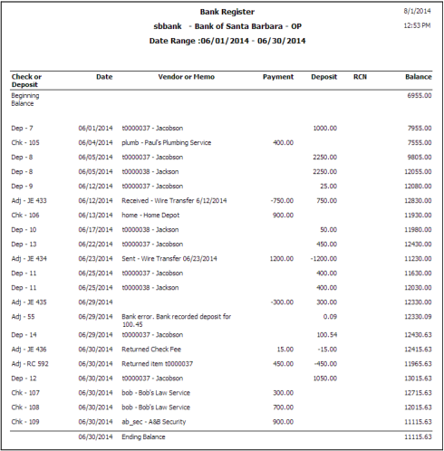

This report is similar to a checkbook ledger, showing each transaction and the resulting balance. The column headers are mostly self-explanatory, except for “RCN.” If the item has been reconciled in a posted bank reconciliation, an “X” appears in this column; otherwise, it is blank.

---

## Daily Bank Reconciliation

If you want to reconcile on a daily basis, load the following optional parameter: `OptBankRecDaily`.

If you reconcile monthly, the **G/L Balance** figure includes all transactions in the month. When you load the optional parameter, the **G/L Balance** figure includes only the transactions up to the **Closing Day**.

> **Note:** This feature is only supported for clients with an International license.
