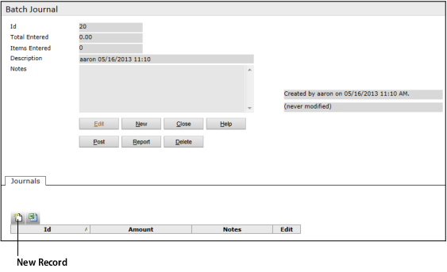
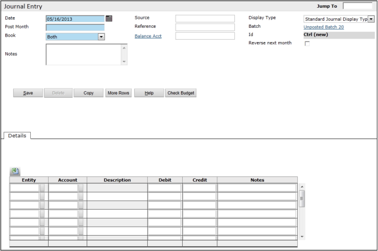

**Creating Journal Entries**

**G/L > Create Journal Batch**

To create a journal entry batch, you perform the following:

- Complete the batch header (the top part of the Journal Entry screen)
- Add individual journal entries (in the bottom half of the screen)
- Post the batch

**To create a journal entry batch**

1. Select **G/L > Create Journal Batch**. The **Batch Journal** screen appears.

   

2. Complete the top part of the screen (the batch header).

   If you are not using batch controls, you can leave everything blank and click **Save**. The **Journals** tab appears at the bottom of the screen.

3. In the **Journals** tab, click the **New Record** button .

   The **Journal Entry** screen appears.

   

   >  The appearance of the screen differs, depending on the options selected for the display type used.

4. Complete the screen. The following fields on the **Journal** screen require explanation:

   - **Source**: Use this field to record the source of the information used to create the journal entry. For example, for a journal entry created for bank fees, the source could be the bank statement.

     - Voyager includes the source on the **Journal Entry Register** report. You can use the source as selection criteria when you review JEs.

   - **Reference**: On Voyager-generated journal entries, this field notes the purpose of the journal entry. Voyager-generated references are preceded by a colon (**:**). An example of a program-generated journal entry is an intercompany reimbursement. For recurring journal entries, the **Reference** field displays the posting code in each journal entry generated by posting the recurring journal entry.

   - **Reverse Next Month**: Simultaneously creates a second journal entry reversing this journal entry in the following month.

   - **Tran Type**: _This functionality requires the International module and appears only if you select the **International** option in the **Journal Display Type** screen._
     - For more information about using tran types with JEs, see the _International User’s Guide_.

   >  If the **Multiple Properties on JE** check box is selected in the **Operations** section of the **Environment Options** tab in the **Accounts & Options** screen, each journal entry can be for multiple properties. If this check box is not selected, the journal entry screen will include one **Property** field and one **Base Currency** field that apply to the entire journal entry.

5. When you have entered all the JEs, return to the top part of the screen (the batch header). Adjust the **Total Declared** and **Items Declared** fields, if needed, and post the batch.
