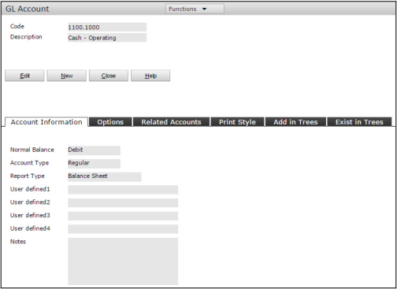
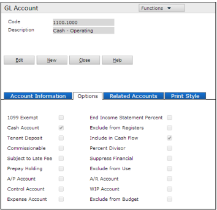
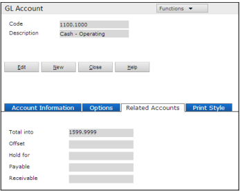
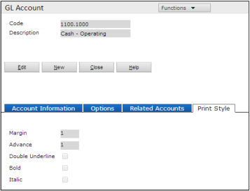
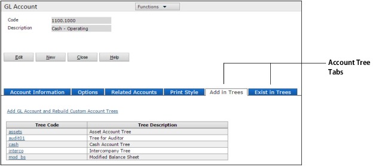

**Adding and Editing Individual General Ledger Accounts**

**Setup > System > Add G/L Account**  
**Setup > System > Review G/L Account**

You can add new general ledger accounts to your chart of accounts. You also use the **GL Account** screen to apply custom options to G/L accounts. For example, you can designate the account as subject to late fees or commissions.

**Account Information Tab**

| **Field**          | **Description**                                                                                                                                                                                    |
| ------------------ | -------------------------------------------------------------------------------------------------------------------------------------------------------------------------------------------------- |
| **Code**           | The account number. It identifies G/L accounts on transaction screens and reports. Voyager formats the number as specified in the **Account Format** field on the **Accounts and Options** screen. |
| **Description**    | Describes the account on transaction screens and report filters (maximum of 32 characters).                                                                                                        |
| **Normal Balance** | **Debit** – Typically expense and asset accounts.                                                                                                                                                  |

**Credit** – Typically income and liability accounts.  
There are exceptions. If unsure, contact your accountant. **Normal Balance** and **Report Type** identify income and expense accounts for retained-earnings calculations. |
| **Account Type** | **Regular** – Accounts to which you post transactions.  
**Heading** – First entry in an account category, used for organizing financial reports. Transactions do not post to heading accounts.  
**Total** – Accounts into which other accounts total. Transactions do not post to total accounts. |
| **Report Type** | **Balance Sheet** – Asset, liability, and capital accounts. Balances carry forward indefinitely.  
**Income Statement** – Revenue and expense accounts. End-of-year processing zeros out year-to-date amounts. |
| **User-defined fields 1 – 4** | Configurable fields (refer to the _Voyager Core Administration Guide_). |

**Options Tab**

| **Field**                  | **Description**                                                                                                                                                          |
| -------------------------- | ------------------------------------------------------------------------------------------------------------------------------------------------------------------------ |
| **1099 Exempt**            | Excludes the account from calculations for end-of-year tax processing in the U.S.                                                                                        |
| **Cash Account**           | Account for bank deposits and check writing. Only one account can be the default, but multiple cash accounts can exist.                                                  |
| **Tenant Deposit**         | Account to which resident security deposits are deposited. **NOTE** – Do not select this for deposit clearing accounts.                                                  |
| **Commissionable**         | Account for commissions calculated using the _Pay Commission_ feature.                                                                                                   |
| **Subject to Late Fee**    | Account for late-fee calculations. **CAUTION** – Must set **Use Flag** to **Account** in the _Late Fee_ section of the _Property Control_ screen for late fees to apply. |
| **Prepay Holding**         | Account for prepayments. **CAUTION** – Not specifying a prepay holding account may cause accounting issues.                                                              |
| **A/P Account**            | The account appears on lookup lists for accounts-payable fields.                                                                                                         |
| **Control Account**        | Only users with the correct security setting can post to this account.                                                                                                   |
| **Expense Account**        | Account used for transactions involving expenses.                                                                                                                        |
| **Exclude from Registers** | Account excluded from income registers.                                                                                                                                  |
| **Include in Cash Flow**   | Account included on cash-flow statements. **NOTE** – Only applies if **Report Type** is **Balance Sheet**.                                                               |
| **Suppress Financial**     | A heading account that does not appear on reports. **CAUTION** – Selecting this option for non-heading accounts can cause data issues.                                   |
| **Exclude from Use**       | Account no longer used for posting transactions. Excluded accounts do not appear in lookup lists but appear on reports if used before exclusion.                         |
| **A/R Account**            | Appears in lookup lists for accounts-receivable fields.                                                                                                                  |
| **WIP Account**            | Work-in-progress account used by Construction Management.                                                                                                                |
| **Exclude from Budget**    | Omits the account when using **Rebuild Standard Account Trees** to build the _ysi_bf_ account tree.                                                                      |

**Related Accounts Tab**

| **Field**      | **Description**                                                                                                                                                                           |
| -------------- | ----------------------------------------------------------------------------------------------------------------------------------------------------------------------------------------- |
| **Total into** | Account into which this account is totaled. If empty, Voyager uses the **Total** account with the next higher number. **NOTE** – The highest-numbered account should be **Total of All**. |
| **Offset**     | Cash account for this G/L account. Transactions post to multiple accounts, and Voyager uses the offset from the first line of the transaction.                                            |
| **Hold for**   | **NOTE** – Only complete this field for a prepayment account. Links a prepayment account to an income account.                                                                            |
| **Payable**    | A/P account for invoices using this G/L account. Leave empty to use the default **Payable** account from **Accounts and Options**.                                                        |
| **Receivable** | A/R account for charges using this G/L account. Leave empty to use the default **Receivable** account from **Accounts and Options**.                                                      |

**Print Style Tab**

| **Field**            | **Description**                                                                                                              |
| -------------------- | ---------------------------------------------------------------------------------------------------------------------------- |
| **Margin**           | Number of spaces from the edge of the print area to where information about this account should print.                       |
| **Advance**          | Distance below the preceding account on reports. Enter **1** to print immediately below, **2** to insert one empty row, etc. |
| **Double Underline** | Prints a double underline below this account on reports.                                                                     |
| **Bold**             | Account appears in bold type on reports.                                                                                     |
| **Italic**           | Account appears in italic type on reports.                                                                                   |

**Account Tree Tabs**

Two tabs on the **GL Account** screen relate to account trees: **Add in Trees** and **Exist in Trees**. For more information, see _The G/L Account Screen and Account Trees_.
