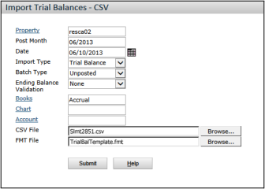

# CSV Imports

## Overview

You can import transaction data and information from CSV files.  
The default field formats in your source data file must comply with **Voyager database field requirements**.

If the import file does not comply with the appropriate format (including field order), you must create a **format template (FMT) file** so that Voyager can correctly read and import the data.

For more information, see:  
[Formats and Template Files for CSV Imports and Exports](./Formats_and_Template_Files_for_CSV.md)

## How to...

### Import Transactions from a CSV File

1. On the **Voyager System Administration** side menu, select:  
   **Toolbox > Import/Export > Import Tran - CSV**  
   The **Import Transactions - CSV** screen appears.

   

2. Complete the screen by specifying import parameters:

   | Field            | Description                                                                                                                                                                                                                     |
   | ---------------- | ------------------------------------------------------------------------------------------------------------------------------------------------------------------------------------------------------------------------------- |
   | **Property**     | Identifies the property associated with the transactions for import. You cannot import transactions to multiple properties or a property list. If the import data file includes a PROPERTY field, Voyager will use those codes. |
   | **Post Month**   | Specifies the default post month (format: mm/yyyy). If left empty, Voyager will use the current operating month.                                                                                                                |
   | **Date**         | If the import file lacks a DATE field, specifies the default transaction date. If left empty, Voyager uses the system date.                                                                                                     |
   | **Tran Type**    | Specifies the transaction type: **All, Charge, Receipt, Payable, Check, Journal, TrialBalance, Budget, InvoiceRegister**. If multiple types exist in the file, select **All**.                                                  |
   | **Book**         | For databases using multiple books, specifies the general-ledger book affected by the import. If importing for both **Cash** and **Accrual** books, select **Both**.                                                            |
   | **Account**      | If the import data lacks an ACCOUNT field, specifies the default posting account. Generally used when importing a batch of transactions to a single account.                                                                    |
   | **CSV File**     | Specifies the path and name of the CSV file to import. Click **Browse** to locate the file.                                                                                                                                     |
   | **FMT File**     | If needed, specifies the format template file for the import. Click **Browse** to locate the file.                                                                                                                              |
   | **Batch Type**   | Select **Posted** or **Unposted**. Yardi recommends importing as **Unposted** for verification before posting.                                                                                                                  |
   | **Intercompany** | Specifies that transactions come from funded properties or entities used in **Voyager Intercompany Accounting**.                                                                                                                |

3. Click **Submit**.  
   Voyager displays a confirmation message when the import is complete.

---

### Import Trial Balances from a CSV File

1. On the **Voyager System Administration** side menu, select:  
   **Toolbox > Import/Export > Import Trial Balance - CSV**  
   The **Import Trial Balances - CSV** screen appears.

   

2. Complete the screen by specifying import parameters:

   | Field                         | Description                                                                                                                 |
   | ----------------------------- | --------------------------------------------------------------------------------------------------------------------------- |
   | **Property**                  | Identifies the property associated with the trial balance import. If included in the file, Voyager uses that property code. |
   | **Post Month**                | Specifies the post month for transactions without a post month field. If empty, Voyager defaults to the current month.      |
   | **Date**                      | Specifies the transaction date if the file lacks a DATE field.                                                              |
   | **Import Type**               | Choose between **Trial Balance** and **Budget** import.                                                                     |
   | **Batch Type**                | Select **Posted** or **Unposted**. **Unposted** allows review before final posting.                                         |
   | **Ending Balance Validation** | Options: **None (no validation), Don’t Import (rejects unbalanced accounts), Make Adj Entry (auto-corrects balances).**     |
   | **Books**                     | Specifies which **G/L book** the data affects.                                                                              |
   | **Chart**                     | If using multiple charts of accounts, specifies the chart for the import data.                                              |
   | **Account**                   | Specifies the default posting account if the import file lacks an ACCOUNT field.                                            |
   | **CSV File**                  | Specifies the CSV file path. Click **Browse** to locate the file.                                                           |
   | **FMT File**                  | Specifies the format template file if required. Click **Browse** to locate the file.                                        |

3. Click **Submit**.  
   Voyager displays a confirmation message when the import is complete.

---

### Import a G/L Budget from a CSV File

1. On the **Voyager System Administration** side menu, select:  
   **Toolbox > Import/Export > Import Budget - CSV**  
   The **Import Budgets - CSV** screen appears.

   

2. Complete the screen:

   | Field        | Description                                                                                                  |
   | ------------ | ------------------------------------------------------------------------------------------------------------ |
   | **Property** | Identifies the property for the budget import. Voyager will use the property codes in the file if available. |
   | **Year**     | Specifies the budget year. If included in the file, Voyager uses that data.                                  |
   | **Books**    | Specifies the **G/L books** affected by the budget import.                                                   |
   | **Account**  | Specifies the default budget account if the file lacks an ACCOUNT field.                                     |
   | **CSV File** | Specifies the budget import file path. Click **Browse** to locate the file.                                  |
   | **FMT File** | Specifies the format template file if needed. Click **Browse** to locate the file.                           |

3. Click **Submit**.  
   Voyager displays a confirmation message when the import is complete.

---

### Convert Transactions from CSV to XML

1. On the **Voyager System Administration** side menu, select:  
   **Toolbox > Import/Export > Convert Tran CSV to XML**  
   The **Convert Transactions - CSV to XML** screen appears.

   

2. Complete the screen:

   | Field            | Description                                                                                                                                 |
   | ---------------- | ------------------------------------------------------------------------------------------------------------------------------------------- |
   | **Property**     | Identifies the property for the transaction conversion.                                                                                     |
   | **Post Month**   | Specifies the default post month if missing from the file. Defaults to the current operating month if left empty.                           |
   | **Date**         | Specifies the transaction date if missing from the file.                                                                                    |
   | **Tran Type**    | Options: **All, Charge, Receipt, Payable, Check, Journal, TrialBalance, Budget, InvoiceRegister**. If multiple types exist, select **All**. |
   | **Book**         | Specifies which **G/L book** is affected. If importing for **Cash** and **Accrual** books, select **Both**.                                 |
   | **Account**      | Specifies the default posting account if missing from the file.                                                                             |
   | **CSV File**     | Specifies the CSV file to convert. Click **Browse** to locate the file.                                                                     |
   | **FMT File**     | Specifies the format template file if needed. Click **Browse** to locate the file.                                                          |
   | **Intercompany** | Specifies that transactions for conversion are from **Voyager Intercompany Accounting**.                                                    |

3. Click **Submit**.  
   Voyager displays a confirmation message when the conversion is complete.

---

## Notes

- If **Retained Earnings** are imported, the import may fail due to an unbalanced journal entry.
  - To resolve this, remove the **Retained Earnings** row from the import file.
- For details on **Retained Earnings at Year End**,
