# Property-Management Fees Overview

Property managers receive management fees as payment for their work. Management fees are also known as commissions; in this chapter, we use both terms.

Voyager offers two different features for processing management fees:

- Management Fees
- Pay Commissions

The following table compares the features in detail.

|                                                      | **Management Fees**                                                                                                                                                                                                                                                                                                                             | **Pay Commission**                                                                                                                                                               |
| ---------------------------------------------------- | ----------------------------------------------------------------------------------------------------------------------------------------------------------------------------------------------------------------------------------------------------------------------------------------------------------------------------------------------- | -------------------------------------------------------------------------------------------------------------------------------------------------------------------------------- |
| **General Description**                              | Flexible, but requires more setup.                                                                                                                                                                                                                                                                                                              | Simple setup, but not very flexible.                                                                                                                                             |
| **Setup**                                            | 1. Create fee pools that specify the G/L accounts and percentages or flat amounts for commissions.  2. Apply one or more fee pools to each property.                                                                                                                                                                                         | 1. Select the **Commissionable** check box on the **GL Account** screen for each G/L account.  2. Specify the **Commission %** in the **Ownership** screen for each property. |
| **Tax Calculation**                                  | Yes.                                                                                                                                                                                                                                                                                                                                            | No.                                                                                                                                                                              |
| **Different G/L Accounts for Different Properties**  | Yes.                                                                                                                                                                                                                                                                                                                                            | No.                                                                                                                                                                              |
| **Different Percentages for Different G/L Accounts** | Yes.                                                                                                                                                                                                                                                                                                                                            | No.                                                                                                                                                                              |
| **G/L Segments**                                     | Yes.                                                                                                                                                                                                                                                                                                                                            | No.                                                                                                                                                                              |
| **Flat Commission Amount**                           | Yes.                                                                                                                                                                                                                                                                                                                                            | No.                                                                                                                                                                              |
| **Multiple Commissions Per Property**                | Yes -- for example, you can pay a flat commission and a percentage commission on the same property.                                                                                                                                                                                                                                             | No.                                                                                                                                                                              |
| **Use if...**                                        | - You need to apply taxes to commissions.   - You want to pay commission on different G/L accounts for different properties.   - You want to pay different percentages for different G/L accounts.   - You are using G/L segments.   - You want to pay a flat commission.   - You want to pay multiple commissions per property. | You pay a simple percentage commission for each property, and you pay commission on the same G/L accounts for all properties.                                                    |

If necessary, you can use both methods within the same database, but for individual properties, you should select one method or the other.

## Topics

1. [Setup Management Fees](#setting-up-management-fees-overview)
2. [Creating a Fee Pool](#creating-a-fee-pool)
3. [Creating a Property Fee Pool](#creating-a-property-fee-pool)
4. [Copying a Fee Pool](#copying-a-fee-pool)
5. [Processing Management Fees](#processing-management-fees)
6. [Unposting Management Fees](#unposting-management-fees)
7. [Pay Commission](#pay-commission)

## Setting Up Management Fees (Overview)

Setup requires two tasks:

- Creating a _fee pool_, specifying the G/L accounts and percentages for management-fee calculations.
- Creating a _property fee pool_, associating one or more fee pools with a property and optionally adding G/L segment information.

You create one fee pool for each calculation method that you want to use. For example, if you want the fee percentage for rent to be 3.5%, but you want the fee percentage for late fees to be 50%, create one fee pool for rent and another for late fees. You can include multiple fee pools in a single property fee pool.

If you use G/L account segments, you can add segment information to property fee pools. You can use G/L segments for both management-fee calculations and the transactions used to pay management fees (payable invoice, payable adjustment or journal entry). Voyager honors G/L segment validation rules when you use segments with management fees.

This section also includes a procedure for copying fee pools. Copying is useful when:

- You want to create several similar fee pools.
- You want to change a fee pool that has already been used.

After you have used a fee pool to process management fees, you cannot modify many of its settings. Instead, you can copy the fee pool and modify the copy.

## Creating a Fee Pool

**Navigation:**  
**Payables > Management Fees > Fee Pools > Add Fee Pool**

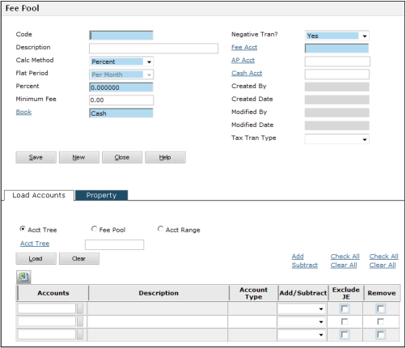

To complete the screen, perform the following three tasks:

- Complete the fields in the top part of the screen
- Load or select accounts
- Set options for accounts

### Completing the Top Part of the Screen

| Field                    | Description                                                                                                                                                  |
| ------------------------ | ------------------------------------------------------------------------------------------------------------------------------------------------------------ |
| **Code**                 | Enter a unique code. You will use the code to associate the fee pool with a property.                                                                        |
| **Description**          | Enter the description that will appear as a note on invoices created using this fee pool. Appears in the **Notes** field depending on invoice consolidation. |
| **Calc Method**          | Select **Percent** to pay a percentage of transactions for specified G/L accounts, or **Flat Rate** for a set amount.                                        |
| **Flat Period**          | Choose **Per Month** or **Calculation**. Not available if **Calc Method** is **Percent**.                                                                    |
| **Percent**              | Enter the management fee percentage. Only available if **Calc Method** is **Percent**. Create separate fee pools for different G/L percentages.              |
| **Flat Rate**            | Enter the flat fee amount. Only available if **Calc Method** is **Flat Rate**.                                                                               |
| **Minimum Monthly Fee**  | Enter the minimum fee the management organization should receive each month.                                                                                 |
| **Book**                 | Select the accounting book (cash, accrual, or user-defined) containing the relevant transactions.                                                            |
| **Negative Tran**        | Select **Yes** if a credit invoice should be created for negative calculated fees; otherwise select **No**.                                                  |
| **Fee Acct**             | Enter the G/L account number for management fee payments or credits.                                                                                         |
| **A/P Acct / Cash Acct** | Enter override values for the default payable and cash accounts.                                                                                             |
| **Tax Tran Type**        | For Voyager International users: select a tax transaction type to apply taxes to management fees. Otherwise, this field has no effect.                       |

### A/P Account Specification Order

Voyager determines the A/P account using the most specific entry from the following locations (most general to most specific):

- **Payable** field in the **Payable Accts** tab of **Accounts and Options**
- **Payable** field in the **GL Account** screen for the **Fee Acct**
- **Payable Account** field in the **Property Control** screen
- **AP Acct** field in the **Fee Pool** screen
- **AP Acct** field in the **Property Fee Pool** screen

### Cash Account Specification Order

Likewise, for cash accounts:

- **Cash** field in **Essential Accts** tab of **Accounts and Options**
- **Offset** field in the **GL Account** screen for the **Fee Acct**
- **Cash Account (Payables only)** in **Property Control** screen
- **Cash Account** field in the **Fee Pool** screen
- **Cash Account** field in the **Property Fee Pool** screen

---

### Selecting Accounts

If **Percent** is selected as the **Calc Method**, you must select accounts. You can:

- Select manually using the **Account** field lookup
- Use the **Load** button to select via:
  - **Account Tree**
  - **Fee Pool** (from an existing pool)
  - **Account Range**

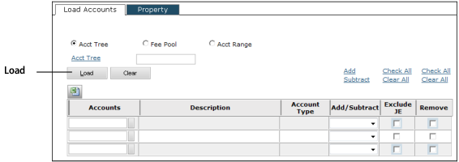

Each option will display additional fields as needed (e.g., selecting **Acct Tree** will show the **Acct Tree** field).

---

### Setting Options for Accounts

After selecting accounts, configure the following options:

| Option           | Description                                                                                                                                                                                   |
| ---------------- | --------------------------------------------------------------------------------------------------------------------------------------------------------------------------------------------- |
| **Add/Subtract** | **Add**: Increases commission (e.g., for income accounts). **Subtract**: Decreases commission (e.g., for non-commissioned expenses). **Blank**: Transaction does not affect commission. |
| **Exclude JE**   | If selected, journal entries to this account are excluded from fee calculations.                                                                                                              |
| **Remove**       | If selected, the row will be removed upon saving.                                                                                                                                             |

## Creating a Property Fee Pool

### To create a property fee pool:

1. From the side menu, select **Payables > Management Fees > Fee Pools > Property Fee Pool**. The **Property Fee Pool** filter appears.
2. In the **Property** field, enter the code for the property.
3. Click **Submit**. The **Property Fee Pool** screen appears.

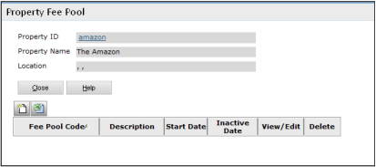

4. Click the **New Record** button  
     
   The **Add Property Fee Pool** screen appears.

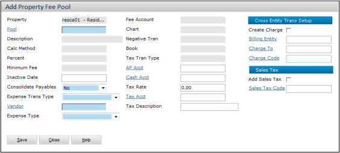

5. In the **Pool** field, enter the code for the pool. When you tab out of this field, Voyager updates the screen with data from the specified pool.

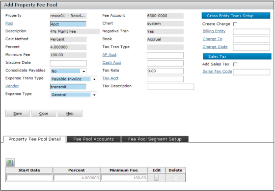

6. Complete the rest of the screen:

| Field                    | Description                                                                                                                                                                                                                                                                                                                                                                                                                                                                               |
| ------------------------ | ----------------------------------------------------------------------------------------------------------------------------------------------------------------------------------------------------------------------------------------------------------------------------------------------------------------------------------------------------------------------------------------------------------------------------------------------------------------------------------------- |
| **Consolidate Payables** | Select **No** for individual payables, or **Yes** to combine with other fee pools.                                                                                                                                                                                                                                                                                                                                                                                                        |
| **Expense Trans Type**   | Choose how fees are paid: • **Payable Invoice** – Creates a payable invoice. • **Payable Adjustment** – Creates a payable adjustment. • **Journal Entry** – Creates a journal entry. Requires additional fields like **Book** and **Offset Account**.  A journal entry: • Debits the management fee amount from the fee G/L account. • Debits tax from the tax account. • Credits the total to the offset account.  Note: Negative fees reverse this logic. |
| **Vendor**               | Enter the property manager's vendor code.                                                                                                                                                                                                                                                                                                                                                                                                                                                 |
| **Expense Type**         | Select the expense type for generated payables.                                                                                                                                                                                                                                                                                                                                                                                                                                           |
| **AP Acct / Cash Acct**  | Optional overrides for accounts defined in the fee pool.                                                                                                                                                                                                                                                                                                                                                                                                                                  |

7. If you are **not using Voyager International** and need tax calculations, complete the tax fields:

| Field               | Description                      |
| ------------------- | -------------------------------- |
| **Tax Rate**        | Enter the tax rate.              |
| **Tax Account**     | Enter the G/L account for tax.   |
| **Tax Description** | Enter a description for the tax. |

8. (Optional) Complete the **Cross Entity Trans Setup** section:

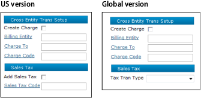

| Field              | Description                                                                                         |
| ------------------ | --------------------------------------------------------------------------------------------------- |
| **Create Charge**  | Creates a charge alongside the payable. For companies managing properties within the same database. |
| **Billing Entity** | Where the charge is recorded (e.g., property management company).                                   |
| **Charge To**      | Who is being charged (e.g., the property owner).                                                    |
| **Charge Code**    | Code for the management charge.                                                                     |
| **Add Sales Tax**  | If selected, calculates sales tax.                                                                  |
| **Sales Tax Code** | Charge code for the tax.                                                                            |
| **Tax Tran Type**  | For global users, defines how taxes apply to this charge.                                           |

9. Edit the **Property Fee Pool Detail** tab as needed:

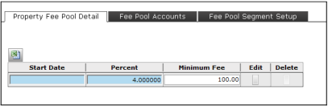

| Field                   | Description                                              |
| ----------------------- | -------------------------------------------------------- |
| **Start Date**          | First post month for applying this pool to the property. |
| **Percent**             | Override the pool's fee percentage.                      |
| **Minimum Monthly Fee** | Override the minimum monthly fee.                        |

10. In the **Fee Pool Accounts** tab, review the accounts.

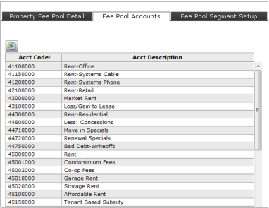

11. To use G/L segments, click the **Fee Pool Segment Setup** tab.

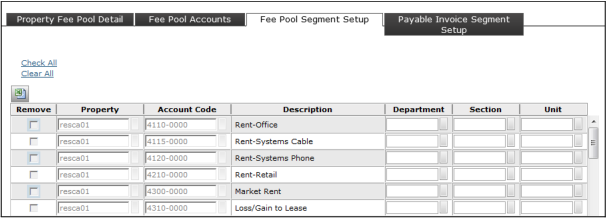

> You can assign multiple segment values for a G/L account by adding more rows.  
>   
> **Note:** Only manually added rows can be deleted using the **Remove** checkbox.

12. Click **Save** and **Close**.

13. To use **G/L segments with management-fee expense transactions**:

    a. On the **Property Fee Pool** screen, click **View/Edit** for the pool.  
    b. Click the **rightmost tab**.

> The tab name changes based on the **Expense Trans Type**:
>
> - Payable Invoice → _Payable Invoice Segment Setup_
> - Payable Adjustment → _Payable Adjustment Segment Setup_
> - Journal Entry → _Journal Entry Segment Setup_

A table will appear showing the relevant G/L accounts:

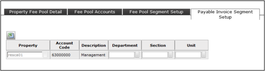

    c. Complete the segment fields you want to use.
    d. Click **Save**.

## Copying a Fee Pool

After you have used a fee pool to process management fees, you cannot modify many of its settings. Instead, you can copy the fee pool and modify the copy. Then associate the new fee pool with the property, and set the end date for the old property fee pool to the day before the new one begins.

### To copy a fee pool:

1. Select **Payables > Management Fees > Fee Pools > Copy Fee Pool**. The **Fee Pool** filter appears.

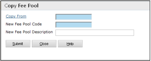

2. Complete the following filter fields:

| Field                        | Description                                                            |
| ---------------------------- | ---------------------------------------------------------------------- |
| **Copy From**                | Enter the code of the existing fee pool you want to copy.              |
| **New Fee Pool Code**        | Enter a unique code for the new fee pool.                              |
| **New Fee Pool Description** | Enter a description to appear on invoices created using this new pool. |

3. Click **Submit**. The **Fee Pool** screen appears showing the new fee pool. Voyager copies all data from the original pool into the new one.

4. Edit the new fee pool as needed.

>   
> **Note:** If you're replacing an existing fee pool, make sure the old fee pool has an end date that is one month before the start of the new fee pool. If the old pool has no end date, Voyager will calculate fees for both pools.

## Processing Management Fees

This section describes how to use the **Management Fees** feature to pay management fees.

If a fee pool includes a **minimum monthly amount**, and the calculation is less than the minimum, Voyager pays the minimum. It subtracts amounts already paid earlier in the month when calculating fees due later. For example:

- Minimum monthly fee: $300
- Management fee calculated June 15: $250
- Amount paid June 16 (for June 1–15): $300
- Management fee calculated July 1 (for June 16–30): $650
- Total management fee for the month: $250 + $650 = $900
- Amount paid July 1: $900 - $300 = $600

Voyager flags processed transactions to avoid duplicate fee calculations. It includes unprocessed transactions from the selected range, even from closed periods.

>   
> When using the **Management Fees** or **Pay Commission** feature, Voyager flags transactions to prevent duplicate processing.

If a receipt or charge is reversed, Voyager accounts for the reversal in future fee calculations.

---

### To post management fees:

1. From the side menu, select  
   **Payables > Management Fees > Management Fee Calculation**.  
   The **Management Fee Calculation** screen appears.

   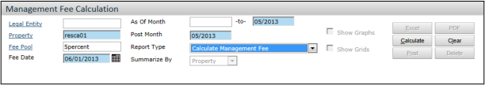

2. Complete the filter:

| Field            | Description                                                                                                 |
| ---------------- | ----------------------------------------------------------------------------------------------------------- |
| **Legal Entity** | (Voyager International only) Enter the legal entity code. Leave blank otherwise.                            |
| **Property**     | Enter the property code.                                                                                    |
| **Fee Pool**     | Leave empty to include all pools, or select specific ones.                                                  |
| **Fee Date**     | Date for the payable invoice/adjustment.                                                                    |
| **As Of Month**  | Range of post months to process. Leave the first field blank to include all prior unprocessed transactions. |
| **Post Month**   | Month to post the fee.                                                                                      |
| **Report Type**  | Select **Calculate Management Fee**.                                                                        |

3. Click **Calculate**.  
   A table of calculated amounts appears below the filter.

   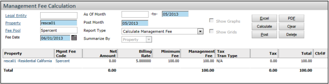

---

### Optional: Review Before Posting

#### 4. To view a summary:

- a. In **Report Type**, select **Unposted Management Fee Summary**
- b. Click **Display** to view a property-level summary.

#### 5. To view detail:

- a. In **Report Type**, select **Unposted Management Fee Detail**
- b. In **Summarize By**, select **Property** or **G/L**
- c. Click **Display** to see transaction details.

>   
> If you leave the screen without posting, the calculation is saved. To view it again, use **Report Type: Unposted Management Fee Summary** or **Detail**.

---

### Finalizing

6. Click **Post** to create the management fee transactions.  
   A confirmation prompt appears.

7. Click **OK**.  
   The posted amount appears in bold.

   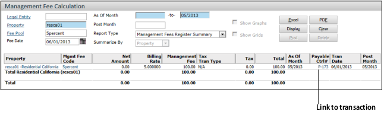

> The system creates an **unposted payable batch**.  
> A link appears to access the **Payable** screen and post the batch.

## Unposting Management Fees

If you need to **recalculate management fees** after they’ve been posted and included in a payable or journal entry batch, you can unpost them by either:

- Deleting the **payable** or **journal entry** transaction/batch
- Running the **Unpost Management Fees** function

---

### To unpost management fees:

1. From the side menu, go to  
   **Payables > Management Fees > Unpost Management Fee Calculation**  
   The **Unpost Management Fee Calculation** screen appears.

   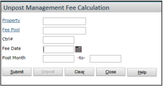

2. Complete the filter as needed:

| Field          | Description                                                                                                     |
| -------------- | --------------------------------------------------------------------------------------------------------------- |
| **Ctrl #**     | Enter the control number of the specific transaction to unpost (payable invoice, adjustment, or journal entry). |
| **Fee Date**   | Date used when the fee was originally calculated.                                                               |
| **Post Month** | Range of months for which the fee was posted.                                                                   |

3. Click **Submit**  
   A table with posted management fees appears below the filter.

   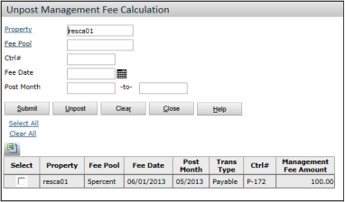

>   
> If fees don’t appear in the list, check that:
>
> - The transaction or batch has been **deleted**
> - The payable or journal entry batch is **not posted**
>
> You must delete the expense transaction before unposting fees. Look for batches with **":Pay Fees"** in the Batch Description.

---

4. Check the **Select** box for each row you want to unpost.

5. Click **Delete**  
   A confirmation dialog appears.

6. Click **OK**  
   The selected rows are removed, and the related transactions are marked as **unposted**.

## Pay Commission

This section explains how to **set up and use the Pay Commission** feature for paying **property-management fees**.

### Setup Overview

To use the **Pay Commission** feature, complete the following setup steps:

- **Specify commissionable accounts**  
  You need to define which General Ledger (G/L) accounts are eligible for commissions.

- **Enter commission percentages**  
  Set the commission rate for each property using the feature.

Once the setup is complete, you can proceed to **create a payable batch for commission payments**.

### Specifying General Ledger Accounts as Commissionable

**Navigation:**  
**Setup > System > Review G/L Account**

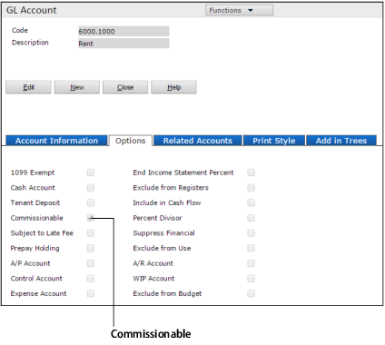

---

To mark accounts as eligible for commissions:

1. Open the **GL Account** screen.
2. Select the **Commissionable** check box.

---

After updating all necessary GL accounts:

- Run the **Rebuild Standard Account Trees** function:  
  **Setup > System > Rebuild Standard Account Trees**

This ensures the system updates all account trees accordingly.

### Setting the Commission Percentage

**Navigation:**  
**Setup > Property > Review Property**  
In the **Property** screen, go to: **Function Menu > Ownership**

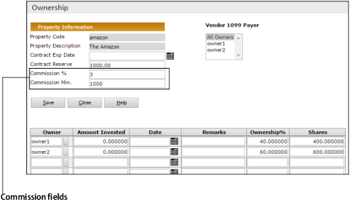

---

In the **Ownership** screen:

- **Commission %**: Enter the percentage of commission the property-management organization receives.  
  This percentage will apply to all commissionable G/L accounts.

- **Commission Min**: If there's a minimum commission amount, enter it here.  
  Voyager ensures the organization receives at least this amount when calculating commissions.

### Creating a Payable Batch for Commission Payments

This section explains how to calculate and pay management commissions for an operating month. It is recommended to pay commissions **before closing each month** and **before paying owners**.

> 💡 Voyager flags transactions once commissions are paid to prevent duplicate payments.

You define:

- **Commissionable G/L accounts** in the **GL Account** screen
- **Commission % and minimums** in the **Ownership** screen

---

##### Steps To Pay Commissions

1. From the side menu, navigate to:  
   **Payables > Pay Commission**  
   The **Pay Commission** filter screen appears.
   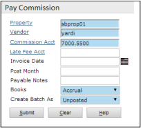

2. Complete the filter fields:

| Field                  | Description                                                                                               |
| ---------------------- | --------------------------------------------------------------------------------------------------------- |
| **Property**           | Code(s) for one or more properties or lists                                                               |
| **Vendor**             | Vendor code for the property-management organization                                                      |
| **Commission Account** | G/L account number for management commission                                                              |
| **Late Fee Acct**      | G/L account for 100% commission on late fees, or leave blank to use the same percentage as other accounts |
| **Invoice Date**       | Date for the commission invoice                                                                           |
| **Post Month**         | Month (MMYY) that the commission invoice affects the G/L                                                  |
| **Payable Notes**      | Text that appears in the **Notes** field of the commission invoice                                        |
| **Books**              | Select the accounting book                                                                                |
| **Create Batch As**    | Choose **Posted** or **Unposted** batch                                                                   |

3. Click **Submit**.

Voyager:

- Calculates commissions
- Flags processed transactions
- Creates a **payable batch**
- Displays:
  - Total commission
  - Commission per property

> 🧾 The batch number appears as a link — click it to review the batch.  
> ✅ You must
