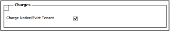
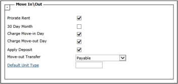
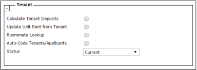

# Resident Options

| Topics | Charges | Move In and Move Out | Tenant |
| ------ | ------- | -------------------- | ------ |

Settings on the Resident Options tab define database defaults for multifamily systems like Residential, Affordable, Public Housing, and other applicable Voyager systems and modules that have residential data. If needed, you can override some of these options at the property level on the Property Control screen. Following are descriptions of the available settings and options for each of the tab sections.

For more information about setting up properties and Property Control screen configuration, see the Voyager Core Setup Guide.

## Charges

The Charges section determines how Voyager processes rent charges for on-notice or evicted residents.

| Charge Notice/Evict Tenant | Voyager continues charging rent to tenants who have a status of Notice or Evict. |
| -------------------------- | -------------------------------------------------------------------------------- |

## Move In and Move Out

Move In/Out settings determine how Voyager performs tenant move‑in and move‑out tasks.

> For information about overriding the first four settings in this section at the property level, see the Voyager Core Setup Guide.

| Prorate Rent        | If selected, Voyager calculates rent based on the number of days that the unit is occupied in a month. If not selected, tenants pay a full month’s rent regardless of move-in and move-out days.                                                                                                                                                                                                                                                                                                                                                                                                                                                                                                                                                                                                                                                                               |
| ------------------- | ------------------------------------------------------------------------------------------------------------------------------------------------------------------------------------------------------------------------------------------------------------------------------------------------------------------------------------------------------------------------------------------------------------------------------------------------------------------------------------------------------------------------------------------------------------------------------------------------------------------------------------------------------------------------------------------------------------------------------------------------------------------------------------------------------------------------------------------------------------------------------ |
| 30 Day Month        | If selected, Voyager prorates rent charges using a 30-day month, regardless of the actual days in the month. For example, a resident who moves out on the 27th of June is charged the same rent as a resident who moves out on 27th of February or the 27th of December. If not selected, Voyager prorates rent charges using the actual number of days in the month.                                                                                                                                                                                                                                                                                                                                                                                                                                                                                                          |
| Charge Move-in Day  | If selected, includes the move-in date in the prorated period. For example, if the move-in date is January 4, the prorated period would be January 4--31. If not selected, does not include the move-in date in the prorated period. For example, if the move-in date is January 4, the prorated period would be January 5--31.                                                                                                                                                                                                                                                                                                                                                                                                                                                                                                                                                |
| Charge Move-out Day | If selected, includes the move-out date in the prorated period. For example, if the move-out date is January 25, the prorated period would be January 1--25. If not selected, does not include the move-out date in the prorated period. For example, if the move-out date is January 25, the prorated period would be January 1--24.                                                                                                                                                                                                                                                                                                                                                                                                                                                                                                                                          |
| Apply Deposit       | Applies deposits to final month’s rent when a resident or tenant moves out. NOTE FOR CANADIAN USERS Voyager generates N4 forms for tenants who do not pay rent on time. Select this check box to prevent Voyager from generating an N4 form due to a deposit not being applied to the final month’s rent.                                                                                                                                                                                                                                                                                                                                                                                                                                                                                                                                                                      |
| Move-out Transfer   | Determines how Voyager transfers tenant-deposit funds from the deposit escrow account to the operating (cash) account at move-out. Journal Creates a journal entry to record the transfer of the deposit from the escrow account to the operating account. Use this option if you transfer funds from the escrow account to the operating account outside of Voyager. Payable Creates an invoice to the property-management company. Use this option if you write checks to move funds from the escrow account to the operating account. None Leaves the deposit in the cash account to which it was deposited. Use this option if you do not use an escrow account for deposits. NOTE You should not generally write refund checks from the deposit escrow account. Instead, Yardi recommends that you transfer the deposit to, and write checks from, the operating account. |
| Default Unit Type   | Default unit type for move-ins. NOTE You must set up unit types before specifying a default type. For more information, see Adding Unit Types in the Voyager Core Setup Guide.                                                                                                                                                                                                                                                                                                                                                                                                                                                                                                                                                                                                                                                                                                 |

## Tenant

Tenant settings determine how Voyager processes tenant information.

> Voyager documentation generally uses the terms resident in the multifamily context and tenant in the commercial context; however, some fields in the Tenant section can apply to Voyager Residential and other Yardi multifamily software systems.

| Calculate Tenant Deposits    | Changes the meaning of the amounts on the Deposit Info tab of the Resident screen. If selected, Deposit Info fields show the total of deposit receipts, less deposit refunds. You cannot edit deposit fields. If not selected, by default Deposit Info fields show the deposit charge amount from the Unit screen, but the field can also be edited. CAUTION Leaving this check box cleared can increase the risk of accounting errors or potential fraud. Manually edited deposit amounts that do not reflect deposit receipts can make Deposit Accounting and Deposit Interest calculations inaccurate. |
| ---------------------------- | --------------------------------------------------------------------------------------------------------------------------------------------------------------------------------------------------------------------------------------------------------------------------------------------------------------------------------------------------------------------------------------------------------------------------------------------------------------------------------------------------------------------------------------------------------------------------------------------------------- |
| Update Unit Rent from Tenant | Updates the Rent field in the Unit record when you change the amount in the Rent field on the Lease Info tab of the Resident screen. This is useful if you want to ensure that the default rent matches the rent for the most recent tenant. For example: The Unit record indicates the rent is $1,200. After one year, you increase the resident’s rent to $1,350. If this check box is selected, Voyager updates the Unit record to show the rent as $1,350. If this check box is not selected, the Unit record continues to show the rent as $1,200.                                                   |
| Roommate Lookup              | If selected, Voyager tracks activity for roommates and other paying parties for the unit. - Associates payers’ codes with the code of the unit’s principal resident. - Credits payments from payers to the principal resident ledger. - Includes payers on resident statements and refund checks.                                                                                                                                                                                                                                                                                                         |
| Auto-Code Tenants/Prospects  | Automatically generates codes for prospects and residents. Prospect codes begin with p0000001; resident codes begin with r0000001. If this option is selected, users cannot manually create prospect or resident codes.                                                                                                                                                                                                                                                                                                                                                                                   |
| Status                       | Sets the default initial status for resident and tenant records that are created using the Add Resident or Add Tenant menu item.                                                                                                                                                                                                                                                                                                                                                                                                                                                                          |
